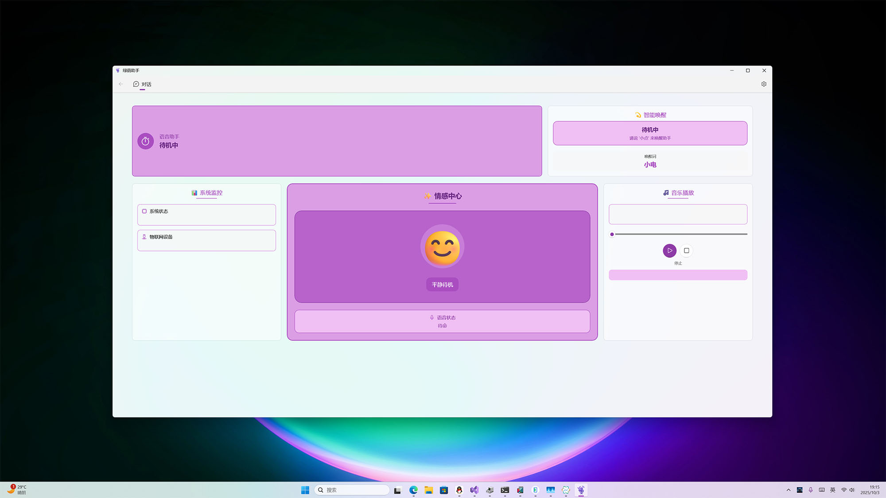
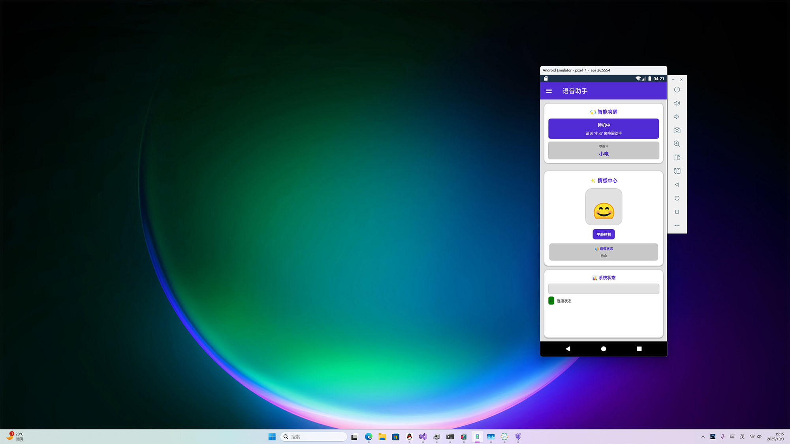
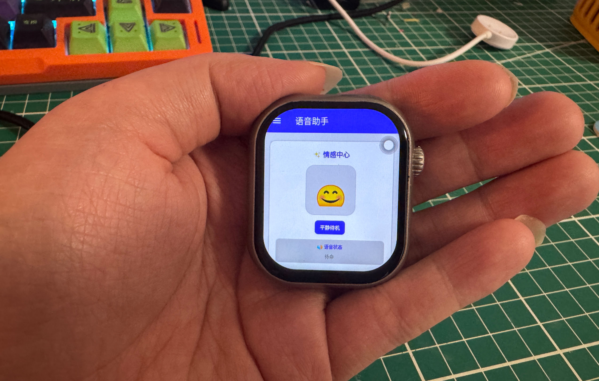
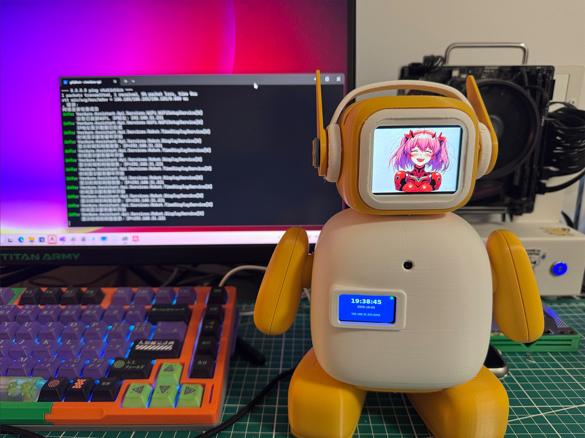

# Verdure Assistant

<p align="center">
  <a href="README.md"><strong>中文说明</strong></a> |
  <a href="https://verdure-assistant.verdure-hiro.cn/en/"><strong>Online Docs</strong></a> |
  <a href="https://verdure-assistant.verdure-hiro.cn/zh/"><strong>中文文档</strong></a>
</p>

<p align="center">
  
</p>

<p align="center">
  <a href="https://github.com/maker-community/Verdure.Assistant/releases/latest">
    
  </a>
  <a href="https://github.com/maker-community/Verdure.Assistant/actions">
    
  </a>
  <a href="https://opensource.org/licenses/MIT">
    
  </a>
  <a href="https://github.com/maker-community/Verdure.Assistant/stargazers">
    
  </a>
</p>

<p align="center">
  🤖 Multi-service intelligent assistant based on .NET 10.0 | Cross-platform AI voice interaction solution
</p>

<p align="center">
  <a href="#quick-start">Quick Start</a> •
  <a href="#features">Features</a> •
  <a href="#platform-support">Platform Support</a> •
  <a href="#architecture">Architecture</a> •
  <a href="#development">Development</a> •
  <a href="#documentation">Documentation</a>
</p>

---

## Overview

Verdure Assistant is a multi-service intelligent assistant built on .NET 10.0. It provides a complete AI voice interaction solution with modern architecture, multiple deployment options, and support for Windows, Linux, macOS, and Android.

The project started around the XiaoZhi ecosystem and is evolving into a broader integration platform for multiple AI assistant services, with a strong focus on voice interaction, music playback, and cross-platform application development.

### Working with VerdiBot

The `Verdure.Assistant.Api` project provides voice conversation and music playback APIs for [VerdiBot](https://github.com/maker-community/VerdiBot). It can be deployed on Raspberry Pi and similar embedded devices, then accessed from hardware robots through HTTP APIs.

- VerdiBot repository: https://github.com/maker-community/VerdiBot
- VerdiBot docs: https://verdibot.verdure-hiro.cn/zh/

> Experimental project note
>
> This project is still under active experimental development. Many areas are already usable, but parts of the system are still being refined. The repository is intended both as a practical assistant project and as a learning resource for modern .NET cross-platform development.

### Wake words

- `你好小电` (default)
- `你好小娜`

### Main usage modes

- Console app: bind the device, start the console program, then say the wake word to begin talking.
- WinUI app: open the desktop UI, connect first, then say the wake word to start the conversation.

## Design Goals

- Cross-platform compatibility for Windows, Linux, macOS, and Android
- Modular architecture with clear layering and extension points
- High-performance audio processing and network communication
- Multiple user experiences: desktop, mobile, console, and Web API
- Strong learning value with complete documentation and examples
- Practical deployment options for real devices and services

## Why This Project

Verdure Assistant is a real multi-project .NET solution rather than a minimal demo. It is useful if you want to study or extend:

- WinUI 3 desktop development
- .NET MAUI Android development
- ASP.NET Core Web API design
- MVVM and dependency injection patterns
- WebSocket-based audio streaming
- Audio processing with Opus and related tooling
- Embedded and Raspberry Pi integration

## Screenshots

### WinUI desktop application

<p align="center">
  <a href="https://github.com/user-attachments/assets/46531b2c-83f0-4eed-9f31-073de5a1a38e" target="_blank">
    
  </a>
</p>

### MAUI Android application

<p align="center">
  <a href="https://github.com/user-attachments/assets/1534b1cf-4e7b-424b-8f9a-fee8fd650cb8" target="_blank">
    
  </a>
</p>

### MAUI Android Watch application

<p align="center">
  <a href="https://github.com/user-attachments/assets/1e64c14c-e2eb-4f71-b99c-2b7ea5cfd0e6" target="_blank">
    
  </a>
</p>

### Console application

<p align="center">
  <a href="https://github.com/user-attachments/assets/cae5a403-cd3e-437e-bef5-173568a849b1" target="_blank">
    
  </a>
</p>

## Features

### Voice interaction

- Real-time speech recognition
- Natural text-to-speech output
- Opus-based audio encoding and decoding
- Noise suppression and audio preprocessing
- Wake word detection
- Smart interruption during conversation

### Communication

- WebSocket support for real-time bidirectional audio and messages
- MQTT integration for IoT scenarios
- Secure transport with WSS
- Automatic reconnect logic
- RESTful HTTP API

### User interfaces

- WinUI 3 desktop app for Windows
- .NET MAUI app for Android
- Console app for cross-platform CLI usage
- Web API for device and service integration

### Music playback

- Music search through integrated services
- Streaming playback
- Local cache management
- Play, pause, stop, and seek controls
- Real-time volume control

### Developer-oriented design

- Dependency injection across the solution
- Shared ViewModels with MVVM
- Detailed logging and diagnostics
- Unit tests and sample projects
- Extensive technical documentation

## Project Structure

```text
verdure-assistant/
├── src/
│   ├── Verdure.Assistant.Core/
│   ├── Verdure.Assistant.ViewModels/
│   ├── Verdure.Assistant.Console/
│   ├── Verdure.Assistant.WinUI/
│   ├── Verdure.Assistant.MAUI/
│   └── Verdure.Assistant.Api/
├── tests/
├── samples/
├── docs/
├── docs-website/
├── scripts/
├── assets/
└── Verdure.Assistant.slnx
```

## Platform Support

### WinUI 3 desktop app

Best for Windows desktop users and developers learning modern XAML-based application design.

- Stack: WinUI 3, MVVM, dependency injection
- Focus: modern Windows UI, XAML, audio integration, async patterns
- Project doc: [src/Verdure.Assistant.WinUI/README.md](src/Verdure.Assistant.WinUI/README.md)

### .NET MAUI Android app

Best for mobile voice assistant scenarios and Android-focused cross-platform development.

- Stack: .NET MAUI 10.0, Android foreground services, shared ViewModels
- Focus: Android integration, permissions, background processing, mobile audio
- Project doc: [src/Verdure.Assistant.MAUI/README.md](src/Verdure.Assistant.MAUI/README.md)

### Console app

Best for server-side deployment, debugging, and automation.

- Stack: .NET 10 console app with cross-platform audio handling
- Platforms: Windows, Linux, macOS
- Project doc: [src/Verdure.Assistant.Console/README.md](src/Verdure.Assistant.Console/README.md)

### ASP.NET Core Web API

Best for robotics, Raspberry Pi deployment, and hardware integration.

- Stack: ASP.NET Core Web API, REST, Swagger, music playback services
- Platforms: Linux, Raspberry Pi, Windows, containerized deployments
- Project doc: [src/Verdure.Assistant.Api/README.md](src/Verdure.Assistant.Api/README.md)

## Architecture

```text
┌─────────────────────────────────────────────────────────────┐
│                         UI Layer                            │
├──────────────┬──────────────┬──────────────┬────────────────┤
│  WinUI App   │  MAUI App    │ Console App  │   Web API      │
├──────────────┴──────────────┴──────────────┴────────────────┤
│                    ViewModel Layer (MVVM)                  │
├─────────────────────────────────────────────────────────────┤
│              Verdure.Assistant.ViewModels                  │
├─────────────────────────────────────────────────────────────┤
│                       Service Layer                        │
├────────────────┬────────────────┬──────────────┬────────────┤
│ Voice Chat     │ Music Playback │ Config       │ Validation │
├────────────────┼────────────────┼──────────────┼────────────┤
│ Audio Capture  │ Audio Output   │ Codec        │ State Mgmt │
├────────────────┴────────────────┴──────────────┴────────────┤
│                    Communication Layer                     │
├────────────────┬────────────────────────────────────────────┤
│ WebSocket      │ MQTT                                       │
├────────────────┴────────────────────────────────────────────┤
│             Core Layer (Verdure.Assistant.Core)            │
└─────────────────────────────────────────────────────────────┘
```

Key architectural ideas:

- Clear separation of concerns across layers
- Shared ViewModels to reduce duplicated UI logic
- Interface-driven core abstractions
- Dependency injection throughout the solution
- Reusable core code across multiple platforms

## Quick Start

### Requirements

- .NET 10.0 SDK or later
- Visual Studio 2026 or Visual Studio Code

Additional platform-specific requirements:

| Platform | Additional requirements |
| --- | --- |
| WinUI | Windows 10 1809+ or Windows 11, Windows App SDK |
| MAUI Android | Android SDK, emulator or physical device |
| API on Linux/Raspberry Pi | `mpg123` and optionally PortAudio |

### Installation

1. Clone the repository.

```bash
git clone https://github.com/maker-community/Verdure.Assistant.git
cd Verdure.Assistant
```

2. Restore dependencies.

```bash
dotnet restore
```

3. Build the solution.

```bash
dotnet build --configuration Release
```

### Run an application

Console app:

```bash
dotnet run --project src/Verdure.Assistant.Console
```

WinUI app:

```bash
dotnet run --project src/Verdure.Assistant.WinUI
```

MAUI Android app:

```bash
dotnet build src/Verdure.Assistant.MAUI -t:Run -f net10.0-android
```

Web API:

```bash
dotnet run --project src/Verdure.Assistant.Api
```

### Basic configuration

Example application configuration:

```json
{
  "ServerUrl": "wss://your-server.com/ws",
  "EnableVoice": true,
  "AudioSampleRate": 16000,
  "AudioChannels": 1,
  "AudioFormat": "opus",
  "KeywordModel": "xiaodian"
}
```

API example:

```json
{
  "Logging": {
    "LogLevel": {
      "Default": "Information"
    }
  },
  "AllowedHosts": "*",
  "Kestrel": {
    "Endpoints": {
      "Http": {
        "Url": "http://localhost:5000"
      }
    }
  }
}
```

### First run flow

1. Start the application you want to use.
2. Configure the server connection.
3. Test the connection.
4. Say the wake word to start voice interaction.

### Quick environment test

Windows:

```powershell
.\scripts\setup-dev.ps1
```

Linux or macOS:

```bash
./scripts/build.sh
```

## Development

Run all tests:

```bash
dotnet test
```

Run a specific test project:

```bash
dotnet test tests/Verdure.Assistant.Core.Tests
```

Useful scripts:

- `scripts/setup-dev.ps1`
- `scripts/build.ps1`
- `scripts/test.ps1`
- `scripts/build.bat`
- `scripts/build.sh`

Recommended workflow:

1. Set up the development environment.
2. Build in Debug.
3. Run tests.
4. Launch the specific app you are working on.

## Documentation

- English docs site: https://verdure-assistant.verdure-hiro.cn/en/
- Chinese docs site: https://verdure-assistant.verdure-hiro.cn/zh/
- Chinese root README: [README.md](README.md)
- Contributing guide: [CONTRIBUTING.md](CONTRIBUTING.md)
- Changelog: [CHANGELOG.md](CHANGELOG.md)

Platform-specific READMEs:

- [src/Verdure.Assistant.WinUI/README.md](src/Verdure.Assistant.WinUI/README.md)
- [src/Verdure.Assistant.MAUI/README.md](src/Verdure.Assistant.MAUI/README.md)
- [src/Verdure.Assistant.Console/README.md](src/Verdure.Assistant.Console/README.md)
- [src/Verdure.Assistant.Api/README.md](src/Verdure.Assistant.Api/README.md)
- [src/Verdure.Assistant.Core/README.md](src/Verdure.Assistant.Core/README.md)

Additional technical notes are available in the `docs/` directory.

## Contributing

Contributions are welcome. See [CONTRIBUTING.md](CONTRIBUTING.md) for the full process.

Typical contribution types:

- Bug reports
- Feature requests
- Documentation improvements
- Code contributions
- UI and UX improvements

## License

This project is released under the MIT License. See [LICENSE.txt](LICENSE.txt) for details.

## Acknowledgements

- [xiaozhi-esp32](https://github.com/78/xiaozhi-esp32)
- [py-xiaozhi](https://github.com/huangjunsen0406/py-xiaozhi)
- [xiaozhi-sharp](https://github.com/GreenShadeZhang/xiaozhi-sharp)
- All contributors and the open-source community