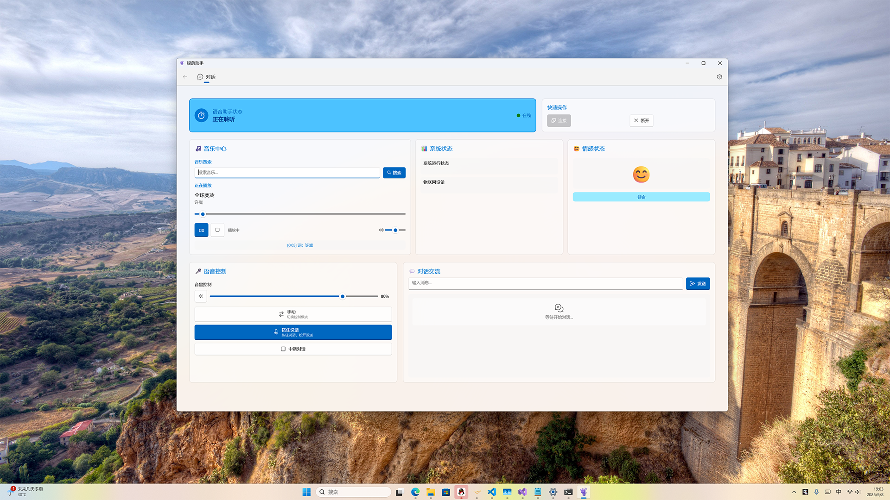

# 绿荫助手（Verdure Assistant）

<p align="center">
  
</p>

<p align="center">
  <a href="https://github.com/maker-community/Verdure.Assistant/releases/latest">
    
  </a>
  <a href="https://github.com/maker-community/Verdure.Assistant/actions">
    
  </a>
  <a href="https://opensource.org/licenses/MIT">
    
  </a>
  <a href="https://github.com/maker-community/Verdure.Assistant/stargazers">
    
  </a>
</p>

<p align="center">
  🤖 基于 .NET 9.0 的多服务智能助手 | 跨平台 AI 语音交互解决方案
</p>

<p align="center">
  <a href="#快速开始">快速开始</a> •
  <a href="#功能特性">功能特性</a> •
  <a href="#架构设计">架构设计</a> •
  <a href="#开发指南">开发指南</a> •
  <a href="#贡献指南">贡献指南</a>
</p>

---

## 📖 项目简介

绿荫助手（Verdure Assistant）是一个基于 .NET 9.0 开发的多服务智能助手，提供了完整的AI语音交互解决方案。项目采用现代化的软件架构设计，支持多种部署方式，可在Windows、Linux、macOS等平台运行。

作为一个多服务集成平台，绿荫助手不仅支持原有的小智服务，还计划集成更多AI助手服务，为用户提供更丰富的智能交互体验。

> **⚠️ 实验开发阶段说明**
> 
> 本项目目前处于实验开发阶段，许多功能尚未完全完善，但核心功能已经可以正常使用。项目主要用于学习和技术探索目的，与社区分享开发经验和技术成果。
> 
> 我们深知项目还有很多需要改进的地方，期待社区的理解和支持。如果您在使用过程中遇到问题，欢迎通过 Issues 或讨论区提出建设性的反馈，让我们一起完善这个项目。
> 
> 感谢您的理解和支持！🙏

**🎤 关键词唤醒支持：**
- "你好小电"（默认）
- "你好小娜"

**💻 双重使用体验：**
- **控制台版本** - 绑定设备后，启动控制台程序，说"你好小电"即可开启对话
- **WinUI版本** - 提供现代化图形界面（见下方截图），先点击连接按钮，然后说"你好小电"开启对话

### 🎯 设计目标

- **跨平台兼容** - 支持 Windows、Linux、macOS
- **模块化架构** - 清晰的分层设计，易于扩展
- **高性能** - 优化的音频处理和网络通信
- **易于使用** - 提供图形界面和命令行两种使用方式
- **开发友好** - 完整的文档和示例代码

## 📸 应用截图

### WinUI 桌面应用
<p align="center">
  
</p>

*现代化的 Windows 桌面应用界面，支持语音交互和实时状态显示*

## ✨ 功能特性

### 🎤 语音交互
- **实时语音识别** - 支持连续语音输入和识别
- **自然语音合成** - 高质量的TTS语音输出
- **音频编解码** - 基于Opus的高效音频处理
- **噪声抑制** - 智能音频预处理和降噪
- **关键词唤醒** - 支持"你好小电"和"你好小娜"唤醒词

### 🌐 通信协议
- **WebSocket支持** - 实时双向通信
- **MQTT协议** - 物联网设备集成
- **加密传输** - WSS安全连接
- **断线重连** - 自动恢复连接机制

### 🖥️ 用户界面
- **WinUI 3应用** - 现代化的Windows桌面应用
- **控制台程序** - 轻量级命令行界面
- **实时状态显示** - 可视化的连接和对话状态
- **情感表情** - 动态表情反馈

### 🔧 智能功能
- **自动对话模式** - 连续对话体验
- **状态管理** - 智能的设备状态切换
- **配置管理** - 灵活的参数配置
- **错误恢复** - 智能的异常处理和恢复

## 📂 项目结构

```
verdure-assistant/
├── src/                          # 源代码
│   ├── Verdure.Assistant.Core/   # 核心库
│   ├── Verdure.Assistant.Console/# 控制台应用
│   └── Verdure.Assistant.WinUI/  # WinUI桌面应用
├── tests/                        # 测试项目
│   ├── ApiCheck/                 # API测试
│   ├── CodecTest/                # 编解码测试
│   ├── ApiCheck/                 # OpusSharp API测试
│   ├── DecodeTest/               # 解码测试
│   ├── OpusApiTest/              # Opus API测试
│   ├── OpusSharpTest/            # OpusSharp测试
│   └── OpusTest/                 # Opus测试
├── samples/                      # 示例代码
│   └── py-xiaozhi/               # Python版本示例
├── docs/                         # 项目文档
├── scripts/                      # 构建和部署脚本
├── assets/                       # 资源文件
├── .github/                      # GitHub工作流和模板
└── Verdure.Assistant.sln          # 解决方案文件
```

## 🏗️ 架构设计

```
┌─────────────────────────────────────────────────────────┐
│                    用户界面层                              │
├─────────────────┬───────────────────────────────────────┤
│   WinUI 应用    │           控制台应用                    │
├─────────────────┴───────────────────────────────────────┤
│                    服务层                                │
├─────────────────┬───────────────┬───────────────────────┤
│   语音聊天服务   │   配置服务     │     验证服务           │
├─────────────────┼───────────────┼───────────────────────┤
│   音频录制服务   │   音频播放服务 │    编解码服务          │
├─────────────────┴───────────────┴───────────────────────┤
│                    通信层                                │
├─────────────────┬───────────────────────────────────────┤
│  WebSocket客户端 │            MQTT客户端                 │
├─────────────────┴───────────────────────────────────────┤
│                    核心层                                │
├─────────────────────────────────────────────────────────┤
│        模型定义 │ 接口定义 │ 常量定义 │ 工具类            │
└─────────────────────────────────────────────────────────┘
```

## 🚀 快速开始

### 环境要求

- **.NET 9.0 SDK** 或更高版本
- **Windows 10/11** (WinUI应用)
- **Visual Studio 2022** 或 **Visual Studio Code**

### 安装步骤

1. **克隆仓库**
   ```bash   git clone https://github.com/maker-community/Verdure.Assistant.git
   cd Verdure.Assistant
   ```

2. **还原依赖**
   ```bash
   dotnet restore
   ```

3. **构建项目**
   ```bash
   dotnet build --configuration Release
   ```

4. **运行应用**
   
   **控制台版本：**
   ```bash
   dotnet run --project src/Verdure.Assistant.Console
   ```
   
   **WinUI版本：**
   ```bash
   dotnet run --project src/Verdure.Assistant.WinUI
   ```

### 配置说明

在首次运行前，请配置 `src/Verdure.Assistant.Console/appsettings.json`：

```json
{
  "ServerUrl": "wss://your-server.com/ws",
  "EnableVoice": true,
  "AudioSampleRate": 16000,
  "AudioChannels": 1,
  "AudioFormat": "opus"
}
```

## 📱 使用指南

### 控制台应用

启动后会显示交互菜单：

```
请选择操作:
1. 开始语音对话
2. 停止语音对话  
3. 切换对话状态 (自动模式)
4. 切换自动对话模式
5. 发送文本消息
6. 查看连接状态
7. 退出
```

**使用流程：**
1. 首先确保设备已绑定
2. 启动控制台程序
3. 说"你好小电"开启对话
4. 进行语音交互

### WinUI应用

如上方截图所示，WinUI应用提供了直观的图形界面：

- **连接状态** - 顶部显示当前连接状态和服务器信息
- **语音控制** - 中央的语音按钮支持手动和自动模式
- **对话记录** - 实时显示对话内容和状态
- **设置面板** - 右侧提供音量调节和参数配置

**使用流程：**
1. 启动 WinUI 应用
2. 点击 **连接** 按钮建立服务器连接
3. 连接成功后，说"你好小电"开启对话
4. 支持手动按钮模式和自动连续对话模式

**界面功能：**
- **手动模式** - 按住语音按钮进行语音输入
- **自动模式** - 点击开始自动对话，支持连续语音交互
- **状态显示** - 实时显示连接状态、语音识别状态
- **参数调节** - 调整音量和其他音频参数

## 🔧 开发指南

### 项目结构

```
verdure-assistant/
├── src/                    # 源代码
│   ├── Verdure.Assistant.Core/      # 核心库
│   ├── Verdure.Assistant.Console/   # 控制台应用
│   └── Verdure.Assistant.WinUI/     # WinUI应用
├── tests/                  # 测试项目
├── samples/               # 示例代码
│   └── py-xiaozhi/        # Python参考实现
├── docs/                  # 项目文档
├── scripts/               # 构建脚本
├── assets/                # 资源文件
├── build/                 # 构建输出
└── .github/               # GitHub配置
```

### 核心组件

#### VoiceChatService
语音聊天服务的核心实现，管理语音输入输出和状态转换。

```csharp
public interface IVoiceChatService
{
    Task StartVoiceChatAsync();
    Task StopVoiceChatAsync();
    Task SendTextMessageAsync(string text);
    bool IsConnected { get; }
    DeviceState CurrentState { get; }
}
```

#### ConfigurationService  
配置管理服务，处理动态配置和OTA更新。

#### AudioCodec
音频编解码服务，支持Opus格式的音频处理。

### 扩展开发

1. **添加新的音频编解码器**
   ```csharp
   public class CustomAudioCodec : IAudioCodec
   {
       public byte[] Encode(byte[] pcmData, int sampleRate, int channels)
       {
           // 实现编码逻辑
       }
       
       public byte[] Decode(byte[] encodedData, int sampleRate, int channels)
       {
           // 实现解码逻辑
       }
   }
   ```

2. **添加新的通信协议**
   ```csharp
   public class CustomClient : ICommunicationClient
   {
       public async Task ConnectAsync() { /* 实现连接逻辑 */ }
       public async Task SendMessageAsync(string message) { /* 实现发送逻辑 */ }
       // ... 其他接口实现
   }
   ```

## 🧪 测试

运行所有测试：
```bash
dotnet test
```

运行特定测试项目：
```bash
dotnet test tests/Verdure.Assistant.Core.Tests
```

## 📦 部署

### 单文件发布

**Windows:**
```bash
dotnet publish src/Verdure.Assistant.Console -c Release -r win-x64 --self-contained true -p:PublishSingleFile=true
```

**Linux:**
```bash
dotnet publish src/Verdure.Assistant.Console -c Release -r linux-x64 --self-contained true -p:PublishSingleFile=true
```

**macOS:**
```bash
dotnet publish src/Verdure.Assistant.Console -c Release -r osx-x64 --self-contained true -p:PublishSingleFile=true
```

### Docker部署

```dockerfile
FROM mcr.microsoft.com/dotnet/runtime:9.0
COPY publish/ /app
WORKDIR /app
ENTRYPOINT ["./Verdure.Assistant.Console"]
```

## 👨‍💻 开发指南

### 快速开始开发

1. **设置开发环境**
   ```bash
   # 运行开发环境设置脚本
   .\scripts\setup-dev.ps1
   ```

2. **构建项目**
   ```bash
   # 使用构建脚本
   .\scripts\build.ps1 -Configuration Debug -Test
   
   # 或者使用dotnet命令
   dotnet build --configuration Debug
   ```

3. **运行测试**
   ```bash
   # 使用测试脚本
   .\scripts\test.ps1 -Coverage
   
   # 或者使用dotnet命令
   dotnet test --configuration Debug
   ```

### 可用脚本

项目提供了以下PowerShell脚本来简化开发流程：

- **`scripts/setup-dev.ps1`** - 设置开发环境
- **`scripts/build.ps1`** - 构建项目
- **`scripts/test.ps1`** - 运行测试
- **`scripts/build.bat`** - Windows批处理构建脚本
- **`scripts/build.sh`** - Unix shell构建脚本

### IDE配置

#### Visual Studio 2022
1. 打开 `Verdure.Assistant.sln`
2. 设置启动项目为 `Verdure.Assistant.Console` 或 `Verdure.Assistant.WinUI`
3. 确保选择了正确的目标框架 (.NET 9.0)

#### Visual Studio Code
1. 安装C# DevKit扩展
2. 打开项目根目录
3. 使用 `Ctrl+Shift+P` 打开命令面板
4. 选择 ".NET: Generate Assets for Build and Debug"

### 调试技巧

1. **断点调试**
   - 在关键代码处设置断点
   - 使用条件断点筛选特定情况

2. **日志调试**
   ```csharp
   // 使用内置日志
   _logger.LogDebug("调试信息: {Value}", someValue);
   _logger.LogWarning("警告: {Message}", message);
   ```

3. **性能分析**
   ```bash
   # 使用dotnet-trace进行性能分析
   dotnet trace collect --providers Microsoft-Extensions-Logging --process-id <PID>
   ```

### 代码规范

项目遵循以下代码规范：

- **命名约定**: 使用PascalCase命名类和方法，camelCase命名字段和变量
- **文件组织**: 每个类一个文件，文件名与类名一致
- **注释**: 为公共API提供XML文档注释
- **异步编程**: 异步方法以Async结尾，正确处理ConfigureAwait

### Git工作流

1. **分支策略**
   - `main` - 主分支，包含稳定代码
   - `develop` - 开发分支，包含最新功能
   - `feature/*` - 功能分支
   - `bugfix/*` - 修复分支

2. **提交规范**
   ```
   type(scope): description
   
   例如:
   feat(core): 添加语音识别功能
   fix(ui): 修复连接状态显示问题
   docs(readme): 更新安装说明
   ```

## 🤝 贡献指南

我们欢迎所有形式的贡献！请查看 [CONTRIBUTING.md](CONTRIBUTING.md) 了解详细信息。

### 贡献类型

- 🐛 **Bug报告** - 帮助我们发现和修复问题
- ✨ **功能请求** - 提出新功能建议
- 📖 **文档改进** - 完善项目文档
- 🔧 **代码贡献** - 提交代码修复或新功能
- 🎨 **UI/UX改进** - 改进用户界面和体验

### 开发流程

1. Fork 项目
2. 创建特性分支 (`git checkout -b feature/AmazingFeature`)
3. 提交更改 (`git commit -m 'Add some AmazingFeature'`)
4. 推送到分支 (`git push origin feature/AmazingFeature`)
5. 开启 Pull Request

## 📝 更新日志

### 最新更新 (2024-12-08)

- 📸 **新增应用截图** - 添加了 WinUI 应用的界面截图展示
- 📖 **文档完善** - 更新了主页 README，增加了详细的使用指南
- 🎯 **关键词唤醒** - 明确了支持"你好小电"和"你好小娜"两个唤醒词
- 🖥️ **界面优化** - 完善了 WinUI 应用的功能说明和使用流程

### 历史更新

详细的更新记录请查看 [CHANGELOG.md](CHANGELOG.md)。

### 版本发布

- **v1.0.0** (2025-05-30) - 首个正式版本，包含完整的语音交互功能
- **v0.9.x** - 测试版本，功能开发和测试阶段
- **当前开发版** - 持续更新中，包含最新功能和改进

## 📄 许可证

本项目基于 MIT 许可证开源 - 查看 [LICENSE](LICENSE.txt) 文件了解详情。

## 🙏 致谢

- 感谢 [xiaozhi-esp32](https://github.com/78/xiaozhi-esp32) 项目提供的参考实现
- 感谢 [py-xiaozhi](https://github.com/huangjunsen0406/py-xiaozhi) 项目提供的参考实现
- 感谢 [xiaozhi-sharp](https://github.com/GreenShadeZhang/xiaozhi-sharp) 项目提供的参考实现
- 感谢所有贡献者的努力
- 感谢开源社区的支持

## 📞 联系我们

- **GitHub Issues** - [提交问题或建议](https://github.com/maker-community/Verdure.Assistant/issues)
- **GitHub Discussions** - [参与讨论](https://github.com/maker-community/Verdure.Assistant/discussions)

---

<p align="center">
  如果这个项目对您有帮助，请考虑给我们一个 ⭐
</p>