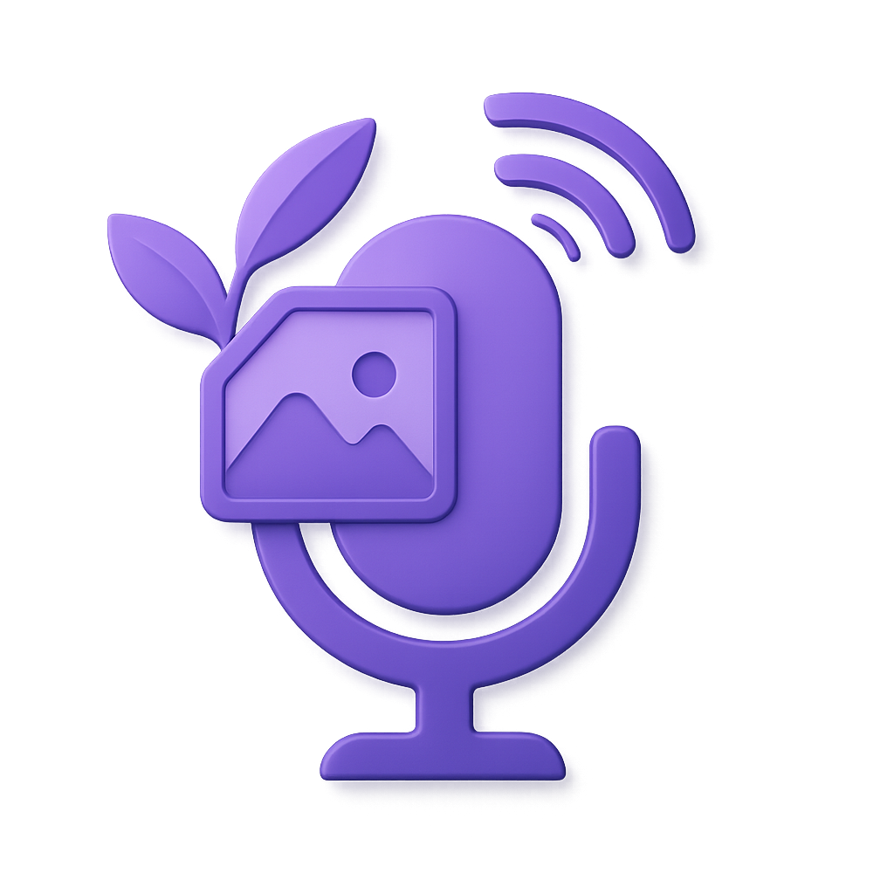
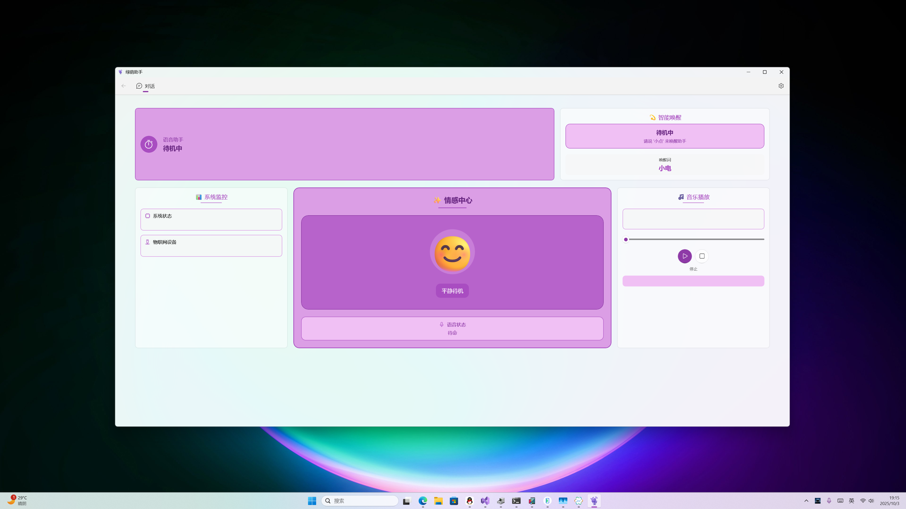
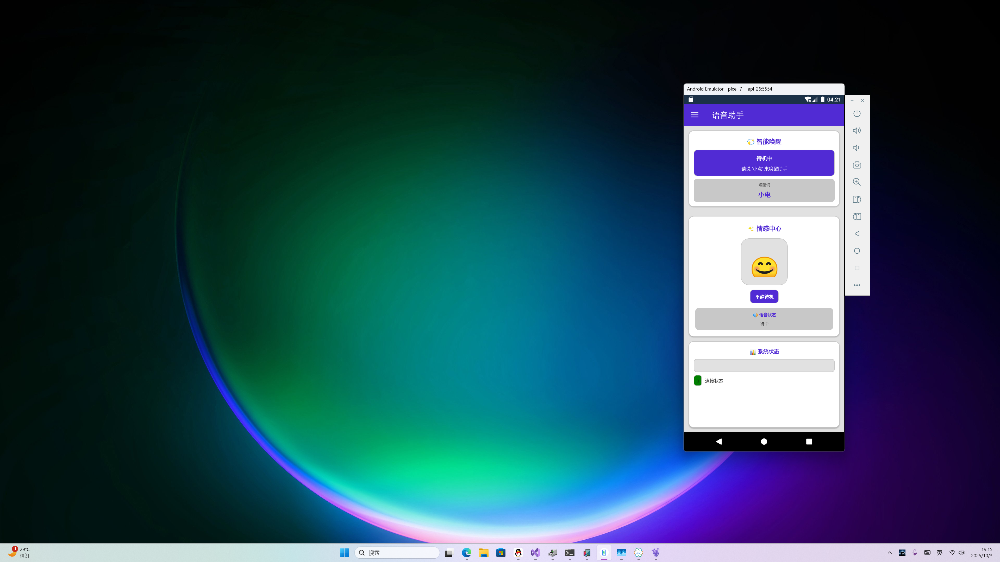
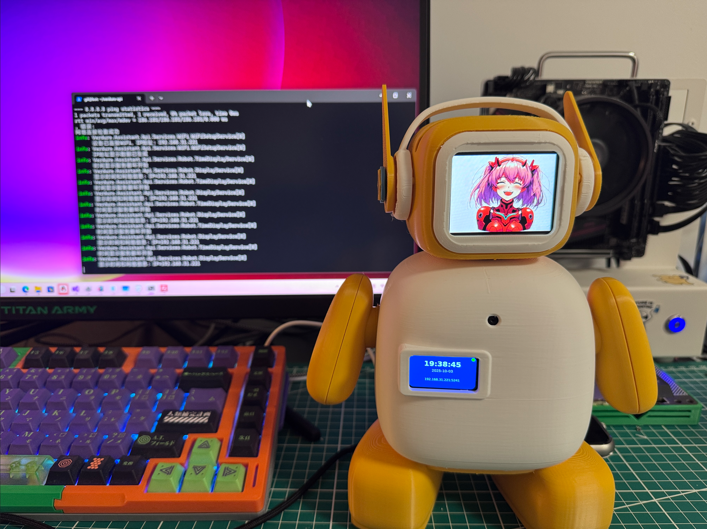

# 绿荫助手（Verdure Assistant）

<p align="center">
  
</p>

<p align="center">
  <a href="https://github.com/maker-community/Verdure.Assistant/releases/latest">
    
  </a>
  <a href="https://github.com/maker-community/Verdure.Assistant/actions">
    
  </a>
  <a href="https://opensource.org/licenses/MIT">
    
  </a>
  <a href="https://github.com/maker-community/Verdure.Assistant/stargazers">
    
  </a>
</p>

<p align="center">
  🤖 基于 .NET 9.0 的多服务智能助手 | 跨平台 AI 语音交互解决方案
</p>

<p align="center">
  <a href="#快速开始">快速开始</a> •
  <a href="#功能特性">功能特性</a> •
  <a href="#多平台支持">多平台支持</a> •
  <a href="#架构设计">架构设计</a> •
  <a href="#开发指南">开发指南</a> •
  <a href="#文档资源">文档资源</a>
</p>

---

## 📖 项目简介

绿荫助手（Verdure Assistant）是一个基于 .NET 9.0 开发的多服务智能助手，提供了完整的AI语音交互解决方案。项目采用现代化的软件架构设计，支持多种部署方式，可在Windows、Linux、macOS、Android等平台运行。

作为一个多服务集成平台，绿荫助手不仅支持原有的小智服务，还计划集成更多AI助手服务，为用户提供更丰富的智能交互体验。

### 🌐 与VerdiBot（阿荫）协同工作

本项目的 **Verdure.Assistant.Api** 为 [VerdiBot（阿荫）](https://github.com/maker-community/VerdiBot) 提供了语音对话和音乐播放API支持，可以部署在树莓派等嵌入式设备上，通过HTTP API与硬件机器人交互。

- **VerdiBot 项目地址**: https://github.com/maker-community/VerdiBot
- **VerdiBot 文档**: https://verdibot.verdure-hiro.cn/zh/

> **⚠️ 实验开发阶段说明**
> 
> 本项目目前处于实验开发阶段，许多功能尚未完全完善，但核心功能已经可以正常使用。项目主要用于学习和技术探索目的，与社区分享开发经验和技术成果。
> 
> 我们深知项目还有很多需要改进的地方，期待社区的理解和支持。如果您在使用过程中遇到问题，欢迎通过 Issues 或讨论区提出建设性的反馈，让我们一起完善这个项目。
> 
> 感谢您的理解和支持！🙏

**🎤 关键词唤醒支持：**
- "你好小电"（默认）
- "你好小娜"

**💻 双重使用体验：**
- **控制台版本** - 绑定设备后，启动控制台程序，说"你好小电"即可开启对话
- **WinUI版本** - 提供现代化图形界面（见下方截图），先点击连接按钮，然后说"你好小电"开启对话

### 🎯 设计目标

- **跨平台兼容** - 支持 Windows、Linux、macOS、Android
- **模块化架构** - 清晰的分层设计，易于扩展
- **高性能** - 优化的音频处理和网络通信
- **多样化界面** - 提供桌面、移动、控制台、API等多种使用方式
- **学习友好** - 完整的文档和示例代码，适合学习.NET跨平台开发
- **生产可用** - 实际可用的AI语音助手解决方案

### 💡 为什么选择本项目？

#### 学习 .NET 跨平台开发的最佳实践

本项目是一个 **完整的、真实的 .NET 跨平台应用示例**，涵盖了现代 .NET 开发的各个方面：

- ✅ **真实项目经验** - 不是简单的demo，而是可实际使用的完整应用
- ✅ **多平台覆盖** - 一个项目学会 WinUI、MAUI、ASP.NET Core、Console开发
- ✅ **现代架构模式** - MVVM、DI、Repository、Service Layer等
- ✅ **丰富的技术栈** - 音频处理、网络通信、UI设计、API开发
- ✅ **详细的文档** - 每个技术决策都有文档说明
- ✅ **持续更新** - 跟随.NET最新版本更新

#### 适合的学习人群

| 学习目标 | 推荐关注 |
|---------|---------|
| **Windows桌面开发** | WinUI 3 项目、XAML界面设计 |
| **Android移动开发** | MAUI项目、前台服务、原生集成 |
| **Web API开发** | ASP.NET Core API、Swagger、RESTful设计 |
| **跨平台应用** | .NET Core、跨平台兼容性处理 |
| **音频处理** | Opus编解码、SoundFlow、音频流 |
| **实时通信** | WebSocket、双向音频流传输 |
| **架构设计** | MVVM、DI、状态机、事件驱动 |
| **IoT/嵌入式** | 树莓派部署、硬件集成 |

## 📸 应用截图与演示

### 🖥️ WinUI 桌面应用
<p align="center">
  
</p>

*现代化的 Windows 桌面应用界面，支持语音交互和实时状态显示*

### 📱 MAUI 移动应用（Android）
<p align="center">
  
</p>

*基于 .NET MAUI 的 Android 移动应用，支持后台语音处理和音乐播放*

### 💻 控制台应用
<p align="center">
  
</p>

*轻量级命令行界面，适合服务器端部署和开发调试*

### 🎬 视频演示

- **WinUI 应用演示**: [查看视频](assets/videos/winui-app.mp4)
- **MAUI 移动应用演示**: [查看视频](assets/videos/maui-app.mp4)
- **控制台应用演示**: [查看视频](assets/videos/console-app.mp4)

## ✨ 功能特性

### 🎤 语音交互
- **实时语音识别** - 支持连续语音输入和识别
- **自然语音合成** - 高质量的TTS语音输出
- **音频编解码** - 基于Opus的高效音频处理
- **噪声抑制** - 智能音频预处理和降噪
- **关键词唤醒** - 支持"你好小电"和"你好小娜"唤醒词
- **语音打断** - 支持对话过程中的智能打断

### 🌐 通信协议
- **WebSocket支持** - 实时双向音频流和消息通信
- **MQTT协议** - 物联网设备集成
- **加密传输** - WSS安全连接
- **断线重连** - 自动恢复连接机制
- **RESTful API** - 标准HTTP API接口

### 🖥️ 多平台用户界面
- **WinUI 3应用** - 现代化的Windows桌面应用
  - Fluent Design 设计语言
  - 响应式布局
  - 深色/浅色主题支持
  
- **.NET MAUI应用** - Android移动应用
  - Material Design 界面
  - 前台服务支持后台运行
  - 通知栏快捷控制
  
- **控制台程序** - 轻量级命令行界面
  - 跨平台支持 (Windows/Linux/macOS)
  - 交互式菜单
  - 详细日志输出
  
- **Web API** - HTTP RESTful接口
  - Swagger文档
  - 适合嵌入式设备集成
  - 支持树莓派部署

### 🎵 音乐播放功能
- **音乐搜索** - 集成酷狗/酷我音乐API
- **在线播放** - 流媒体音乐播放
- **本地缓存** - 自动缓存管理
- **播放控制** - 播放/暂停/停止/跳转
- **音量调节** - 实时音量控制

### 🔧 智能功能
- **自动对话模式** - 连续对话体验，无需重复唤醒
- **状态机管理** - 智能的设备状态切换
- **配置管理** - 灵活的参数配置和OTA更新
- **错误恢复** - 智能的异常处理和自动恢复
- **多服务集成** - 支持扩展更多AI助手服务

### 🛠️ 开发者功能
- **完整的依赖注入** - 松耦合的服务架构
- **MVVM架构** - ViewModels跨平台共享
- **丰富的日志** - 详细的调试信息
- **单元测试** - 完整的测试覆盖
- **文档完善** - 详细的开发文档和示例

## 📂 项目结构

```
verdure-assistant/
├── src/                              # 源代码
│   ├── Verdure.Assistant.Core/       # 核心库（音频、网络、服务）
│   ├── Verdure.Assistant.ViewModels/ # 共享视图模型（MVVM）
│   ├── Verdure.Assistant.Console/    # 控制台应用（跨平台CLI）
│   ├── Verdure.Assistant.WinUI/      # WinUI桌面应用（Windows）
│   ├── Verdure.Assistant.MAUI/       # MAUI移动应用（Android）
│   └── Verdure.Assistant.Api/        # Web API服务（Linux/树莓派）
├── tests/                            # 测试项目
│   ├── CodecTest/                    # 音频编解码测试
│   ├── OpusTest/                     # Opus编解码器测试
│   ├── WebSocketAudioFlowTest/       # WebSocket音频流测试
│   ├── SoundFlowPlaybackTest/        # 音频播放测试
│   └── ...                           # 更多测试项目
├── samples/                          # 示例代码
│   └── py-xiaozhi/                   # Python版本参考实现
├── docs/                             # 技术文档
│   ├── AUDIO_ARCHITECTURE_REFACTORING_SUMMARY.md
│   ├── MVVM_REFACTORING_COMPLETION_SUMMARY.md
│   └── ...                           # 详细技术文档
├── docs-website/                     # 文档网站源码
├── scripts/                          # 构建和部署脚本
├── assets/                           # 资源文件（截图、视频）
├── .github/                          # GitHub工作流和模板
└── Verdure.Assistant.sln             # Visual Studio解决方案文件
```

## � 多平台支持

本项目充分展示了 **.NET 9.0 的跨平台能力**，提供多种部署方式，适合不同场景和学习目标：

### 🖥️ Windows 桌面应用 (WinUI 3)

**适用场景**: Windows 10/11 桌面用户、现代化UI设计学习

**技术栈**:
- WinUI 3 (Windows App SDK)
- MVVM 架构模式
- 依赖注入 (DI)
- 响应式编程

**学习要点**:
- Windows 现代化应用开发
- XAML 界面设计
- Windows 音频 API 集成
- 异步编程最佳实践

**文档**: [WinUI 项目文档](src/Verdure.Assistant.WinUI/README.md)

---

### 📱 Android 移动应用 (.NET MAUI)

**适用场景**: 移动端语音助手、跨平台移动开发学习

**技术栈**:
- .NET MAUI 9.0
- Android 前台服务
- Material Design
- 共享 ViewModels (MVVM)

**学习要点**:
- .NET MAUI 跨平台开发
- Android 原生功能集成
- 前台服务和后台处理
- 移动端音频录制和播放
- Android 权限管理

**文档**: [MAUI 项目文档](src/Verdure.Assistant.MAUI/README.md)

---

### 💻 控制台应用 (跨平台 CLI)

**适用场景**: 服务器部署、开发调试、自动化脚本

**支持平台**: Windows、Linux、macOS

**技术栈**:
- .NET 9.0 Console Application
- 跨平台音频处理
- 命令行交互

**学习要点**:
- 跨平台控制台应用开发
- 命令行参数解析
- 日志和诊断
- 跨平台兼容性处理

**文档**: [Console 项目文档](src/Verdure.Assistant.Console/README.md)

---

### 🌐 Web API 服务 (ASP.NET Core)

**适用场景**: 机器人硬件集成、IoT设备、树莓派部署

**支持平台**: Linux (树莓派)、Windows、Docker

**技术栈**:
- ASP.NET Core Web API
- RESTful API 设计
- Swagger/OpenAPI
- 音乐播放服务 (mpg123)
- 关键词唤醒

**主要功能**:
- 🎵 音乐搜索和播放 API
- 🎤 语音对话 WebSocket 接口
- 🤖 与 VerdiBot 硬件机器人集成
- 📊 系统状态监控

**学习要点**:
- ASP.NET Core Web API 开发
- RESTful API 设计原则
- Linux 音频处理
- 嵌入式设备部署
- 与硬件设备通信

**文档**: [API 项目文档](src/Verdure.Assistant.Api/README.md)

**相关项目**: 
- [VerdiBot 机器人](https://github.com/maker-community/VerdiBot)
- [VerdiBot 文档](https://verdibot.verdure-hiro.cn/zh/)

---

## �🏗️ 架构设计

```
┌─────────────────────────────────────────────────────────────┐
│                        用户界面层                              │
├──────────────┬──────────────┬──────────────┬────────────────┤
│  WinUI 应用  │  MAUI 应用   │  控制台应用   │   Web API      │
│  (Windows)   │  (Android)   │  (跨平台)    │  (嵌入式/服务器) │
├──────────────┴──────────────┴──────────────┴────────────────┤
│                      视图模型层 (MVVM)                         │
├──────────────────────────────────────────────────────────────┤
│                Verdure.Assistant.ViewModels                   │
│              (共享业务逻辑和状态管理)                           │
├──────────────────────────────────────────────────────────────┤
│                        服务层                                 │
├────────────────┬────────────────┬──────────────┬─────────────┤
│ 语音聊天服务    │   音乐播放服务  │   配置服务    │  验证服务   │
├────────────────┼────────────────┼──────────────┼─────────────┤
│ 音频录制服务    │   音频播放服务  │  编解码服务   │  状态管理   │
├────────────────┴────────────────┴──────────────┴─────────────┤
│                        通信层                                 │
├────────────────┬─────────────────────────────────────────────┤
│ WebSocket客户端 │              MQTT客户端                     │
├────────────────┴─────────────────────────────────────────────┤
│                    核心层 (Verdure.Assistant.Core)            │
├──────────────────────────────────────────────────────────────┤
│      模型定义 │ 接口定义 │ 常量定义 │ 工具类 │ 扩展方法        │
└──────────────────────────────────────────────────────────────┘
```

### 架构亮点

- **分层设计**: 清晰的职责分离，易于维护和扩展
- **MVVM模式**: ViewModels 跨平台共享，减少重复代码
- **依赖注入**: 使用 Microsoft.Extensions.DependencyInjection
- **接口抽象**: 核心功能通过接口定义，支持多种实现
- **跨平台兼容**: 同一套核心代码，运行在多个平台

## 🚀 快速开始

### 环境要求

#### 基础要求
- **.NET 9.0 SDK** 或更高版本 - [下载地址](https://dotnet.microsoft.com/download/dotnet/9.0)
- **Visual Studio 2022 (17.8+)** 或 **Visual Studio Code**

#### 平台特定要求

| 平台 | 额外要求 |
|------|---------|
| **WinUI (Windows)** | Windows 10 1809+ 或 Windows 11<br>Windows App SDK |
| **MAUI (Android)** | Android SDK (API 21+)<br>Android Emulator 或真机 |
| **API (Linux/树莓派)** | mpg123 音频播放器<br>PortAudio (可选) |

### 安装步骤

1. **克隆仓库**
   ```bash
   git clone https://github.com/maker-community/Verdure.Assistant.git
   cd Verdure.Assistant
   ```

2. **还原依赖**
   ```bash
   dotnet restore
   ```

3. **构建项目**
   ```bash
   dotnet build --configuration Release
   ```

4. **运行应用**
   
   **选择适合您的平台：**

   <details>
   <summary><b>💻 控制台版本 (跨平台)</b></summary>
   
   ```bash
   # Windows/Linux/macOS
   dotnet run --project src/Verdure.Assistant.Console
   ```
   
   适合：服务器部署、开发调试、自动化脚本
   </details>

   <details>
   <summary><b>🖥️ WinUI版本 (Windows)</b></summary>
   
   ```bash
   # 需要 Windows 10/11
   dotnet run --project src/Verdure.Assistant.WinUI
   ```
   
   或者在 Visual Studio 中：
   1. 打开 `Verdure.Assistant.sln`
   2. 设置 `Verdure.Assistant.WinUI` 为启动项目
   3. 按 F5 运行
   
   适合：Windows桌面用户、现代化UI体验
   </details>

   <details>
   <summary><b>📱 MAUI版本 (Android)</b></summary>
   
   在 Visual Studio 2022 中：
   1. 打开 `Verdure.Assistant.sln`
   2. 设置 `Verdure.Assistant.MAUI` 为启动项目
   3. 选择 Android 模拟器或连接真机
   4. 按 F5 运行
   
   或使用命令行：
   ```bash
   # 部署到连接的Android设备
   dotnet build src/Verdure.Assistant.MAUI -t:Run -f net9.0-android
   ```
   
   适合：移动端用户、Android应用开发学习
   </details>

   <details>
   <summary><b>🌐 Web API版本 (服务器/树莓派)</b></summary>
   
   ```bash
   # 首先安装 mpg123 (音乐播放需要)
   # Ubuntu/Debian
   sudo apt-get install mpg123
   
   # 运行API服务
   dotnet run --project src/Verdure.Assistant.Api
   ```
   
   服务将在以下地址启动：
   - HTTP: `http://localhost:5000`
   - HTTPS: `https://localhost:5001`
   - Swagger: `https://localhost:5001/swagger`
   
   适合：VerdiBot机器人集成、IoT设备、远程API访问
   </details>

### 配置说明

#### 控制台/WinUI/MAUI 配置

编辑 `appsettings.json` 文件：

```json
{
  "ServerUrl": "wss://your-server.com/ws",
  "EnableVoice": true,
  "AudioSampleRate": 16000,
  "AudioChannels": 1,
  "AudioFormat": "opus",
  "KeywordModel": "xiaodian"  // "xiaodian" 或 "cortana"
}
```

#### API服务配置

编辑 `src/Verdure.Assistant.Api/appsettings.json`：

```json
{
  "Logging": {
    "LogLevel": {
      "Default": "Information"
    }
  },
  "AllowedHosts": "*",
  "Kestrel": {
    "Endpoints": {
      "Http": {
        "Url": "http://localhost:5000"
      }
    }
  }
}
```

### 首次使用

1. **启动您选择的应用版本**
2. **配置服务器连接** - 输入WebSocket服务器地址
3. **测试连接** - 点击连接按钮或使用菜单选项
4. **开始对话** - 说出"你好小电"或"你好小娜"开启语音交互

### 快速测试

使用示例脚本快速验证环境：

```bash
# Windows
.\scripts\setup-dev.ps1

# Linux/macOS
./scripts/build.sh
```

## 📱 使用指南

### 💻 控制台应用使用指南

启动后会显示交互菜单：

```
请选择操作:
1. 开始语音对话
2. 停止语音对话  
3. 切换对话状态 (自动模式)
4. 切换自动对话模式
5. 发送文本消息
6. 查看连接状态
7. 退出
```

**使用流程：**
1. 首先确保设备已绑定（或配置服务器地址）
2. 启动控制台程序
3. 选择操作 1 开始语音对话
4. 说"你好小电"或"你好小娜"开启对话
5. 进行语音交互

**适用场景：**
- 🖥️ 服务器端部署（Linux/Windows Server）
- 🔧 开发调试和测试
- 📝 查看详细日志输出
- 🤖 自动化脚本集成

---

### 🖥️ WinUI应用使用指南

如上方截图所示，WinUI应用提供了直观的现代化图形界面：

**界面布局：**
- **连接状态栏** - 顶部显示当前连接状态和服务器信息
- **语音控制中心** - 中央的大型语音按钮
- **对话记录区** - 实时显示对话内容和AI回复
- **情感表情显示** - 动态GIF表情反馈
- **设置面板** - 右侧提供参数配置
- **音乐播放器** - 底部音乐控制界面

**使用流程：**
1. 启动 WinUI 应用
2. 点击 **连接** 按钮建立服务器连接
3. 连接成功后，说"你好小电"开启对话
4. 支持手动按钮模式和自动连续对话模式

**功能特性：**
- 🎤 **手动模式** - 按住语音按钮进行语音输入
- 🔄 **自动模式** - 点击开始自动对话，支持连续语音交互
- 📊 **状态显示** - 实时显示连接状态、语音识别状态
- ⚙️ **参数调节** - 调整音量和其他音频参数
- 🎵 **音乐控制** - 搜索、播放、暂停音乐
- 🎨 **主题切换** - 支持深色/浅色主题

**快捷键：**
- `Ctrl + L` - 清空对话记录
- `Space` - 按住进行语音输入
- `Esc` - 停止当前操作

---

### 📱 MAUI应用使用指南 (Android)

移动端提供紧凑而功能完整的界面：

**主要功能区：**
- **顶部状态区** - 连接状态、系统状态、TTS状态
- **情感表情区** - 动态表情显示
- **音乐播放器** - 歌曲信息和播放控制
- **对话记录** - 上下滚动查看历史对话
- **底部控制区** - 语音输入和快捷操作

**使用流程：**
1. 安装APK到Android设备
2. 授予录音和通知权限
3. 在设置页面配置服务器地址
4. 点击连接按钮
5. 长按麦克风按钮说话，或使用唤醒词

**特色功能：**
- 📳 **后台运行** - 使用前台服务保持后台运行
- 🔔 **通知栏控制** - 快速访问常用操作
- 🎤 **长按录音** - 按住录音按钮说话
- 💬 **文本输入** - 支持键盘输入文本消息
- 🎵 **音乐播放** - 集成音乐播放器
- 🌙 **深色模式** - 自动跟随系统主题

**权限说明：**
- 🎤 录音权限 - 语音识别必需
- 🔔 通知权限 - 后台服务通知
- 📱 前台服务 - 保持后台运行

---

### 🌐 Web API使用指南

API服务适合集成到其他系统或硬件设备：

**启动服务：**
```bash
dotnet run --project src/Verdure.Assistant.Api
# 访问 https://localhost:5001/swagger 查看API文档
```

**主要API端点：**

```bash
# 音乐搜索
GET /api/music/search?songName=青花瓷

# 播放音乐
POST /api/music/search-and-play
{
  "songName": "青花瓷"
}

# 播放控制
POST /api/music/pause
POST /api/music/resume
POST /api/music/stop

# 语音对话 (WebSocket)
ws://localhost:5000/ws

# 系统状态
GET /api/system/status
```

**集成示例：**

使用curl测试：
```bash
# 搜索并播放音乐
curl -X POST https://localhost:5001/api/music/search-and-play \
  -H "Content-Type: application/json" \
  -d '{"songName":"周杰伦"}'

# 检查mpg123可用性
curl https://localhost:5001/api/test/check-mpg123
```

**VerdiBot集成：**
- 在树莓派上部署API服务
- VerdiBot通过HTTP调用API控制语音和音乐
- 详见：[VerdiBot文档](https://verdibot.verdure-hiro.cn/zh/)

**适用场景：**
- 🤖 硬件机器人集成
- 🏠 智能家居控制
- 🖥️ 远程API访问
- 📡 IoT设备集成

## 🔧 开发指南

### 项目结构

```
verdure-assistant/
├── src/                    # 源代码
│   ├── Verdure.Assistant.Core/      # 核心库
│   ├── Verdure.Assistant.Console/   # 控制台应用
│   └── Verdure.Assistant.WinUI/     # WinUI应用
├── tests/                  # 测试项目
├── samples/               # 示例代码
│   └── py-xiaozhi/        # Python参考实现
├── docs/                  # 项目文档
├── scripts/               # 构建脚本
├── assets/                # 资源文件
├── build/                 # 构建输出
└── .github/               # GitHub配置
```

### 核心组件

#### VoiceChatService
语音聊天服务的核心实现，管理语音输入输出和状态转换。

```csharp
public interface IVoiceChatService
{
    Task StartVoiceChatAsync();
    Task StopVoiceChatAsync();
    Task SendTextMessageAsync(string text);
    bool IsConnected { get; }
    DeviceState CurrentState { get; }
}
```

#### ConfigurationService  
配置管理服务，处理动态配置和OTA更新。

#### AudioCodec
音频编解码服务，支持Opus格式的音频处理。

### 扩展开发

1. **添加新的音频编解码器**
   ```csharp
   public class CustomAudioCodec : IAudioCodec
   {
       public byte[] Encode(byte[] pcmData, int sampleRate, int channels)
       {
           // 实现编码逻辑
       }
       
       public byte[] Decode(byte[] encodedData, int sampleRate, int channels)
       {
           // 实现解码逻辑
       }
   }
   ```

2. **添加新的通信协议**
   ```csharp
   public class CustomClient : ICommunicationClient
   {
       public async Task ConnectAsync() { /* 实现连接逻辑 */ }
       public async Task SendMessageAsync(string message) { /* 实现发送逻辑 */ }
       // ... 其他接口实现
   }
   ```

## 🧪 测试

运行所有测试：
```bash
dotnet test
```

运行特定测试项目：
```bash
dotnet test tests/Verdure.Assistant.Core.Tests
```

## 📦 部署

### 单文件发布

**Windows:**
```bash
dotnet publish src/Verdure.Assistant.Console -c Release -r win-x64 --self-contained true -p:PublishSingleFile=true
```

**Linux:**
```bash
dotnet publish src/Verdure.Assistant.Console -c Release -r linux-x64 --self-contained true -p:PublishSingleFile=true
```

**macOS:**
```bash
dotnet publish src/Verdure.Assistant.Console -c Release -r osx-x64 --self-contained true -p:PublishSingleFile=true
```

### Docker部署

```dockerfile
FROM mcr.microsoft.com/dotnet/runtime:9.0
COPY publish/ /app
WORKDIR /app
ENTRYPOINT ["./Verdure.Assistant.Console"]
```

## 👨‍💻 开发指南

### 快速开始开发

1. **设置开发环境**
   ```bash
   # 运行开发环境设置脚本
   .\scripts\setup-dev.ps1
   ```

2. **构建项目**
   ```bash
   # 使用构建脚本
   .\scripts\build.ps1 -Configuration Debug -Test
   
   # 或者使用dotnet命令
   dotnet build --configuration Debug
   ```

3. **运行测试**
   ```bash
   # 使用测试脚本
   .\scripts\test.ps1 -Coverage
   
   # 或者使用dotnet命令
   dotnet test --configuration Debug
   ```

### 可用脚本

项目提供了以下PowerShell脚本来简化开发流程：

- **`scripts/setup-dev.ps1`** - 设置开发环境
- **`scripts/build.ps1`** - 构建项目
- **`scripts/test.ps1`** - 运行测试
- **`scripts/build.bat`** - Windows批处理构建脚本
- **`scripts/build.sh`** - Unix shell构建脚本

### IDE配置

#### Visual Studio 2022
1. 打开 `Verdure.Assistant.sln`
2. 设置启动项目为 `Verdure.Assistant.Console` 或 `Verdure.Assistant.WinUI`
3. 确保选择了正确的目标框架 (.NET 9.0)

#### Visual Studio Code
1. 安装C# DevKit扩展
2. 打开项目根目录
3. 使用 `Ctrl+Shift+P` 打开命令面板
4. 选择 ".NET: Generate Assets for Build and Debug"

### 调试技巧

1. **断点调试**
   - 在关键代码处设置断点
   - 使用条件断点筛选特定情况

2. **日志调试**
   ```csharp
   // 使用内置日志
   _logger.LogDebug("调试信息: {Value}", someValue);
   _logger.LogWarning("警告: {Message}", message);
   ```

3. **性能分析**
   ```bash
   # 使用dotnet-trace进行性能分析
   dotnet trace collect --providers Microsoft-Extensions-Logging --process-id <PID>
   ```

### 代码规范

项目遵循以下代码规范：

- **命名约定**: 使用PascalCase命名类和方法，camelCase命名字段和变量
- **文件组织**: 每个类一个文件，文件名与类名一致
- **注释**: 为公共API提供XML文档注释
- **异步编程**: 异步方法以Async结尾，正确处理ConfigureAwait

### Git工作流

1. **分支策略**
   - `main` - 主分支，包含稳定代码
   - `develop` - 开发分支，包含最新功能
   - `feature/*` - 功能分支
   - `bugfix/*` - 修复分支

2. **提交规范**
   ```
   type(scope): description
   
   例如:
   feat(core): 添加语音识别功能
   fix(ui): 修复连接状态显示问题
   docs(readme): 更新安装说明
   ```

## 📚 文档资源

### 官方文档

- **🏠 绿荫助手文档**: https://verdure-assistant.verdure-hiro.cn/zh/
  - 完整的使用指南和开发文档
  - API 参考文档
  - 配置说明和最佳实践

- **🤖 VerdiBot 文档**: https://verdibot.verdure-hiro.cn/zh/
  - 硬件机器人集成指南
  - API 服务部署教程
  - 树莓派配置说明

### 项目文档

#### 📖 各平台项目文档

| 平台 | 文档路径 | 说明 |
|------|---------|------|
| **WinUI** | [src/Verdure.Assistant.WinUI/README.md](src/Verdure.Assistant.WinUI/README.md) | Windows 桌面应用开发指南 |
| **MAUI** | [src/Verdure.Assistant.MAUI/README.md](src/Verdure.Assistant.MAUI/README.md) | Android 移动应用开发指南 |
| **Console** | [src/Verdure.Assistant.Console/README.md](src/Verdure.Assistant.Console/README.md) | 控制台应用使用说明 |
| **API** | [src/Verdure.Assistant.Api/README.md](src/Verdure.Assistant.Api/README.md) | Web API 服务部署和使用 |
| **Core** | [src/Verdure.Assistant.Core/README.md](src/Verdure.Assistant.Core/README.md) | 核心库架构和接口说明 |

#### 🔧 技术文档

<details>
<summary>音频处理相关</summary>

- [AUDIO_ARCHITECTURE_REFACTORING_SUMMARY.md](docs/AUDIO_ARCHITECTURE_REFACTORING_SUMMARY.md) - 音频架构重构总结
- [AUDIO_CODEC_FIX_SUMMARY.md](docs/AUDIO_CODEC_FIX_SUMMARY.md) - 音频编解码修复
- [SOUNDFLOW_INTEGRATION_SUMMARY.md](docs/SOUNDFLOW_INTEGRATION_SUMMARY.md) - SoundFlow 集成说明
- [PORTAUDIO_EXCEPTION_OPTIMIZATION_SUMMARY.md](docs/PORTAUDIO_EXCEPTION_OPTIMIZATION_SUMMARY.md) - PortAudio 优化
- [RASPBERRY_PI_AUDIO_TIMEOUT_FIX.md](docs/RASPBERRY_PI_AUDIO_TIMEOUT_FIX.md) - 树莓派音频问题修复

</details>

<details>
<summary>MAUI 移动开发相关</summary>

- [MAUI_HOMEPAGE_REFACTORING_SUMMARY.md](docs/MAUI_HOMEPAGE_REFACTORING_SUMMARY.md) - MAUI 主页重构
- [MAUI_GIF_EMOTION_IMPLEMENTATION_SUMMARY.md](docs/MAUI_GIF_EMOTION_IMPLEMENTATION_SUMMARY.md) - GIF 表情实现
- [MAUI_PERMISSION_OPTIMIZATION_SUMMARY.md](docs/MAUI_PERMISSION_OPTIMIZATION_SUMMARY.md) - 权限优化
- [MAUI_ANDROID_FILE_EXISTS_COMPATIBILITY_FIX.md](docs/MAUI_ANDROID_FILE_EXISTS_COMPATIBILITY_FIX.md) - Android 兼容性修复

</details>

<details>
<summary>架构和设计模式</summary>

- [MVVM_REFACTORING_COMPLETION_SUMMARY.md](docs/MVVM_REFACTORING_COMPLETION_SUMMARY.md) - MVVM 重构完成总结
- [STATE_MACHINE_ARCHITECTURE_OPTIMIZATION_SUMMARY.md](docs/STATE_MACHINE_ARCHITECTURE_OPTIMIZATION_SUMMARY.md) - 状态机架构优化
- [PROJECT_REORGANIZATION_SUMMARY.md](docs/PROJECT_REORGANIZATION_SUMMARY.md) - 项目重组总结
- [THREADING_ISSUE_RESOLUTION_SUMMARY.md](docs/THREADING_ISSUE_RESOLUTION_SUMMARY.md) - 线程问题解决

</details>

<details>
<summary>关键词唤醒和语音识别</summary>

- [KEYWORD_SPOTTING_CONTINUOUS_RECOGNITION_COMPLETION.md](docs/KEYWORD_SPOTTING_CONTINUOUS_RECOGNITION_COMPLETION.md) - 关键词连续识别
- [KEYWORD_SPOTTING_FIX_COMPLETION_REPORT.md](docs/KEYWORD_SPOTTING_FIX_COMPLETION_REPORT.md) - 关键词唤醒修复
- [KEYWORD_MODEL_CONFIGURATION.md](docs/KEYWORD_MODEL_CONFIGURATION.md) - 关键词模型配置
- [WAKE_WORD_DETECTOR_COORDINATION_COMPLETE.md](docs/WAKE_WORD_DETECTOR_COORDINATION_COMPLETE.md) - 唤醒词检测器协调

</details>

<details>
<summary>网络通信</summary>

- [CONNECTION_FIX_SUMMARY.md](docs/CONNECTION_FIX_SUMMARY.md) - 连接问题修复
- [WEBSOCKET_EVENT_SYSTEM_OPTIMIZATION.md](docs/WEBSOCKET_EVENT_SYSTEM_OPTIMIZATION.md) - WebSocket 事件优化
- [WEBSOCKET_TASK_MANAGEMENT_IMPROVEMENT.md](docs/WEBSOCKET_TASK_MANAGEMENT_IMPROVEMENT.md) - WebSocket 任务管理

</details>

<details>
<summary>其他功能实现</summary>

- [MUSIC_PLAYER_SERVICE_DI_REFACTORING_SUMMARY.md](docs/MUSIC_PLAYER_SERVICE_DI_REFACTORING_SUMMARY.md) - 音乐播放器服务重构
- [SETTINGS_SYSTEM_IMPLEMENTATION_SUMMARY.md](docs/SETTINGS_SYSTEM_IMPLEMENTATION_SUMMARY.md) - 设置系统实现
- [VOICE_INTERRUPTION_COMPLETE.md](docs/VOICE_INTERRUPTION_COMPLETE.md) - 语音打断功能
- [AUTO_DIALOGUE_IMPLEMENTATION_SUMMARY.md](docs/AUTO_DIALOGUE_IMPLEMENTATION_SUMMARY.md) - 自动对话实现

</details>

### .NET 学习资源

本项目是学习以下 .NET 技术的优秀实践案例：

#### 🎯 核心技术

- **.NET 9.0** - 最新的 .NET 平台特性
  - [官方文档](https://learn.microsoft.com/dotnet/core/whats-new/dotnet-9)
  - C# 13 新特性
  - 性能优化和改进

- **跨平台开发** - 一次编写，到处运行
  - Windows、Linux、macOS 支持
  - Android 移动应用
  - 嵌入式设备 (树莓派)

#### 🖼️ UI 框架

- **WinUI 3** - Windows 现代化应用
  - [WinUI 3 文档](https://learn.microsoft.com/windows/apps/winui/winui3/)
  - XAML 界面设计
  - Windows App SDK

- **.NET MAUI** - 跨平台移动应用
  - [MAUI 文档](https://learn.microsoft.com/dotnet/maui/)
  - Android/iOS 应用开发
  - 原生平台功能集成

#### 🏗️ 架构模式

- **MVVM (Model-View-ViewModel)** - 现代应用架构
  - 职责分离
  - 可测试性
  - 代码复用

- **依赖注入 (DI)** - 松耦合设计
  - [Microsoft.Extensions.DependencyInjection](https://learn.microsoft.com/dotnet/core/extensions/dependency-injection)
  - 服务生命周期管理
  - 单元测试友好

#### 🌐 网络和API

- **ASP.NET Core Web API** - RESTful 服务
  - [ASP.NET Core 文档](https://learn.microsoft.com/aspnet/core/)
  - Swagger/OpenAPI
  - 中间件管道

- **WebSocket** - 实时双向通信
  - 音频流传输
  - 状态同步

#### 🎵 音频处理

- **跨平台音频** - 多种音频库集成
  - Opus 编解码
  - SoundFlow 音频框架
  - 平台特定音频 API

### 相关项目

- **[VerdiBot](https://github.com/maker-community/VerdiBot)** - 硬件机器人项目
- **[xiaozhi-esp32](https://github.com/78/xiaozhi-esp32)** - ESP32 参考实现
- **[py-xiaozhi](https://github.com/huangjunsen0406/py-xiaozhi)** - Python 参考实现

---

## 🤝 贡献指南

我们欢迎所有形式的贡献！请查看 [CONTRIBUTING.md](CONTRIBUTING.md) 了解详细信息。

### 贡献类型

- 🐛 **Bug报告** - 帮助我们发现和修复问题
- ✨ **功能请求** - 提出新功能建议
- 📖 **文档改进** - 完善项目文档
- 🔧 **代码贡献** - 提交代码修复或新功能
- 🎨 **UI/UX改进** - 改进用户界面和体验

### 开发流程

1. Fork 项目
2. 创建特性分支 (`git checkout -b feature/AmazingFeature`)
3. 提交更改 (`git commit -m 'Add some AmazingFeature'`)
4. 推送到分支 (`git push origin feature/AmazingFeature`)
5. 开启 Pull Request

## 📝 更新日志

### 最新更新 (2024-12-08)

- 📸 **新增应用截图** - 添加了 WinUI 应用的界面截图展示
- 📖 **文档完善** - 更新了主页 README，增加了详细的使用指南
- 🎯 **关键词唤醒** - 明确了支持"你好小电"和"你好小娜"两个唤醒词
- 🖥️ **界面优化** - 完善了 WinUI 应用的功能说明和使用流程

### 历史更新

详细的更新记录请查看 [CHANGELOG.md](CHANGELOG.md)。

### 版本发布

- **v1.0.0** (2025-05-30) - 首个正式版本，包含完整的语音交互功能
- **v0.9.x** - 测试版本，功能开发和测试阶段
- **当前开发版** - 持续更新中，包含最新功能和改进

## 📄 许可证

本项目基于 MIT 许可证开源 - 查看 [LICENSE](LICENSE.txt) 文件了解详情。

## 🙏 致谢

- 感谢 [xiaozhi-esp32](https://github.com/78/xiaozhi-esp32) 项目提供的参考实现
- 感谢 [py-xiaozhi](https://github.com/huangjunsen0406/py-xiaozhi) 项目提供的参考实现
- 感谢 [xiaozhi-sharp](https://github.com/GreenShadeZhang/xiaozhi-sharp) 项目提供的参考实现
- 感谢所有贡献者的努力
- 感谢开源社区的支持

## � 平台功能对比

| 功能特性 | WinUI | MAUI | Console | API |
|---------|:-----:|:----:|:-------:|:---:|
| 语音对话 | ✅ | ✅ | ✅ | ✅ |
| 音乐播放 | ✅ | ✅ | ✅ | ✅ |
| 关键词唤醒 | ✅ | ✅ | ✅ | ✅ |
| 图形界面 | ✅ | ✅ | ❌ | 🌐 |
| 后台运行 | ❌ | ✅ | ✅ | ✅ |
| 移动优化 | ❌ | ✅ | ❌ | ❌ |
| RESTful API | ❌ | ❌ | ❌ | ✅ |
| 跨平台 | Windows | Android | Win/Linux/Mac | Win/Linux |
| 硬件集成 | ❌ | 📱 | ❌ | 🤖 |
| 适合场景 | 桌面用户 | 移动用户 | 服务器/开发 | IoT/机器人 |

说明：
- ✅ 完全支持
- 🌐 Swagger Web UI
- 📱 移动设备
- 🤖 硬件机器人
- ❌ 不支持/不适用

---

## �📞 联系我们

### 获取帮助和支持

- **📖 官方文档**: https://verdure-assistant.verdure-hiro.cn/zh/
- **🐛 报告问题**: [GitHub Issues](https://github.com/maker-community/Verdure.Assistant/issues)
- **💬 讨论交流**: [GitHub Discussions](https://github.com/maker-community/Verdure.Assistant/discussions)
- **🤖 VerdiBot社区**: [VerdiBot项目](https://github.com/maker-community/VerdiBot)

### 问题类型

选择合适的渠道：

| 类型 | 渠道 | 说明 |
|------|------|------|
| 🐛 Bug报告 | [Issues](https://github.com/maker-community/Verdure.Assistant/issues/new?template=bug_report.md) | 功能异常、错误报告 |
| ✨ 功能建议 | [Issues](https://github.com/maker-community/Verdure.Assistant/issues/new?template=feature_request.md) | 新功能建议 |
| ❓ 使用问题 | [Discussions](https://github.com/maker-community/Verdure.Assistant/discussions) | 使用疑问、配置帮助 |
| 💡 技术讨论 | [Discussions](https://github.com/maker-community/Verdure.Assistant/discussions) | 技术交流、最佳实践 |
| 📖 文档问题 | [Issues](https://github.com/maker-community/Verdure.Assistant/issues) | 文档改进建议 |

### 参与贡献

欢迎各种形式的贡献：

- 🔧 **代码贡献** - 修复bug、添加功能
- 📖 **文档改进** - 完善文档、添加示例
- 🌍 **翻译** - 帮助翻译文档
- 🎨 **UI/UX** - 改进界面设计
- 🧪 **测试** - 报告问题、测试新功能
- ⭐ **Star项目** - 帮助项目获得更多关注

详见：[贡献指南](CONTRIBUTING.md)

---

## 🌟 Star历史

[](https://star-history.com/#maker-community/Verdure.Assistant&Date)

---

<p align="center">
  <b>如果这个项目对您有帮助，请考虑给我们一个 ⭐</b>
</p>

<p align="center">
  <sub>让更多人了解 .NET 跨平台开发的魅力</sub>
</p>

<p align="center">
  Made with ❤️ by <a href="https://github.com/maker-community">Maker Community</a>
</p>