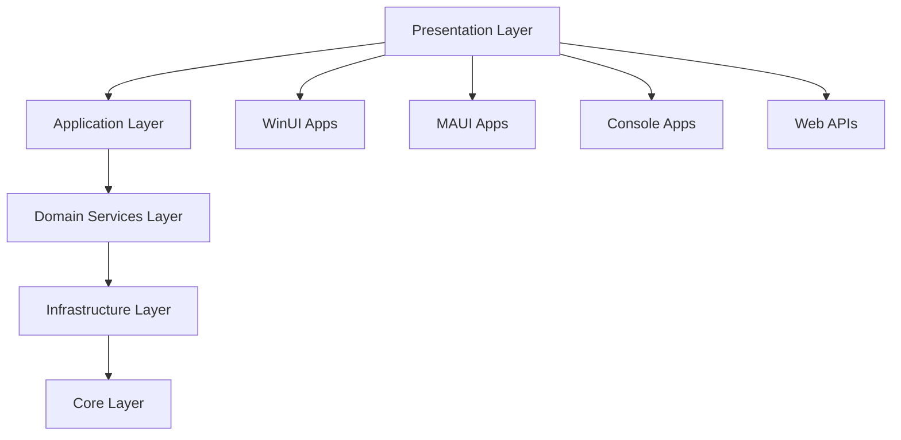

# Project Architecture

Deep dive into the system architecture design of Verdure Assistant.

## Overall Architecture

Verdure Assistant uses a layered architecture design with dependency injection and modular principles.



## Core Projects

### Project Structure

```
src/
├── Verdure.Assistant.Core/          # Core library - domain models and interfaces
├── Verdure.Assistant.ViewModels/    # View models - MVVM support
├── Verdure.Assistant.Console/       # Console application
├── Verdure.Assistant.WinUI/         # Windows desktop application
├── Verdure.Assistant.MAUI/          # Cross-platform mobile application
└── Verdure.Assistant.Api/           # Web API service
```

## Design Patterns

### 1. Dependency Injection Pattern

```csharp
public static class ServiceCollectionExtensions
{
    public static IServiceCollection AddVerdureServices(this IServiceCollection services)
    {
        services.AddSingleton<IAudioCodec, OpusCodec>();
        services.AddSingleton<IWebSocketClient, WebSocketClient>();
        services.AddScoped<IVoiceChatService, VoiceChatService>();
        
        return services;
    }
}
```

### 2. Observer Pattern

Used for event notifications and state updates:

```csharp
public class VoiceChatService : IVoiceChatService
{
    public event EventHandler<ChatMessage>? MessageReceived;
    public event EventHandler<DeviceState>? StateChanged;
    
    private void HandleWebSocketMessage(string message)
    {
        var chatMessage = JsonSerializer.Deserialize<ChatMessage>(message);
        MessageReceived?.Invoke(this, chatMessage);
    }
}
```

### 3. Factory Pattern

```csharp
public interface IVoiceChatServiceFactory
{
    IVoiceChatService Create(VoiceChatConfig config);
}

public class VoiceChatServiceFactory : IVoiceChatServiceFactory
{
    public IVoiceChatService Create(VoiceChatConfig config)
    {
        // Create service instance based on configuration
    }
}
```

## State Management

### State Machine Design

```csharp
public class VoiceStateMachine
{
    private readonly Dictionary<(DeviceState From, VoiceEvent Event), DeviceState> _transitions;
    
    public bool CanTransition(DeviceState from, VoiceEvent @event)
    {
        return _transitions.ContainsKey((from, @event));
    }
    
    public DeviceState GetNextState(DeviceState from, VoiceEvent @event)
    {
        if (_transitions.TryGetValue((from, @event), out var nextState))
        {
            return nextState;
        }
        throw new InvalidOperationException($"Cannot transition from {from} via {@event}");
    }
}
```

## Communication Architecture

### WebSocket Communication

```csharp
public class WebSocketManager
{
    private ClientWebSocket? _webSocket;
    public event EventHandler<WebSocketMessage>? MessageReceived;
    
    public async Task ConnectAsync(Uri serverUri)
    {
        _webSocket = new ClientWebSocket();
        await _webSocket.ConnectAsync(serverUri, CancellationToken.None);
        
        _ = Task.Run(ReceiveMessagesAsync);
    }
    
    public async Task SendAsync<T>(T message) where T : class
    {
        var json = JsonSerializer.Serialize(message);
        var buffer = Encoding.UTF8.GetBytes(json);
        
        await _webSocket.SendAsync(
            new ArraySegment<byte>(buffer),
            WebSocketMessageType.Text,
            true,
            CancellationToken.None);
    }
}
```

## Audio Processing Architecture

### Audio Pipeline Design

```csharp
public class AudioPipeline
{
    private readonly List<IAudioProcessor> _processors = new();
    
    public AudioPipeline AddProcessor(IAudioProcessor processor)
    {
        _processors.Add(processor);
        return this;
    }
    
    public async Task<byte[]> ProcessAsync(byte[] audioData)
    {
        byte[] result = audioData;
        
        foreach (var processor in _processors)
        {
            result = await processor.ProcessAsync(result);
        }
        
        return result;
    }
}
```

## UI Architecture Design

### MVVM Architecture Implementation

```csharp
public abstract class ViewModelBase : ObservableObject
{
    protected readonly ILogger _logger;
    
    protected ViewModelBase(ILogger logger)
    {
        _logger = logger;
    }
    
    public virtual Task InitializeAsync() => Task.CompletedTask;
    
    protected virtual void OnError(Exception exception)
    {
        _logger.LogError(exception, "ViewModel error occurred");
    }
}
```

## Configuration Management

### Layered Configuration System

```csharp
public class ConfigurationManager
{
    private readonly List<IConfigurationProvider> _providers = new();
    
    public async Task<T> GetValueAsync<T>(string key, T defaultValue = default)
    {
        foreach (var provider in _providers.OrderByDescending(p => p.Priority))
        {
            if (await provider.ContainsKeyAsync(key))
            {
                return await provider.GetValueAsync<T>(key);
            }
        }
        
        return defaultValue;
    }
}
```

## Testing Architecture

### Unit Testing Structure

```csharp
public abstract class UnitTestBase
{
    protected readonly IServiceProvider ServiceProvider;
    protected readonly Mock<ILogger> MockLogger;
    
    protected UnitTestBase()
    {
        var services = new ServiceCollection();
        ConfigureServices(services);
        ServiceProvider = services.BuildServiceProvider();
        
        MockLogger = new Mock<ILogger>();
    }
    
    protected T GetService<T>() => ServiceProvider.GetRequiredService<T>();
}
```

## Performance Monitoring

### Performance Metrics Collection

```csharp
public class PerformanceMetrics
{
    private readonly ConcurrentDictionary<string, PerformanceCounter> _counters = new();
    
    public void RecordLatency(string operation, TimeSpan duration)
    {
        var counter = _counters.GetOrAdd($"{operation}_latency", _ => new PerformanceCounter());
        counter.RecordValue(duration.TotalMilliseconds);
    }
    
    public PerformanceReport GenerateReport()
    {
        return new PerformanceReport
        {
            Timestamp = DateTime.UtcNow,
            Counters = _counters.ToDictionary(
                kvp => kvp.Key,
                kvp => kvp.Value.GetSnapshot())
        };
    }
}
```

## Next Steps

- [Choose a Project Type](/en/projects/) - Dive into specific project implementations
- [Development Environment](/en/development/visual-studio) - Set up efficient development environment
- [Debugging Tips](/en/development/debugging) - Learn debugging and troubleshooting skills

By understanding these architectural designs, you will:
- Understand modern .NET application design principles
- Master the practical application of layered architecture and design patterns
- Learn how to build testable, maintainable code
- Understand how to handle complex state management and asynchronous programming scenarios