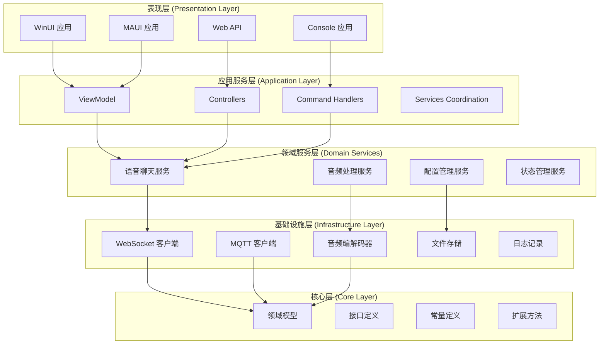

# 项目架构

本章将深入分析 Verdure Assistant 的系统架构设计，帮助您理解项目的设计理念、模块组织和扩展机制。

## 🏗️ 整体架构概览

Verdure Assistant 采用分层架构设计，结合依赖注入和模块化原则，实现了高内聚、低耦合的系统结构。



## 📁 项目结构分析

### 核心项目组织

```
src/
├── Verdure.Assistant.Core/          # 核心库 - 领域模型和接口
├── Verdure.Assistant.ViewModels/    # 视图模型 - MVVM 支持
├── Verdure.Assistant.Console/       # 控制台应用
├── Verdure.Assistant.WinUI/         # Windows 桌面应用
├── Verdure.Assistant.MAUI/          # 跨平台移动应用
└── Verdure.Assistant.Api/           # Web API 服务
```

### 核心库（Core）设计

Core 项目是整个系统的基础，定义了领域模型和核心接口：

```csharp
namespace Verdure.Assistant.Core
{
    // 领域模型
    public record ChatMessage(
        string Id,
        string Content,
        MessageType Type,
        DateTime Timestamp,
        string? UserId = null);
    
    public enum MessageType
    {
        User,
        Assistant,
        System,
        Audio
    }
    
    public enum DeviceState
    {
        Disconnected,
        Connecting,
        Connected,
        Listening,
        Speaking,
        Processing,
        Error
    }
    
    // 核心接口定义
    public interface IVoiceChatService
    {
        event EventHandler<ChatMessage>? MessageReceived;
        event EventHandler<DeviceState>? StateChanged;
        
        DeviceState CurrentState { get; }
        bool IsConnected { get; }
        
        Task StartVoiceChatAsync();
        Task StopVoiceChatAsync();
        Task SendTextMessageAsync(string text);
        Task<bool> SwitchKeywordModelAsync(string modelName);
    }
    
    public interface IAudioCodec
    {
        byte[] Encode(byte[] pcmData, int sampleRate, int channels);
        byte[] Decode(byte[] encodedData, int sampleRate, int channels);
    }
    
    public interface IWebSocketClient
    {
        event EventHandler<string>? MessageReceived;
        event EventHandler<bool>? ConnectionStateChanged;
        
        bool IsConnected { get; }
        Task ConnectAsync(Uri serverUri);
        Task DisconnectAsync();
        Task SendAsync(string message);
    }
}
```

## 🎯 设计模式应用

### 1. 依赖注入模式

项目广泛使用依赖注入实现控制反转：

```csharp
// 服务注册 (Program.cs)
public static class ServiceCollectionExtensions
{
    public static IServiceCollection AddVerdureServices(this IServiceCollection services)
    {
        // 核心服务
        services.AddSingleton<IAudioCodec, OpusCodec>();
        services.AddSingleton<IWebSocketClient, WebSocketClient>();
        services.AddScoped<IVoiceChatService, VoiceChatService>();
        
        // 音频服务
        services.AddSingleton<IAudioCaptureService, PortAudioCaptureService>();
        services.AddSingleton<IAudioPlaybackService, PortAudioPlaybackService>();
        
        // 配置服务
        services.AddSingleton<IConfigurationService, JsonConfigurationService>();
        services.AddSingleton<ISettingsService, SettingsService>();
        
        return services;
    }
}

// 服务使用
public class VoiceChatService : IVoiceChatService
{
    private readonly IAudioCodec _audioCodec;
    private readonly IWebSocketClient _webSocketClient;
    private readonly ILogger<VoiceChatService> _logger;
    
    public VoiceChatService(
        IAudioCodec audioCodec,
        IWebSocketClient webSocketClient,
        ILogger<VoiceChatService> logger)
    {
        _audioCodec = audioCodec;
        _webSocketClient = webSocketClient;
        _logger = logger;
    }
}
```

### 2. 观察者模式

用于事件通知和状态更新：

```csharp
public class VoiceChatService : IVoiceChatService
{
    public event EventHandler<ChatMessage>? MessageReceived;
    public event EventHandler<DeviceState>? StateChanged;
    
    private DeviceState _currentState = DeviceState.Disconnected;
    
    public DeviceState CurrentState
    {
        get => _currentState;
        private set
        {
            if (_currentState != value)
            {
                _currentState = value;
                StateChanged?.Invoke(this, value);
                _logger.LogInformation("状态变更: {State}", value);
            }
        }
    }
    
    private void HandleWebSocketMessage(string message)
    {
        var chatMessage = JsonSerializer.Deserialize<ChatMessage>(message);
        MessageReceived?.Invoke(this, chatMessage);
    }
}
```

### 3. 策略模式

用于不同平台的实现：

```csharp
public interface IAudioPlatformProvider
{
    Task<IAudioDevice[]> GetInputDevicesAsync();
    Task<IAudioDevice[]> GetOutputDevicesAsync();
    IAudioCapture CreateAudioCapture(IAudioDevice device);
    IAudioPlayback CreateAudioPlayback(IAudioDevice device);
}

#if WINDOWS
public class WindowsAudioProvider : IAudioPlatformProvider
{
    public async Task<IAudioDevice[]> GetInputDevicesAsync()
    {
        // Windows 特定实现
        return await GetWasapiInputDevicesAsync();
    }
    
    public IAudioCapture CreateAudioCapture(IAudioDevice device)
    {
        return new WasapiAudioCapture(device);
    }
}
#elif ANDROID
public class AndroidAudioProvider : IAudioPlatformProvider
{
    public async Task<IAudioDevice[]> GetInputDevicesAsync()
    {
        // Android 特定实现
        return await GetAndroidAudioDevicesAsync();
    }
    
    public IAudioCapture CreateAudioCapture(IAudioDevice device)
    {
        return new AndroidAudioCapture(device);
    }
}
#endif
```

### 4. 工厂模式

用于创建复杂对象：

```csharp
public interface IVoiceChatServiceFactory
{
    IVoiceChatService Create(VoiceChatConfig config);
}

public class VoiceChatServiceFactory : IVoiceChatServiceFactory
{
    private readonly IServiceProvider _serviceProvider;
    
    public VoiceChatServiceFactory(IServiceProvider serviceProvider)
    {
        _serviceProvider = serviceProvider;
    }
    
    public IVoiceChatService Create(VoiceChatConfig config)
    {
        // 根据配置创建不同的服务实例
        var audioCodec = config.CodecType switch
        {
            CodecType.Opus => _serviceProvider.GetRequiredService<OpusCodec>(),
            CodecType.PCM => _serviceProvider.GetRequiredService<PcmCodec>(),
            _ => throw new ArgumentException($"不支持的编解码器类型: {config.CodecType}")
        };
        
        var webSocketClient = new WebSocketClient(config.ServerUrl);
        
        return new VoiceChatService(
            audioCodec,
            webSocketClient,
            _serviceProvider.GetRequiredService<ILogger<VoiceChatService>>());
    }
}
```

## 🔄 状态管理架构

### 状态机设计

语音聊天服务使用状态机模式管理复杂的状态转换：

```csharp
public class VoiceStateMachine
{
    private readonly Dictionary<(DeviceState From, VoiceEvent Event), DeviceState> _transitions;
    
    public VoiceStateMachine()
    {
        _transitions = new Dictionary<(DeviceState, VoiceEvent), DeviceState>
        {
            { (DeviceState.Disconnected, VoiceEvent.Connect), DeviceState.Connecting },
            { (DeviceState.Connecting, VoiceEvent.Connected), DeviceState.Connected },
            { (DeviceState.Connected, VoiceEvent.StartListening), DeviceState.Listening },
            { (DeviceState.Listening, VoiceEvent.VoiceDetected), DeviceState.Processing },
            { (DeviceState.Processing, VoiceEvent.ResponseReceived), DeviceState.Speaking },
            { (DeviceState.Speaking, VoiceEvent.SpeechFinished), DeviceState.Connected },
            // ... 更多状态转换
        };
    }
    
    public bool CanTransition(DeviceState from, VoiceEvent @event)
    {
        return _transitions.ContainsKey((from, @event));
    }
    
    public DeviceState GetNextState(DeviceState from, VoiceEvent @event)
    {
        if (_transitions.TryGetValue((from, @event), out var nextState))
        {
            return nextState;
        }
        throw new InvalidOperationException($"无法从状态 {from} 通过事件 {@event} 进行转换");
    }
}

public enum VoiceEvent
{
    Connect,
    Connected,
    Disconnect,
    StartListening,
    StopListening,
    VoiceDetected,
    VoiceEnded,
    ResponseReceived,
    SpeechFinished,
    Error
}
```

### 全局状态管理

```csharp
public class ApplicationState
{
    private readonly ConcurrentDictionary<string, object> _state = new();
    private readonly Subject<StateChange> _stateChanges = new();
    
    public IObservable<StateChange> StateChanges => _stateChanges.AsObservable();
    
    public T GetValue<T>(string key, T defaultValue = default)
    {
        if (_state.TryGetValue(key, out var value) && value is T typedValue)
        {
            return typedValue;
        }
        return defaultValue;
    }
    
    public void SetValue<T>(string key, T value)
    {
        var oldValue = GetValue<T>(key);
        _state.AddOrUpdate(key, value, (k, v) => value);
        
        _stateChanges.OnNext(new StateChange
        {
            Key = key,
            OldValue = oldValue,
            NewValue = value,
            Timestamp = DateTime.UtcNow
        });
    }
}

public record StateChange
{
    public string Key { get; init; }
    public object? OldValue { get; init; }
    public object? NewValue { get; init; }
    public DateTime Timestamp { get; init; }
}
```

## 🌐 通信架构

### WebSocket 通信层

```csharp
public class WebSocketManager
{
    private ClientWebSocket? _webSocket;
    private readonly SemaphoreSlim _sendSemaphore = new(1, 1);
    private readonly CancellationTokenSource _cancellationTokenSource = new();
    
    public event EventHandler<WebSocketMessage>? MessageReceived;
    public event EventHandler<WebSocketState>? StateChanged;
    
    public async Task ConnectAsync(Uri serverUri)
    {
        _webSocket = new ClientWebSocket();
        
        // 配置 WebSocket
        _webSocket.Options.SetRequestHeader("User-Agent", "Verdure-Assistant/1.0");
        _webSocket.Options.KeepAliveInterval = TimeSpan.FromSeconds(30);
        
        await _webSocket.ConnectAsync(serverUri, _cancellationTokenSource.Token);
        
        // 开始监听消息
        _ = Task.Run(ReceiveMessagesAsync, _cancellationTokenSource.Token);
        
        StateChanged?.Invoke(this, _webSocket.State);
    }
    
    public async Task SendAsync<T>(T message) where T : class
    {
        if (_webSocket?.State != WebSocketState.Open)
        {
            throw new InvalidOperationException("WebSocket 未连接");
        }
        
        await _sendSemaphore.WaitAsync();
        try
        {
            var json = JsonSerializer.Serialize(message);
            var buffer = Encoding.UTF8.GetBytes(json);
            
            await _webSocket.SendAsync(
                new ArraySegment<byte>(buffer),
                WebSocketMessageType.Text,
                true,
                _cancellationTokenSource.Token);
        }
        finally
        {
            _sendSemaphore.Release();
        }
    }
    
    private async Task ReceiveMessagesAsync()
    {
        var buffer = new byte[8192];
        
        while (_webSocket?.State == WebSocketState.Open && !_cancellationTokenSource.Token.IsCancellationRequested)
        {
            try
            {
                var result = await _webSocket.ReceiveAsync(
                    new ArraySegment<byte>(buffer),
                    _cancellationTokenSource.Token);
                
                if (result.MessageType == WebSocketMessageType.Text)
                {
                    var message = Encoding.UTF8.GetString(buffer, 0, result.Count);
                    var webSocketMessage = JsonSerializer.Deserialize<WebSocketMessage>(message);
                    MessageReceived?.Invoke(this, webSocketMessage);
                }
            }
            catch (OperationCanceledException)
            {
                break;
            }
            catch (Exception ex)
            {
                // 处理接收错误
                OnError(ex);
            }
        }
    }
}
```

### 消息路由系统

```csharp
public class MessageRouter
{
    private readonly Dictionary<string, List<IMessageHandler>> _handlers = new();
    
    public void RegisterHandler<T>(IMessageHandler<T> handler) where T : class
    {
        var messageType = typeof(T).Name;
        
        if (!_handlers.ContainsKey(messageType))
        {
            _handlers[messageType] = new List<IMessageHandler>();
        }
        
        _handlers[messageType].Add(handler);
    }
    
    public async Task RouteMessageAsync(WebSocketMessage message)
    {
        if (_handlers.TryGetValue(message.Type, out var handlers))
        {
            var tasks = handlers.Select(handler => handler.HandleAsync(message));
            await Task.WhenAll(tasks);
        }
    }
}

public interface IMessageHandler
{
    Task HandleAsync(WebSocketMessage message);
}

public interface IMessageHandler<T> : IMessageHandler where T : class
{
    Task HandleAsync(T message);
    
    async Task IMessageHandler.HandleAsync(WebSocketMessage message)
    {
        if (JsonSerializer.Deserialize<T>(message.Payload) is T typedMessage)
        {
            await HandleAsync(typedMessage);
        }
    }
}
```

## 🎤 音频处理架构

### 音频管道设计

```csharp
public class AudioPipeline
{
    private readonly List<IAudioProcessor> _processors = new();
    
    public AudioPipeline AddProcessor(IAudioProcessor processor)
    {
        _processors.Add(processor);
        return this;
    }
    
    public async Task<byte[]> ProcessAsync(byte[] audioData)
    {
        byte[] result = audioData;
        
        foreach (var processor in _processors)
        {
            result = await processor.ProcessAsync(result);
        }
        
        return result;
    }
}

public interface IAudioProcessor
{
    Task<byte[]> ProcessAsync(byte[] audioData);
}

// 具体处理器实现
public class NoiseReductionProcessor : IAudioProcessor
{
    public async Task<byte[]> ProcessAsync(byte[] audioData)
    {
        // 噪声抑制算法实现
        return await ApplyNoiseReductionAsync(audioData);
    }
}

public class VolumeNormalizationProcessor : IAudioProcessor
{
    private readonly float _targetVolume;
    
    public VolumeNormalizationProcessor(float targetVolume = 0.8f)
    {
        _targetVolume = targetVolume;
    }
    
    public async Task<byte[]> ProcessAsync(byte[] audioData)
    {
        // 音量标准化处理
        return await NormalizeVolumeAsync(audioData, _targetVolume);
    }
}
```

### 音频缓冲管理

```csharp
public class CircularAudioBuffer
{
    private readonly byte[] _buffer;
    private readonly int _capacity;
    private int _writeIndex;
    private int _readIndex;
    private int _count;
    private readonly object _lock = new();
    
    public CircularAudioBuffer(int capacity)
    {
        _capacity = capacity;
        _buffer = new byte[capacity];
    }
    
    public bool Write(byte[] data)
    {
        lock (_lock)
        {
            if (_count + data.Length > _capacity)
            {
                return false; // 缓冲区满
            }
            
            for (int i = 0; i < data.Length; i++)
            {
                _buffer[_writeIndex] = data[i];
                _writeIndex = (_writeIndex + 1) % _capacity;
            }
            
            _count += data.Length;
            return true;
        }
    }
    
    public byte[] Read(int length)
    {
        lock (_lock)
        {
            length = Math.Min(length, _count);
            var result = new byte[length];
            
            for (int i = 0; i < length; i++)
            {
                result[i] = _buffer[_readIndex];
                _readIndex = (_readIndex + 1) % _capacity;
            }
            
            _count -= length;
            return result;
        }
    }
    
    public int AvailableBytes => _count;
    public int FreeBytes => _capacity - _count;
}
```

## 📱 UI 架构设计

### MVVM 架构实现

```csharp
// ViewModelBase 基类
public abstract class ViewModelBase : ObservableObject
{
    protected readonly ILogger _logger;
    
    protected ViewModelBase(ILogger logger)
    {
        _logger = logger;
    }
    
    public virtual Task InitializeAsync() => Task.CompletedTask;
    public virtual Task LoadedAsync() => Task.CompletedTask;
    public virtual Task UnloadedAsync() => Task.CompletedTask;
    
    protected virtual void OnError(Exception exception)
    {
        _logger.LogError(exception, "ViewModel 发生错误");
        // 可以通过事件通知 UI 显示错误信息
    }
}

// 具体 ViewModel 实现
public partial class HomePageViewModel : ViewModelBase
{
    private readonly IVoiceChatService _voiceChatService;
    
    [ObservableProperty]
    private ObservableCollection<ChatMessage> _messages = new();
    
    [ObservableProperty]
    private string _connectionStatus = "未连接";
    
    [ObservableProperty]
    private bool _isVoiceActive;
    
    public HomePageViewModel(
        IVoiceChatService voiceChatService,
        ILogger<HomePageViewModel> logger) : base(logger)
    {
        _voiceChatService = voiceChatService;
        _voiceChatService.MessageReceived += OnMessageReceived;
        _voiceChatService.StateChanged += OnStateChanged;
    }
    
    public override async Task InitializeAsync()
    {
        try
        {
            await _voiceChatService.InitializeAsync();
        }
        catch (Exception ex)
        {
            OnError(ex);
        }
    }
    
    [RelayCommand]
    private async Task ToggleVoiceAsync()
    {
        try
        {
            if (IsVoiceActive)
            {
                await _voiceChatService.StopVoiceChatAsync();
            }
            else
            {
                await _voiceChatService.StartVoiceChatAsync();
            }
        }
        catch (Exception ex)
        {
            OnError(ex);
        }
    }
    
    private void OnMessageReceived(object? sender, ChatMessage message)
    {
        // 在 UI 线程上更新集合
        Application.Current.Dispatcher.Invoke(() =>
        {
            Messages.Add(message);
        });
    }
    
    private void OnStateChanged(object? sender, DeviceState state)
    {
        IsVoiceActive = state == DeviceState.Listening;
        ConnectionStatus = GetStatusText(state);
    }
}
```

### 导航管理

```csharp
public interface INavigationService
{
    Task NavigateToAsync<T>() where T : class;
    Task NavigateToAsync<T>(object parameter) where T : class;
    Task GoBackAsync();
    bool CanGoBack { get; }
}

public class NavigationService : INavigationService
{
    private readonly Stack<Type> _navigationStack = new();
    private readonly IServiceProvider _serviceProvider;
    
    public bool CanGoBack => _navigationStack.Count > 1;
    
    public async Task NavigateToAsync<T>() where T : class
    {
        await NavigateToAsync<T>(null);
    }
    
    public async Task NavigateToAsync<T>(object parameter) where T : class
    {
        var pageType = typeof(T);
        var page = _serviceProvider.GetRequiredService<T>();
        
        if (page is Page wpfPage)
        {
            // WPF/WinUI 导航
            await NavigateToPageAsync(wpfPage, parameter);
        }
        else if (page is ContentPage mauiPage)
        {
            // MAUI 导航
            await Shell.Current.GoToAsync(pageType.Name, 
                parameter != null ? new Dictionary<string, object> { ["Parameter"] = parameter } : null);
        }
        
        _navigationStack.Push(pageType);
    }
    
    public async Task GoBackAsync()
    {
        if (CanGoBack)
        {
            _navigationStack.Pop();
            var previousPageType = _navigationStack.Peek();
            
            // 执行返回导航逻辑
            await NavigateBackToTypeAsync(previousPageType);
        }
    }
}
```

## 🔧 配置管理架构

### 分层配置系统

```csharp
public interface IConfigurationProvider
{
    int Priority { get; }
    Task<T> GetValueAsync<T>(string key);
    Task SetValueAsync<T>(string key, T value);
    Task<bool> ContainsKeyAsync(string key);
}

public class ConfigurationManager
{
    private readonly List<IConfigurationProvider> _providers = new();
    
    public void AddProvider(IConfigurationProvider provider)
    {
        _providers.Add(provider);
        _providers.Sort((x, y) => y.Priority.CompareTo(x.Priority));
    }
    
    public async Task<T> GetValueAsync<T>(string key, T defaultValue = default)
    {
        foreach (var provider in _providers)
        {
            if (await provider.ContainsKeyAsync(key))
            {
                return await provider.GetValueAsync<T>(key);
            }
        }
        
        return defaultValue;
    }
    
    public async Task SetValueAsync<T>(string key, T value)
    {
        // 使用优先级最高的可写提供程序
        var writableProvider = _providers.FirstOrDefault(p => p is IWritableConfigurationProvider);
        if (writableProvider is IWritableConfigurationProvider writable)
        {
            await writable.SetValueAsync(key, value);
        }
    }
}

// 具体提供程序实现
public class EnvironmentConfigurationProvider : IConfigurationProvider
{
    public int Priority => 100; // 环境变量优先级最高
    
    public Task<T> GetValueAsync<T>(string key)
    {
        var value = Environment.GetEnvironmentVariable(key);
        if (value != null)
        {
            return Task.FromResult(ConvertValue<T>(value));
        }
        throw new KeyNotFoundException($"环境变量 {key} 不存在");
    }
    
    public Task<bool> ContainsKeyAsync(string key)
    {
        return Task.FromResult(Environment.GetEnvironmentVariable(key) != null);
    }
}

public class JsonFileConfigurationProvider : IConfigurationProvider, IWritableConfigurationProvider
{
    public int Priority => 50;
    private readonly string _filePath;
    private Dictionary<string, object> _config = new();
    
    public async Task<T> GetValueAsync<T>(string key)
    {
        await LoadConfigIfNeededAsync();
        
        if (_config.TryGetValue(key, out var value))
        {
            return ConvertValue<T>(value);
        }
        
        throw new KeyNotFoundException($"配置项 {key} 不存在");
    }
    
    public async Task SetValueAsync<T>(string key, T value)
    {
        await LoadConfigIfNeededAsync();
        _config[key] = value;
        await SaveConfigAsync();
    }
}
```

## 🧪 测试架构

### 测试分层结构

```csharp
// 单元测试基类
public abstract class UnitTestBase
{
    protected readonly IServiceProvider ServiceProvider;
    protected readonly Mock<ILogger> MockLogger;
    
    protected UnitTestBase()
    {
        var services = new ServiceCollection();
        ConfigureServices(services);
        ServiceProvider = services.BuildServiceProvider();
        
        MockLogger = new Mock<ILogger>();
    }
    
    protected virtual void ConfigureServices(IServiceCollection services)
    {
        // 注册测试用的模拟服务
        services.AddSingleton(MockLogger.Object);
    }
    
    protected T GetService<T>() => ServiceProvider.GetRequiredService<T>();
    protected Mock<T> GetMock<T>() where T : class => Mock.Get(GetService<T>());
}

// 具体测试类
public class VoiceChatServiceTests : UnitTestBase
{
    private readonly Mock<IAudioCodec> _mockAudioCodec;
    private readonly Mock<IWebSocketClient> _mockWebSocketClient;
    private readonly VoiceChatService _sut; // System Under Test
    
    public VoiceChatServiceTests()
    {
        _mockAudioCodec = new Mock<IAudioCodec>();
        _mockWebSocketClient = new Mock<IWebSocketClient>();
        
        _sut = new VoiceChatService(
            _mockAudioCodec.Object,
            _mockWebSocketClient.Object,
            MockLogger.Object);
    }
    
    [Fact]
    public async Task StartVoiceChatAsync_WhenCalled_ShouldConnectWebSocket()
    {
        // Arrange
        _mockWebSocketClient.Setup(x => x.ConnectAsync(It.IsAny<Uri>()))
            .Returns(Task.CompletedTask);
        
        // Act
        await _sut.StartVoiceChatAsync();
        
        // Assert
        _mockWebSocketClient.Verify(x => x.ConnectAsync(It.IsAny<Uri>()), Times.Once);
        Assert.Equal(DeviceState.Connected, _sut.CurrentState);
    }
}
```

### 集成测试框架

```csharp
public class IntegrationTestFixture : IDisposable
{
    public WebApplicationFactory<Program> Factory { get; }
    public HttpClient HttpClient { get; }
    
    public IntegrationTestFixture()
    {
        Factory = new WebApplicationFactory<Program>()
            .WithWebHostBuilder(builder =>
            {
                builder.ConfigureServices(services =>
                {
                    // 替换真实服务为测试用的模拟服务
                    services.RemoveAll<IVoiceChatService>();
                    services.AddSingleton<Mock<IVoiceChatService>>();
                    services.AddSingleton<IVoiceChatService>(provider => 
                        provider.GetRequiredService<Mock<IVoiceChatService>>().Object);
                });
            });
            
        HttpClient = Factory.CreateClient();
    }
    
    public void Dispose()
    {
        HttpClient?.Dispose();
        Factory?.Dispose();
    }
}
```

## 🔍 性能监控架构

### 性能指标收集

```csharp
public class PerformanceMetrics
{
    private readonly ConcurrentDictionary<string, PerformanceCounter> _counters = new();
    
    public void IncrementCounter(string name, double value = 1.0)
    {
        var counter = _counters.GetOrAdd(name, _ => new PerformanceCounter());
        counter.Increment(value);
    }
    
    public void RecordLatency(string operation, TimeSpan duration)
    {
        var counter = _counters.GetOrAdd($"{operation}_latency", _ => new PerformanceCounter());
        counter.RecordValue(duration.TotalMilliseconds);
    }
    
    public PerformanceReport GenerateReport()
    {
        return new PerformanceReport
        {
            Timestamp = DateTime.UtcNow,
            Counters = _counters.ToDictionary(
                kvp => kvp.Key,
                kvp => kvp.Value.GetSnapshot())
        };
    }
}

// 性能监控中间件
public class PerformanceMonitoringMiddleware
{
    private readonly RequestDelegate _next;
    private readonly PerformanceMetrics _metrics;
    
    public async Task InvokeAsync(HttpContext context)
    {
        var stopwatch = Stopwatch.StartNew();
        
        try
        {
            await _next(context);
            _metrics.IncrementCounter("requests_success");
        }
        catch (Exception)
        {
            _metrics.IncrementCounter("requests_error");
            throw;
        }
        finally
        {
            stopwatch.Stop();
            _metrics.RecordLatency("request_duration", stopwatch.Elapsed);
        }
    }
}
```

## 📚 下一步学习

理解了项目架构后，您可以：

1. **[选择具体项目](/zh/projects/)** - 深入学习感兴趣的项目类型
2. **[开发环境配置](/zh/development/visual-studio)** - 设置高效的开发环境
3. **[调试技巧](/zh/development/debugging)** - 掌握调试和故障排除技能

---

通过深入理解这些架构设计，您将能够：
- 理解现代 .NET 应用的设计理念
- 掌握分层架构和设计模式的实际应用
- 学会如何构建可测试、可维护的代码
- 了解如何处理复杂的状态管理和异步编程场景

这些架构知识不仅适用于 Verdure Assistant，也是现代软件开发的通用最佳实践。