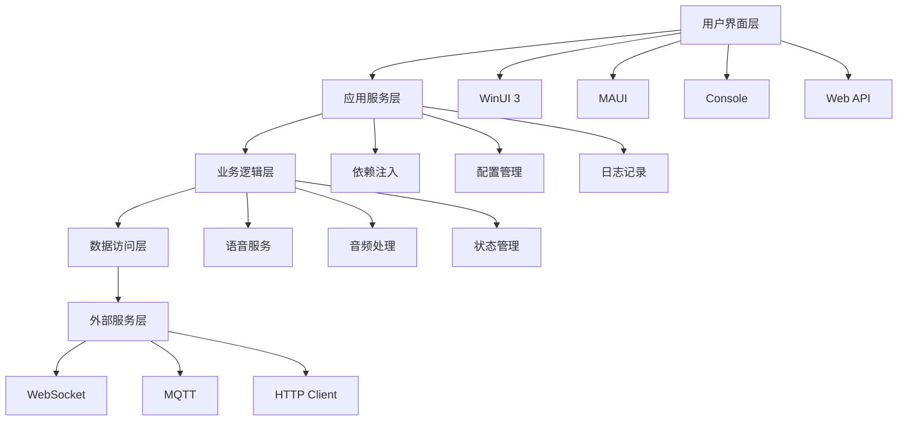

# 技术栈介绍

Verdure Assistant 采用现代化的技术栈，基于 .NET 9 构建。本章将深入介绍项目中使用的各种技术和框架，帮助您理解项目的技术选型和设计理念。

## 🏗️ 整体技术架构



## 🎯 核心技术栈

### .NET 9 平台

**.NET 9** 是微软最新的跨平台开发框架，为项目提供了强大的基础能力。

#### 关键特性
```csharp
// .NET 9 的新特性示例

// 1. 性能优化的集合操作
var numbers = [1, 2, 3, 4, 5];
var evenNumbers = numbers.Where(x => x % 2 == 0).ToArray();

// 2. 增强的模式匹配
string GetDescription(object obj) => obj switch
{
    int n when n > 0 => "正整数",
    int n when n < 0 => "负整数",
    string s when !string.IsNullOrEmpty(s) => "非空字符串",
    _ => "其他类型"
};

// 3. 改进的异步编程
await foreach (var item in GetItemsAsync())
{
    await ProcessItemAsync(item);
}
```

#### 项目中的应用
- **跨平台兼容性**：在 Windows、Linux、macOS 上运行
- **性能优化**：JIT 编译器优化，启动速度提升
- **内存管理**：垃圾回收器改进，内存占用降低
- **异步编程**：原生支持 async/await 模式

### C# 12 语言特性

项目充分利用了 C# 12 的现代语言特性：

#### Primary Constructors（主构造函数）
```csharp
// 传统写法
public class AudioService
{
    private readonly ILogger<AudioService> _logger;
    
    public AudioService(ILogger<AudioService> logger)
    {
        _logger = logger;
    }
}

// C# 12 主构造函数写法
public class AudioService(ILogger<AudioService> logger)
{
    public void PlaySound() => logger.LogInformation("Playing sound...");
}
```

#### Collection Expressions（集合表达式）
```csharp
// 传统写法
var supportedFormats = new List<string> { "wav", "mp3", "opus" };

// C# 12 集合表达式
var supportedFormats = ["wav", "mp3", "opus"];
```

#### 增强的 Using 声明
```csharp
// 自动资源管理
using var audioStream = new FileStream("audio.wav", FileMode.Open);
// audioStream 在作用域结束时自动释放
```

## 🎤 音频处理技术

### Opus 编解码器

**Opus** 是项目的核心音频编解码技术，提供高质量、低延迟的音频处理。

```csharp
public interface IAudioCodec
{
    byte[] Encode(byte[] pcmData, int sampleRate, int channels);
    byte[] Decode(byte[] encodedData, int sampleRate, int channels);
}

public class OpusCodec : IAudioCodec
{
    private readonly OpusEncoder _encoder;
    private readonly OpusDecoder _decoder;
    
    public OpusCodec(int sampleRate, int channels)
    {
        _encoder = new OpusEncoder(sampleRate, channels, Application.Audio);
        _decoder = new OpusDecoder(sampleRate, channels);
    }
    
    public byte[] Encode(byte[] pcmData, int sampleRate, int channels)
    {
        // Opus 编码实现
        return _encoder.Encode(pcmData);
    }
    
    public byte[] Decode(byte[] encodedData, int sampleRate, int channels)
    {
        // Opus 解码实现
        return _decoder.Decode(encodedData);
    }
}
```

#### 技术优势
- **高压缩率**：在保证音质的前提下大幅减小文件大小
- **低延迟**：实时语音处理的理想选择
- **自适应**：根据网络状况动态调整编码参数
- **跨平台**：在所有支持的平台上表现一致

### 音频采集与播放

#### PortAudio 集成
```csharp
public class AudioCaptureService : IAudioCaptureService
{
    private PortAudioSharp.PortAudio _portAudio;
    private Stream _inputStream;
    
    public async Task<byte[]> CaptureAudioAsync(int durationMs)
    {
        var buffer = new byte[GetBufferSize(durationMs)];
        await _inputStream.ReadAsync(buffer, 0, buffer.Length);
        return buffer;
    }
    
    public async Task PlayAudioAsync(byte[] audioData)
    {
        await _outputStream.WriteAsync(audioData, 0, audioData.Length);
    }
}
```

## 🌐 通信协议

### WebSocket 实时通信

WebSocket 提供全双工通信能力，支持实时语音数据传输。

```csharp
public class WebSocketClient : IWebSocketClient
{
    private ClientWebSocket _webSocket;
    
    public async Task ConnectAsync(Uri serverUri)
    {
        _webSocket = new ClientWebSocket();
        await _webSocket.ConnectAsync(serverUri, CancellationToken.None);
        
        // 开始监听消息
        _ = Task.Run(ListenForMessagesAsync);
    }
    
    public async Task SendAudioAsync(byte[] audioData)
    {
        var message = CreateAudioMessage(audioData);
        var buffer = Encoding.UTF8.GetBytes(JsonSerializer.Serialize(message));
        
        await _webSocket.SendAsync(
            new ArraySegment<byte>(buffer),
            WebSocketMessageType.Text,
            true,
            CancellationToken.None);
    }
    
    private async Task ListenForMessagesAsync()
    {
        var buffer = new byte[4096];
        while (_webSocket.State == WebSocketState.Open)
        {
            var result = await _webSocket.ReceiveAsync(
                new ArraySegment<byte>(buffer),
                CancellationToken.None);
                
            if (result.MessageType == WebSocketMessageType.Text)
            {
                var message = Encoding.UTF8.GetString(buffer, 0, result.Count);
                await HandleMessageAsync(message);
            }
        }
    }
}
```

### MQTT 物联网通信

支持 MQTT 协议用于物联网设备集成：

```csharp
public class MqttClientService : IMqttClientService
{
    private IMqttClient _mqttClient;
    
    public async Task ConnectAsync(string brokerAddress)
    {
        var factory = new MqttFactory();
        _mqttClient = factory.CreateMqttClient();
        
        var options = new MqttClientOptionsBuilder()
            .WithTcpServer(brokerAddress)
            .Build();
            
        await _mqttClient.ConnectAsync(options);
    }
    
    public async Task PublishVoiceCommandAsync(string command)
    {
        var message = new MqttApplicationMessageBuilder()
            .WithTopic("verdure/voice/command")
            .WithPayload(command)
            .Build();
            
        await _mqttClient.PublishAsync(message);
    }
}
```

## 📱 用户界面技术

### WinUI 3 桌面应用

WinUI 3 是 Windows 平台的现代 UI 框架：

```xml
<!-- MainWindow.xaml -->
<Grid>
    <Grid.RowDefinitions>
        <RowDefinition Height="Auto"/>
        <RowDefinition Height="*"/>
        <RowDefinition Height="Auto"/>
    </Grid.RowDefinitions>
    
    <!-- 标题栏 -->
    <Border Grid.Row="0" Background="{ThemeResource SystemAccentColor}">
        <TextBlock Text="绿荫助手" Style="{StaticResource TitleTextBlockStyle}"/>
    </Border>
    
    <!-- 主内容区 -->
    <ScrollViewer Grid.Row="1">
        <StackPanel Spacing="16" Padding="24">
            <!-- 语音波形显示 -->
            <controls:VoiceWaveform x:Name="VoiceWave"/>
            
            <!-- 控制按钮 -->
            <StackPanel Orientation="Horizontal" Spacing="12">
                <Button Command="{x:Bind ViewModel.StartVoiceCommand}">
                    <StackPanel Orientation="Horizontal" Spacing="8">
                        <FontIcon Glyph="&#xE1D6;"/>
                        <TextBlock Text="开始语音"/>
                    </StackPanel>
                </Button>
                
                <Button Command="{x:Bind ViewModel.StopVoiceCommand}">
                    <StackPanel Orientation="Horizontal" Spacing="8">
                        <FontIcon Glyph="&#xE15B;"/>
                        <TextBlock Text="停止语音"/>
                    </StackPanel>
                </Button>
            </StackPanel>
        </StackPanel>
    </ScrollViewer>
</Grid>
```

对应的 ViewModel：
```csharp
public partial class MainViewModel : ObservableObject
{
    private readonly IVoiceChatService _voiceChatService;
    
    public MainViewModel(IVoiceChatService voiceChatService)
    {
        _voiceChatService = voiceChatService;
    }
    
    [RelayCommand]
    private async Task StartVoiceAsync()
    {
        await _voiceChatService.StartVoiceChatAsync();
    }
    
    [RelayCommand] 
    private async Task StopVoiceAsync()
    {
        await _voiceChatService.StopVoiceChatAsync();
    }
}
```

### .NET MAUI 跨平台应用

MAUI 支持 iOS、Android、macOS、Windows 平台：

```csharp
// MauiProgram.cs
public static class MauiProgram
{
    public static MauiApp CreateMauiApp()
    {
        var builder = MauiApp.CreateBuilder();
        builder
            .UseMauiApp<App>()
            .ConfigureFonts(fonts =>
            {
                fonts.AddFont("OpenSans-Regular.ttf", "OpenSansRegular");
            });
            
        // 注册服务
        builder.Services.AddSingleton<IVoiceChatService, VoiceChatService>();
        builder.Services.AddTransient<MainPage>();
        builder.Services.AddTransient<MainPageViewModel>();
        
        return builder.Build();
    }
}
```

跨平台权限处理：
```csharp
public class PlatformService : IPlatformService
{
    public async Task<bool> RequestMicrophonePermissionAsync()
    {
#if ANDROID
        var status = await Permissions.RequestAsync<Permissions.Microphone>();
        return status == PermissionStatus.Granted;
#elif IOS
        var authStatus = AVAudioSession.SharedInstance().RecordPermission;
        if (authStatus == AVAudioSessionRecordPermission.Undetermined)
        {
            var granted = await AVAudioSession.SharedInstance().RequestRecordPermissionAsync();
            return granted;
        }
        return authStatus == AVAudioSessionRecordPermission.Granted;
#else
        return true; // Desktop platforms
#endif
    }
}
```

## ⚙️ 架构模式

### 依赖注入（DI）

项目采用 Microsoft.Extensions.DependencyInjection：

```csharp
// Program.cs - 服务注册
var builder = Host.CreateApplicationBuilder(args);

// 核心服务
builder.Services.AddSingleton<IAudioCodec, OpusCodec>();
builder.Services.AddSingleton<IWebSocketClient, WebSocketClient>();
builder.Services.AddScoped<IVoiceChatService, VoiceChatService>();

// 配置服务
builder.Services.Configure<AppConfig>(
    builder.Configuration.GetSection("AppConfig"));

// 日志服务
builder.Services.AddLogging(logging =>
{
    logging.AddConsole();
    logging.AddDebug();
});

var app = builder.Build();
```

### MVVM 模式

使用 CommunityToolkit.Mvvm 实现 MVVM：

```csharp
[ObservableObject]
public partial class HomePageViewModel
{
    private readonly IVoiceChatService _voiceChatService;
    
    [ObservableProperty]
    private string _connectionStatus = "未连接";
    
    [ObservableProperty]
    private bool _isVoiceActive;
    
    [ObservableProperty]
    private ObservableCollection<ChatMessage> _messages = new();
    
    public HomePageViewModel(IVoiceChatService voiceChatService)
    {
        _voiceChatService = voiceChatService;
        _voiceChatService.ConnectionStatusChanged += OnConnectionStatusChanged;
    }
    
    [RelayCommand]
    private async Task ToggleVoiceAsync()
    {
        if (IsVoiceActive)
        {
            await _voiceChatService.StopVoiceChatAsync();
        }
        else
        {
            await _voiceChatService.StartVoiceChatAsync();
        }
    }
    
    partial void OnConnectionStatusChanged(string status)
    {
        ConnectionStatus = status;
    }
}
```

### Repository 模式

数据访问抽象：

```csharp
public interface IConfigurationRepository
{
    Task<T> GetAsync<T>(string key);
    Task SetAsync<T>(string key, T value);
    Task<Dictionary<string, object>> GetAllAsync();
}

public class JsonConfigurationRepository : IConfigurationRepository
{
    private readonly string _configPath;
    
    public JsonConfigurationRepository(IOptions<StorageOptions> options)
    {
        _configPath = options.Value.ConfigFilePath;
    }
    
    public async Task<T> GetAsync<T>(string key)
    {
        var config = await LoadConfigAsync();
        if (config.TryGetValue(key, out var value))
        {
            return JsonSerializer.Deserialize<T>(value.ToString());
        }
        return default(T);
    }
    
    public async Task SetAsync<T>(string key, T value)
    {
        var config = await LoadConfigAsync();
        config[key] = JsonSerializer.Serialize(value);
        await SaveConfigAsync(config);
    }
}
```

## 🧪 测试框架

### 单元测试

使用 xUnit 和 Moq：

```csharp
public class VoiceChatServiceTests
{
    private readonly Mock<IAudioCodec> _mockAudioCodec;
    private readonly Mock<IWebSocketClient> _mockWebSocketClient;
    private readonly VoiceChatService _service;
    
    public VoiceChatServiceTests()
    {
        _mockAudioCodec = new Mock<IAudioCodec>();
        _mockWebSocketClient = new Mock<IWebSocketClient>();
        _service = new VoiceChatService(_mockAudioCodec.Object, _mockWebSocketClient.Object);
    }
    
    [Fact]
    public async Task StartVoiceChatAsync_ShouldConnectWebSocket()
    {
        // Arrange
        _mockWebSocketClient.Setup(x => x.ConnectAsync(It.IsAny<Uri>()))
            .Returns(Task.CompletedTask);
        
        // Act
        await _service.StartVoiceChatAsync();
        
        // Assert
        _mockWebSocketClient.Verify(x => x.ConnectAsync(It.IsAny<Uri>()), Times.Once);
        Assert.True(_service.IsConnected);
    }
}
```

### 集成测试

```csharp
public class ApiIntegrationTests : IClassFixture<WebApplicationFactory<Program>>
{
    private readonly WebApplicationFactory<Program> _factory;
    private readonly HttpClient _client;
    
    public ApiIntegrationTests(WebApplicationFactory<Program> factory)
    {
        _factory = factory;
        _client = _factory.CreateClient();
    }
    
    [Fact]
    public async Task GetStatus_ReturnsSuccessAndCorrectContentType()
    {
        // Act
        var response = await _client.GetAsync("/api/status");
        
        // Assert
        response.EnsureSuccessStatusCode();
        Assert.Equal("application/json; charset=utf-8", 
            response.Content.Headers.ContentType.ToString());
    }
}
```

## 📊 性能监控

### 应用性能监控（APM）

```csharp
public class PerformanceMiddleware
{
    private readonly RequestDelegate _next;
    private readonly ILogger<PerformanceMiddleware> _logger;
    
    public PerformanceMiddleware(RequestDelegate next, ILogger<PerformanceMiddleware> logger)
    {
        _next = next;
        _logger = logger;
    }
    
    public async Task InvokeAsync(HttpContext context)
    {
        var stopwatch = Stopwatch.StartNew();
        
        await _next(context);
        
        stopwatch.Stop();
        
        if (stopwatch.ElapsedMilliseconds > 1000) // 超过1秒记录警告
        {
            _logger.LogWarning("慢请求: {Method} {Path} 耗时 {ElapsedMilliseconds}ms",
                context.Request.Method,
                context.Request.Path,
                stopwatch.ElapsedMilliseconds);
        }
    }
}
```

### 内存使用监控

```csharp
public class MemoryMetrics
{
    public static void LogMemoryUsage(ILogger logger)
    {
        var gc = GC.GetTotalMemory(false);
        var workingSet = Environment.WorkingSet;
        
        logger.LogInformation("内存使用情况 - GC: {GCMemory:N0} bytes, WorkingSet: {WorkingSet:N0} bytes",
            gc, workingSet);
    }
}
```

## 🔒 安全特性

### 数据加密

```csharp
public class EncryptionService : IEncryptionService
{
    private readonly byte[] _key;
    private readonly byte[] _iv;
    
    public string Encrypt(string plainText)
    {
        using var aes = Aes.Create();
        aes.Key = _key;
        aes.IV = _iv;
        
        var encryptor = aes.CreateEncryptor();
        var plainBytes = Encoding.UTF8.GetBytes(plainText);
        var encryptedBytes = encryptor.TransformFinalBlock(plainBytes, 0, plainBytes.Length);
        
        return Convert.ToBase64String(encryptedBytes);
    }
    
    public string Decrypt(string cipherText)
    {
        using var aes = Aes.Create();
        aes.Key = _key;
        aes.IV = _iv;
        
        var decryptor = aes.CreateDecryptor();
        var encryptedBytes = Convert.FromBase64String(cipherText);
        var decryptedBytes = decryptor.TransformFinalBlock(encryptedBytes, 0, encryptedBytes.Length);
        
        return Encoding.UTF8.GetString(decryptedBytes);
    }
}
```

## 📚 学习资源

### 官方文档
- [.NET 9 文档](https://docs.microsoft.com/dotnet/core/whats-new/dotnet-9)
- [C# 12 新特性](https://docs.microsoft.com/dotnet/csharp/whats-new/csharp-12)
- [WinUI 3 文档](https://docs.microsoft.com/windows/apps/winui/)
- [.NET MAUI 文档](https://docs.microsoft.com/dotnet/maui/)

### 社区资源
- [.NET Community Toolkit](https://github.com/CommunityToolkit/dotnet)
- [Awesome .NET](https://github.com/quozd/awesome-dotnet)
- [.NET Foundation](https://dotnetfoundation.org/)

## 🎯 下一步

了解技术栈后，您可以：

1. **[项目架构](/zh/guide/architecture)** - 深入理解系统架构设计
2. **[API 项目](/zh/projects/api)** - 学习后端服务开发
3. **[WinUI 项目](/zh/projects/winui)** - 掌握桌面应用开发
4. **[MAUI 项目](/zh/projects/maui)** - 学习跨平台移动开发

---

通过深入理解这些技术栈，您将具备开发现代 .NET 应用的所有必要知识。每一项技术都有其特定的应用场景和优势，合理组合使用能够构建出高性能、可维护的应用程序。