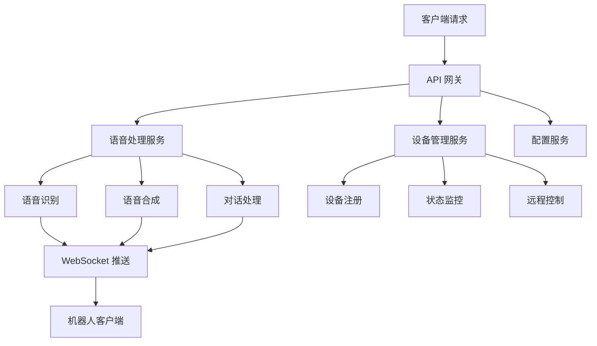

# API 服务项目 (树莓派机器人)

Verdure.Assistant.Api 是项目的服务端组件，专为树莓派等嵌入式设备设计，提供 RESTful API 和 WebSocket 服务，是整个智能助手系统的核心后端。

## 🎯 项目概述

### 设计目标

- **🤖 机器人后端**：为树莓派机器人提供智能语音服务
- **📡 IoT 集成**：支持物联网设备的连接和管理
- **⚡ 高性能**：优化的资源使用，适合嵌入式环境
- **🔄 实时通信**：WebSocket 支持实时双向通信
- **🌐 标准接口**：RESTful API 设计，易于集成

### 核心功能



## 🏗️ 项目结构

### 目录组织

```
src/Verdure.Assistant.Api/
├── Controllers/                 # API 控制器
│   ├── VoiceController.cs      # 语音相关接口
│   ├── DeviceController.cs     # 设备管理接口
│   └── ConfigController.cs     # 配置管理接口
├── Services/                   # 业务服务
│   ├── VoiceChatService.cs     # 语音聊天服务
│   ├── DeviceManagerService.cs # 设备管理服务
│   └── ConfigurationService.cs # 配置服务
├── Hubs/                       # SignalR Hubs
│   └── VoiceChatHub.cs         # 语音聊天中心
├── Models/                     # 数据模型
│   ├── Requests/               # 请求模型
│   ├── Responses/              # 响应模型
│   └── DTOs/                   # 数据传输对象
├── Middleware/                 # 中间件
│   ├── AuthenticationMiddleware.cs
│   ├── LoggingMiddleware.cs
│   └── ExceptionHandlingMiddleware.cs
├── Configuration/              # 配置文件
│   ├── appsettings.json
│   ├── appsettings.Development.json
│   └── appsettings.Production.json
└── Program.cs                  # 程序入口
```

## 🚀 快速开始

### 环境要求

- **.NET 9.0 SDK**
- **Linux ARM64** (树莓派 4 推荐) 或任何支持 .NET 的系统
- **至少 1GB RAM** (推荐 2GB+)
- **网络连接** (用于语音服务调用)

### 本地开发运行

1. **克隆并进入项目目录**

```bash
git clone https://github.com/maker-community/Verdure.Assistant.git
cd Verdure.Assistant/src/Verdure.Assistant.Api
```

2. **配置 appsettings.json**

```json
{
  "Logging": {
    "LogLevel": {
      "Default": "Information",
      "Microsoft.AspNetCore": "Warning"
    }
  },
  "AllowedHosts": "*",
  "VoiceService": {
    "ServerUrl": "wss://api.tenclass.net/xiaozhi/v1/",
    "ApiKey": "your-api-key-here",
    "EnableVoice": true,
    "AudioSampleRate": 16000,
    "AudioChannels": 1
  },
  "DeviceManagement": {
    "AllowDeviceRegistration": true,
    "MaxDevices": 10,
    "TokenExpiration": "24:00:00"
  },
  "Mqtt": {
    "BrokerAddress": "localhost",
    "Port": 1883,
    "Username": "",
    "Password": ""
  }
}
```

3. **运行项目**

```bash
# 开发模式
dotnet run

# 或指定配置
dotnet run --configuration Release --environment Production
```

4. **验证服务**

```bash
# 检查健康状态
curl http://localhost:5000/health

# 检查 API 文档
open http://localhost:5000/swagger
```

## 📡 API 接口文档

### 语音服务接口

#### 开始语音会话

```http
POST /api/voice/start
Content-Type: application/json

{
  "deviceId": "raspberry-pi-001",
  "userId": "user123",
  "sessionConfig": {
    "audioFormat": "opus",
    "sampleRate": 16000,
    "channels": 1,
    "autoMode": true
  }
}
```

**响应：**

```json
{
  "sessionId": "sess-uuid-12345",
  "status": "started",
  "websocketUrl": "ws://localhost:5000/voice-hub",
  "message": "语音会话已启动"
}
```

#### 停止语音会话

```http
POST /api/voice/stop
Content-Type: application/json

{
  "sessionId": "sess-uuid-12345"
}
```

#### 发送文本消息

```http
POST /api/voice/message
Content-Type: application/json

{
  "sessionId": "sess-uuid-12345",
  "text": "今天天气怎么样？",
  "messageType": "text"
}
```

### 设备管理接口

#### 设备注册

```http
POST /api/device/register
Content-Type: application/json

{
  "deviceId": "raspberry-pi-001",
  "deviceName": "客厅小助手",
  "deviceType": "raspberry-pi",
  "capabilities": ["voice", "audio", "led"],
  "location": "living-room"
}
```

**响应：**

```json
{
  "deviceToken": "eyJhbGciOiJIUzI1NiIs...",
  "expiresAt": "2024-12-09T10:00:00Z",
  "deviceInfo": {
    "id": "raspberry-pi-001",
    "name": "客厅小助手",
    "status": "online",
    "lastSeen": "2024-12-08T10:00:00Z"
  }
}
```

#### 设备状态更新

```http
PUT /api/device/{deviceId}/status
Authorization: Bearer {deviceToken}
Content-Type: application/json

{
  "status": "online",
  "batteryLevel": 85,
  "temperature": 45.2,
  "memoryUsage": 768,
  "cpuUsage": 15.5
}
```

#### 获取设备列表

```http
GET /api/device/list
Authorization: Bearer {adminToken}
```

**响应：**

```json
{
  "devices": [
    {
      "id": "raspberry-pi-001",
      "name": "客厅小助手",
      "type": "raspberry-pi",
      "status": "online",
      "location": "living-room",
      "lastSeen": "2024-12-08T10:00:00Z",
      "metrics": {
        "batteryLevel": 85,
        "temperature": 45.2,
        "memoryUsage": 768,
        "cpuUsage": 15.5
      }
    }
  ],
  "totalCount": 1
}
```

### 配置管理接口

#### 获取配置

```http
GET /api/config/{category}
Authorization: Bearer {deviceToken}
```

例如：`GET /api/config/voice` 返回语音相关配置

#### 更新配置

```http
PUT /api/config/{category}
Authorization: Bearer {adminToken}
Content-Type: application/json

{
  "audioSampleRate": 16000,
  "enableNoiseReduction": true,
  "wakeWords": ["你好小电", "你好小娜"]
}
```

## 🔌 WebSocket 实时通信

### VoiceChatHub 连接

```javascript
// JavaScript 客户端示例
const connection = new signalR.HubConnectionBuilder()
    .withUrl("/voice-hub")
    .build();

// 连接到 Hub
await connection.start();

// 加入语音会话
await connection.invoke("JoinSession", sessionId, deviceToken);

// 监听语音数据
connection.on("AudioData", (audioData) => {
    // 处理接收到的音频数据
    playAudio(audioData);
});

// 发送语音数据
await connection.invoke("SendAudioData", sessionId, audioDataBase64);
```

### Hub 方法说明

#### JoinSession

```csharp
public async Task JoinSession(string sessionId, string deviceToken)
{
    // 验证设备令牌
    var device = await _deviceService.ValidateTokenAsync(deviceToken);
    if (device == null)
    {
        await Clients.Caller.SendAsync("Error", "无效的设备令牌");
        return;
    }
    
    // 加入会话组
    await Groups.AddToGroupAsync(Context.ConnectionId, $"session-{sessionId}");
    await Clients.Caller.SendAsync("SessionJoined", sessionId);
}
```

#### SendAudioData

```csharp
public async Task SendAudioData(string sessionId, string audioDataBase64)
{
    try
    {
        var audioData = Convert.FromBase64String(audioDataBase64);
        
        // 处理音频数据
        var processedAudio = await _voiceService.ProcessAudioAsync(audioData);
        
        // 广播到会话组
        await Clients.Group($"session-{sessionId}")
            .SendAsync("AudioProcessed", processedAudio);
    }
    catch (Exception ex)
    {
        await Clients.Caller.SendAsync("Error", ex.Message);
    }
}
```

## 🔧 核心服务实现

### VoiceChatService

语音聊天服务的核心实现：

```csharp
public class VoiceChatService : IVoiceChatService
{
    private readonly IWebSocketClient _webSocketClient;
    private readonly IAudioCodec _audioCodec;
    private readonly IDeviceManagerService _deviceManager;
    private readonly ILogger<VoiceChatService> _logger;
    
    public VoiceChatService(
        IWebSocketClient webSocketClient,
        IAudioCodec audioCodec,
        IDeviceManagerService deviceManager,
        ILogger<VoiceChatService> logger)
    {
        _webSocketClient = webSocketClient;
        _audioCodec = audioCodec;
        _deviceManager = deviceManager;
        _logger = logger;
        
        _webSocketClient.MessageReceived += OnWebSocketMessageReceived;
    }
    
    public async Task<VoiceSession> StartSessionAsync(string deviceId, VoiceSessionConfig config)
    {
        _logger.LogInformation("启动语音会话: 设备 {DeviceId}", deviceId);
        
        // 验证设备
        var device = await _deviceManager.GetDeviceAsync(deviceId);
        if (device == null)
        {
            throw new ArgumentException($"设备 {deviceId} 不存在");
        }
        
        // 创建会话
        var session = new VoiceSession
        {
            Id = Guid.NewGuid().ToString(),
            DeviceId = deviceId,
            StartTime = DateTime.UtcNow,
            Config = config,
            State = VoiceSessionState.Starting
        };
        
        // 连接到语音服务
        await _webSocketClient.ConnectAsync(new Uri(config.ServerUrl));
        
        // 初始化音频编解码器
        _audioCodec.Initialize(config.SampleRate, config.Channels);
        
        session.State = VoiceSessionState.Active;
        
        // 存储会话信息
        await StoreSessionAsync(session);
        
        return session;
    }
    
    public async Task ProcessAudioDataAsync(string sessionId, byte[] audioData)
    {
        var session = await GetSessionAsync(sessionId);
        if (session == null)
        {
            throw new ArgumentException($"会话 {sessionId} 不存在");
        }
        
        try
        {
            // 音频编码
            var encodedAudio = _audioCodec.Encode(audioData, session.Config.SampleRate, session.Config.Channels);
            
            // 发送到语音服务
            await _webSocketClient.SendAsync(CreateAudioMessage(sessionId, encodedAudio));
            
            // 更新会话统计
            session.AudioPacketsSent++;
            await UpdateSessionAsync(session);
        }
        catch (Exception ex)
        {
            _logger.LogError(ex, "处理音频数据失败: 会话 {SessionId}", sessionId);
            throw;
        }
    }
    
    private async void OnWebSocketMessageReceived(object sender, string message)
    {
        try
        {
            var response = JsonSerializer.Deserialize<VoiceResponse>(message);
            
            switch (response.Type)
            {
                case "audio":
                    await HandleAudioResponse(response);
                    break;
                case "text":
                    await HandleTextResponse(response);
                    break;
                case "error":
                    await HandleErrorResponse(response);
                    break;
            }
        }
        catch (Exception ex)
        {
            _logger.LogError(ex, "处理语音响应失败");
        }
    }
    
    private async Task HandleAudioResponse(VoiceResponse response)
    {
        // 解码音频数据
        var audioData = _audioCodec.Decode(response.AudioData, response.SampleRate, response.Channels);
        
        // 通过 SignalR 发送到客户端
        await _hubContext.Clients.Group($"session-{response.SessionId}")
            .SendAsync("AudioResponse", Convert.ToBase64String(audioData));
    }
}
```

### DeviceManagerService

设备管理服务：

```csharp
public class DeviceManagerService : IDeviceManagerService
{
    private readonly IDeviceRepository _deviceRepository;
    private readonly ITokenService _tokenService;
    private readonly ILogger<DeviceManagerService> _logger;
    
    public async Task<DeviceRegistrationResult> RegisterDeviceAsync(DeviceRegistrationRequest request)
    {
        _logger.LogInformation("注册设备: {DeviceId}", request.DeviceId);
        
        // 检查设备是否已存在
        var existingDevice = await _deviceRepository.GetByIdAsync(request.DeviceId);
        if (existingDevice != null)
        {
            throw new InvalidOperationException($"设备 {request.DeviceId} 已存在");
        }
        
        // 创建设备记录
        var device = new Device
        {
            Id = request.DeviceId,
            Name = request.DeviceName,
            Type = request.DeviceType,
            Capabilities = request.Capabilities,
            Location = request.Location,
            RegisteredAt = DateTime.UtcNow,
            LastSeenAt = DateTime.UtcNow,
            Status = DeviceStatus.Online
        };
        
        await _deviceRepository.CreateAsync(device);
        
        // 生成设备令牌
        var token = _tokenService.GenerateDeviceToken(device.Id);
        
        return new DeviceRegistrationResult
        {
            DeviceToken = token.Token,
            ExpiresAt = token.ExpiresAt,
            DeviceInfo = MapToDeviceInfo(device)
        };
    }
    
    public async Task UpdateDeviceStatusAsync(string deviceId, DeviceStatusUpdate update)
    {
        var device = await _deviceRepository.GetByIdAsync(deviceId);
        if (device == null)
        {
            throw new ArgumentException($"设备 {deviceId} 不存在");
        }
        
        device.Status = update.Status;
        device.LastSeenAt = DateTime.UtcNow;
        device.BatteryLevel = update.BatteryLevel;
        device.Temperature = update.Temperature;
        device.MemoryUsage = update.MemoryUsage;
        device.CpuUsage = update.CpuUsage;
        
        await _deviceRepository.UpdateAsync(device);
        
        _logger.LogInformation("设备状态已更新: {DeviceId} - {Status}", deviceId, update.Status);
    }
}
```

## 🐳 Docker 部署

### Dockerfile

```dockerfile
FROM mcr.microsoft.com/dotnet/aspnet:9.0-alpine AS base
WORKDIR /app
EXPOSE 80
EXPOSE 443

# 安装音频库依赖
RUN apk add --no-cache alsa-lib-dev portaudio-dev

FROM mcr.microsoft.com/dotnet/sdk:9.0 AS build
WORKDIR /src

# 复制项目文件
COPY ["src/Verdure.Assistant.Api/Verdure.Assistant.Api.csproj", "src/Verdure.Assistant.Api/"]
COPY ["src/Verdure.Assistant.Core/Verdure.Assistant.Core.csproj", "src/Verdure.Assistant.Core/"]

# 还原包
RUN dotnet restore "src/Verdure.Assistant.Api/Verdure.Assistant.Api.csproj"

# 复制源码
COPY . .

# 构建项目
WORKDIR "/src/src/Verdure.Assistant.Api"
RUN dotnet build "Verdure.Assistant.Api.csproj" -c Release -o /app/build

# 发布
FROM build AS publish
RUN dotnet publish "Verdure.Assistant.Api.csproj" -c Release -o /app/publish

# 运行时镜像
FROM base AS final
WORKDIR /app
COPY --from=publish /app/publish .
ENTRYPOINT ["dotnet", "Verdure.Assistant.Api.dll"]
```

### docker-compose.yml

```yaml
version: '3.8'

services:
  verdure-api:
    build:
      context: .
      dockerfile: src/Verdure.Assistant.Api/Dockerfile
    ports:
      - "5000:80"
      - "5001:443"
    environment:
      - ASPNETCORE_ENVIRONMENT=Production
      - VoiceService__ServerUrl=wss://api.tenclass.net/xiaozhi/v1/
      - DeviceManagement__AllowDeviceRegistration=true
      - Mqtt__BrokerAddress=mqtt-broker
    volumes:
      - ./config:/app/config
      - ./logs:/app/logs
    depends_on:
      - mqtt-broker
      - redis
    restart: unless-stopped

  mqtt-broker:
    image: eclipse-mosquitto:2
    ports:
      - "1883:1883"
      - "9001:9001"
    volumes:
      - ./mosquitto/config:/mosquitto/config
      - ./mosquitto/data:/mosquitto/data
      - ./mosquitto/log:/mosquitto/log
    restart: unless-stopped

  redis:
    image: redis:alpine
    ports:
      - "6379:6379"
    volumes:
      - redis-data:/data
    restart: unless-stopped

volumes:
  redis-data:
```

### 部署脚本

```bash
#!/bin/bash
# deploy.sh

echo "开始部署 Verdure Assistant API..."

# 停止现有容器
docker-compose down

# 拉取最新镜像或构建
docker-compose build --no-cache

# 启动服务
docker-compose up -d

# 等待服务启动
sleep 30

# 健康检查
echo "检查服务健康状态..."
curl -f http://localhost:5000/health || exit 1

echo "部署完成！"
echo "API 文档: http://localhost:5000/swagger"
echo "健康检查: http://localhost:5000/health"
```

## 🍓 树莓派部署指南

### 系统准备

```bash
# 更新系统
sudo apt update && sudo apt upgrade -y

# 安装 .NET 9
wget https://dot.net/v1/dotnet-install.sh -O dotnet-install.sh
chmod +x ./dotnet-install.sh
./dotnet-install.sh --version latest --runtime aspnetcore
export PATH="$PATH:$HOME/.dotnet"

# 安装音频支持
sudo apt install -y alsa-utils portaudio19-dev pulseaudio

# 安装 Docker (可选)
curl -fsSL https://get.docker.com -o get-docker.sh
sudo sh get-docker.sh
sudo usermod -aG docker pi
```

### 直接部署

```bash
# 克隆项目
git clone https://github.com/maker-community/Verdure.Assistant.git
cd Verdure.Assistant

# 构建项目（在开发机器上完成，然后传输到树莓派）
dotnet publish src/Verdure.Assistant.Api -c Release -r linux-arm64 --self-contained

# 或者在树莓派上直接构建
dotnet publish src/Verdure.Assistant.Api -c Release

# 复制到运行目录
sudo cp -r src/Verdure.Assistant.Api/bin/Release/net9.0/publish/* /opt/verdure-api/

# 创建服务配置
sudo tee /etc/systemd/system/verdure-api.service > /dev/null <<EOF
[Unit]
Description=Verdure Assistant API
After=network.target

[Service]
Type=notify
ExecStart=/opt/verdure-api/Verdure.Assistant.Api
Restart=always
RestartSec=5
User=pi
Environment=ASPNETCORE_ENVIRONMENT=Production
Environment=ASPNETCORE_URLS=http://0.0.0.0:5000
WorkingDirectory=/opt/verdure-api

[Install]
WantedBy=multi-user.target
EOF

# 启动服务
sudo systemctl enable verdure-api
sudo systemctl start verdure-api

# 查看状态
sudo systemctl status verdure-api
```

### 性能优化

```bash
# 配置 GPU 内存分割 (树莓派)
echo "gpu_mem=64" | sudo tee -a /boot/config.txt

# 启用硬件音频
sudo modprobe snd_bcm2835
echo "snd_bcm2835" | sudo tee -a /etc/modules

# 配置音频设备
sudo tee /etc/asound.conf > /dev/null <<EOF
pcm.!default {
    type hw
    card 0
}
ctl.!default {
    type hw
    card 0
}
EOF
```

## 🔍 监控和维护

### 日志管理

```csharp
// 配置结构化日志
builder.Services.AddLogging(logging =>
{
    logging.ClearProviders();
    logging.AddConsole();
    logging.AddFile("logs/verdure-api-{Date}.txt", LogLevel.Information);
    logging.AddApplicationInsights(); // 如果使用 Azure
});

// 自定义日志格式
public class CustomLoggerProvider : ILoggerProvider
{
    public ILogger CreateLogger(string categoryName)
    {
        return new CustomLogger(categoryName);
    }
    
    public void Dispose() { }
}
```

### 健康检查

```csharp
// 添加健康检查
builder.Services.AddHealthChecks()
    .AddCheck<VoiceServiceHealthCheck>("voice-service")
    .AddCheck<DatabaseHealthCheck>("database")
    .AddCheck<MqttHealthCheck>("mqtt");

// 健康检查实现
public class VoiceServiceHealthCheck : IHealthCheck
{
    private readonly IVoiceChatService _voiceService;
    
    public async Task<HealthCheckResult> CheckHealthAsync(
        HealthCheckContext context, 
        CancellationToken cancellationToken = default)
    {
        try
        {
            var isConnected = await _voiceService.TestConnectionAsync();
            
            if (isConnected)
            {
                return HealthCheckResult.Healthy("语音服务连接正常");
            }
            
            return HealthCheckResult.Unhealthy("语音服务连接失败");
        }
        catch (Exception ex)
        {
            return HealthCheckResult.Unhealthy("语音服务健康检查异常", ex);
        }
    }
}
```

### 性能监控

```bash
# 监控脚本 monitor.sh
#!/bin/bash

API_URL="http://localhost:5000"
LOG_FILE="/var/log/verdure-api-monitor.log"

while true; do
    # 检查 API 健康状态
    if curl -f "$API_URL/health" > /dev/null 2>&1; then
        echo "$(date): API 健康正常" >> $LOG_FILE
    else
        echo "$(date): API 健康检查失败" >> $LOG_FILE
        # 重启服务
        sudo systemctl restart verdure-api
    fi
    
    # 检查内存使用
    MEM_USAGE=$(free | grep Mem | awk '{printf("%.2f", ($3/$2)*100)}')
    echo "$(date): 内存使用率: ${MEM_USAGE}%" >> $LOG_FILE
    
    # 检查磁盘空间
    DISK_USAGE=$(df / | tail -1 | awk '{print $5}' | sed 's/%//')
    if [ $DISK_USAGE -gt 80 ]; then
        echo "$(date): 警告 - 磁盘使用率过高: ${DISK_USAGE}%" >> $LOG_FILE
    fi
    
    sleep 300 # 5分钟检查一次
done
```

## 📚 进阶主题

### 自定义中间件

```csharp
public class ApiKeyMiddleware
{
    private readonly RequestDelegate _next;
    private readonly IConfiguration _config;
    
    public ApiKeyMiddleware(RequestDelegate next, IConfiguration config)
    {
        _next = next;
        _config = config;
    }
    
    public async Task InvokeAsync(HttpContext context)
    {
        var endpoint = context.GetEndpoint();
        var requiresAuth = endpoint?.Metadata?.GetMetadata<RequireApiKeyAttribute>() != null;
        
        if (requiresAuth)
        {
            if (!context.Request.Headers.TryGetValue("X-API-Key", out var apiKey) ||
                !IsValidApiKey(apiKey))
            {
                context.Response.StatusCode = 401;
                await context.Response.WriteAsync("无效的 API Key");
                return;
            }
        }
        
        await _next(context);
    }
    
    private bool IsValidApiKey(string apiKey)
    {
        var validKeys = _config.GetSection("ApiKeys").Get<string[]>();
        return validKeys?.Contains(apiKey) == true;
    }
}

[AttributeUsage(AttributeTargets.Class | AttributeTargets.Method)]
public class RequireApiKeyAttribute : Attribute { }
```

### 缓存策略

```csharp
public class CacheService : ICacheService
{
    private readonly IDistributedCache _distributedCache;
    private readonly IMemoryCache _memoryCache;
    
    public async Task<T> GetOrSetAsync<T>(
        string key, 
        Func<Task<T>> getItem, 
        TimeSpan? expiry = null)
    {
        // 先尝试内存缓存
        if (_memoryCache.TryGetValue(key, out T cachedValue))
        {
            return cachedValue;
        }
        
        // 再尝试分布式缓存
        var distributedValue = await _distributedCache.GetStringAsync(key);
        if (!string.IsNullOrEmpty(distributedValue))
        {
            cachedValue = JsonSerializer.Deserialize<T>(distributedValue);
            _memoryCache.Set(key, cachedValue, expiry ?? TimeSpan.FromMinutes(5));
            return cachedValue;
        }
        
        // 获取新值
        var value = await getItem();
        
        // 保存到缓存
        var serializedValue = JsonSerializer.Serialize(value);
        await _distributedCache.SetStringAsync(key, serializedValue, new DistributedCacheEntryOptions
        {
            AbsoluteExpirationRelativeToNow = expiry ?? TimeSpan.FromHours(1)
        });
        
        _memoryCache.Set(key, value, expiry ?? TimeSpan.FromMinutes(5));
        
        return value;
    }
}
```

## 🔗 相关资源

- **[Console 项目](/zh/projects/console)** - 客户端控制台实现
- **[WinUI 项目](/zh/projects/winui)** - 桌面客户端实现
- **[部署指南](/zh/development/deployment)** - 详细部署说明
- **[调试技巧](/zh/development/debugging)** - 故障排除方法

---

通过学习 API 项目，您将掌握：
- 现代 Web API 设计和开发
- 实时通信（WebSocket/SignalR）
- 嵌入式设备部署
- 微服务架构实践
- 性能优化和监控

这些技能在物联网、智能硬件和企业级 API 开发中都非常有价值。