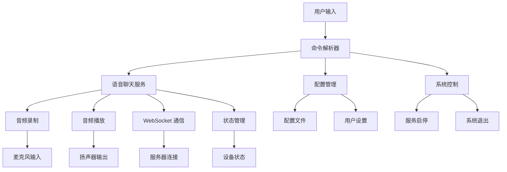

# Console 控制台应用项目

Verdure.Assistant.Console 是项目的命令行版本，提供最直接、最轻量级的智能语音助手体验。它是学习项目核心功能和架构的最佳入口点，也是服务器部署和自动化脚本的理想选择。

## 🎯 项目概述

### 设计目标

- **🚀 简单易用**：最小化的用户界面，专注于核心功能
- **📝 学习友好**：清晰的代码结构，便于理解和学习
- **⚡ 高效轻量**：最小的资源占用，快速启动
- **🔧 脚本友好**：支持命令行参数和批处理操作
- **🌐 跨平台**：在 Windows、Linux、macOS 上完全兼容

### 核心特性



## 🏗️ 项目结构

### 目录组织

```
src/Verdure.Assistant.Console/
├── Commands/                       # 命令处理
│   ├── ICommand.cs                 # 命令接口
│   ├── VoiceCommands.cs            # 语音相关命令
│   ├── ConfigCommands.cs           # 配置相关命令
│   └── SystemCommands.cs           # 系统控制命令
├── Services/                       # 控制台专用服务
│   ├── ConsoleService.cs           # 控制台交互服务
│   ├── MenuService.cs              # 菜单管理服务
│   └── CommandLineParser.cs       # 命令行参数解析
├── UI/                             # 用户界面
│   ├── ConsoleUI.cs                # 控制台 UI 管理
│   ├── MenuRenderer.cs             # 菜单渲染器
│   └── StatusDisplay.cs            # 状态显示
├── Models/                         # 数据模型
│   ├── MenuOption.cs               # 菜单选项
│   ├── CommandResult.cs            # 命令结果
│   └── ConsoleSettings.cs          # 控制台设置
├── Configuration/                  # 配置文件
│   ├── appsettings.json            # 应用配置
│   ├── appsettings.Development.json # 开发环境配置
│   └── appsettings.Production.json  # 生产环境配置
├── Program.cs                      # 程序入口
└── GlobalUsings.cs                 # 全局引用
```

## 🚀 快速开始

### 环境要求

- **.NET 9.0 SDK** 或更高版本
- **支持的操作系统**：Windows 7+, Linux (多数发行版), macOS 10.15+
- **音频支持**：系统需要有麦克风和扬声器设备
- **网络连接**：用于连接语音服务

### 运行应用

#### 直接运行

```bash
# 克隆项目
git clone https://github.com/maker-community/Verdure.Assistant.git
cd Verdure.Assistant/src/Verdure.Assistant.Console

# 运行
dotnet run
```

#### 带参数运行

```bash
# 指定配置文件
dotnet run --config custom-config.json

# 启用详细日志
dotnet run --verbose

# 自动连接模式
dotnet run --auto-connect

# 批处理模式（发送单条消息后退出）
dotnet run --message "今天天气怎么样？" --exit
```

#### 编译后运行

```bash
# 构建发布版本
dotnet publish -c Release -o ./publish

# 运行编译后的程序
cd publish
./Verdure.Assistant.Console

# Windows
Verdure.Assistant.Console.exe
```

### 配置文件

默认配置文件 `appsettings.json`：

```json
{
  "Logging": {
    "LogLevel": {
      "Default": "Information",
      "Microsoft": "Warning",
      "Microsoft.Hosting.Lifetime": "Information"
    },
    "Console": {
      "IncludeScopes": false,
      "TimestampFormat": "yyyy-MM-dd HH:mm:ss "
    }
  },
  "VoiceService": {
    "ServerUrl": "wss://api.tenclass.net/xiaozhi/v1/",
    "ApiKey": "",
    "EnableVoice": true,
    "AudioSampleRate": 16000,
    "AudioChannels": 1,
    "AutoReconnect": true,
    "ConnectionTimeout": 30,
    "KeywordModels": {
      "ModelsPath": "ModelFiles",
      "CurrentModel": "keyword_xiaodian.table",
      "AvailableModels": [
        "keyword_xiaodian.table",
        "keyword_cortana.table"
      ]
    }
  },
  "ConsoleSettings": {
    "ShowWelcomeMessage": true,
    "EnableColors": true,
    "AutoClearScreen": false,
    "MaxHistoryItems": 100,
    "MenuTimeout": 30,
    "Language": "zh-CN"
  },
  "AudioSettings": {
    "InputDeviceId": null,
    "OutputDeviceId": null,
    "Volume": 0.8,
    "NoiseReduction": true,
    "EchoCancellation": true
  }
}
```

## 📱 用户界面

### 主菜单

启动应用后显示的交互式菜单：

```
===============================
    绿荫助手 (Verdure Assistant)
    Version 1.0.0
===============================

当前状态: 未连接
服务器: wss://api.tenclass.net/xiaozhi/v1/

请选择操作:
1. 🎤 开始语音对话
2. ⏹️  停止语音对话
3. 🔄 切换对话状态 (自动模式)
4. ⚙️  切换自动对话模式
5. 📝 发送文本消息
6. 📊 查看连接状态
7. 🔧 配置设置
8. 📜 查看对话历史
9. 🔍 系统信息
0. ❌ 退出

请输入选项 (0-9): _
```

### 语音对话界面

选择语音对话后的界面：

```
🎤 语音对话模式已启动

当前状态: 正在连接...
音频设备: 默认麦克风 -> 默认扬声器
采样率: 16000 Hz | 声道: 单声道

━━━━━━━━━━━━━━━━━━━━━━━━━━━━━━━━━━━━━━━━
💬 对话记录:

[10:30:15] 👤 用户: 你好小电
[10:30:16] 🤖 助手: 你好！我是绿荫助手，有什么可以帮助您的吗？

[10:30:20] 👤 用户: 今天天气怎么样？
[10:30:22] 🤖 助手: 今天天气晴朗，温度约25度，适合外出活动。

━━━━━━━━━━━━━━━━━━━━━━━━━━━━━━━━━━━━━━━━

状态: 🎧 正在监听... (说"你好小电"开始对话)

按 'q' 退出语音模式 | 按 's' 暂停/继续 | 按 'h' 显示帮助
```

### 配置界面

设置配置选项：

```
⚙️ 配置设置

当前配置:
━━━━━━━━━━━━━━━━━━━━━━━━━━━━━━━━━━━━━━━━
🔗 连接设置:
   服务器地址: wss://api.tenclass.net/xiaozhi/v1/
   API 密钥: ••••••••••••••••
   自动重连: 启用
   连接超时: 30 秒

🎤 语音设置:
   启用语音: 是
   采样率: 16000 Hz
   声道: 单声道
   唤醒词: 你好小电

🖥️ 界面设置:
   启用颜色: 是
   显示欢迎信息: 是
   语言: 中文 (zh-CN)

━━━━━━━━━━━━━━━━━━━━━━━━━━━━━━━━━━━━━━━━

配置选项:
1. 修改服务器地址
2. 设置 API 密钥
3. 音频设备配置
4. 更换唤醒词模型
5. 界面语言设置
6. 重置为默认配置
7. 保存当前配置
8. 返回主菜单

请选择配置项 (1-8): _
```

## 🔧 核心实现

### 程序入口点

```csharp
// Program.cs
using Microsoft.Extensions.DependencyInjection;
using Microsoft.Extensions.Hosting;
using Microsoft.Extensions.Logging;
using Verdure.Assistant.Console.Services;
using Verdure.Assistant.Console.UI;
using Verdure.Assistant.Core.Services;

namespace Verdure.Assistant.Console;

class Program
{
    private static IVoiceChatService? _voiceChatService;
    private static IConsoleService? _consoleService;
    private static ILogger<Program>? _logger;
    private static ConsoleSettings? _settings;

    static async Task Main(string[] args)
    {
        // 解析命令行参数
        var options = CommandLineParser.Parse(args);
        
        // 构建服务容器
        var host = CreateHostBuilder(args, options).Build();
        
        // 获取服务实例
        _voiceChatService = host.Services.GetRequiredService<IVoiceChatService>();
        _consoleService = host.Services.GetRequiredService<IConsoleService>();
        _logger = host.Services.GetRequiredService<ILogger<Program>>();
        _settings = host.Services.GetRequiredService<ConsoleSettings>();

        try
        {
            _logger.LogInformation("绿荫助手控制台版本启动");
            
            // 处理命令行模式
            if (options.BatchMode)
            {
                await RunBatchModeAsync(options);
                return;
            }
            
            // 显示欢迎信息
            if (_settings.ShowWelcomeMessage)
            {
                ConsoleUI.ShowWelcomeMessage();
            }
            
            // 设置控制台中断处理
            Console.CancelKeyPress += OnCancelKeyPress;
            
            // 自动连接模式
            if (options.AutoConnect)
            {
                await _voiceChatService.ConnectAsync();
            }
            
            // 运行主循环
            await RunMainLoopAsync();
        }
        catch (Exception ex)
        {
            _logger.LogError(ex, "程序运行出现异常");
            ConsoleUI.DisplayError($"程序运行异常: {ex.Message}");
        }
        finally
        {
            _logger.LogInformation("绿荫助手控制台版本退出");
            await CleanupAsync();
        }
    }
    
    private static IHostBuilder CreateHostBuilder(string[] args, CommandLineOptions options)
    {
        return Host.CreateDefaultBuilder(args)
            .ConfigureServices((context, services) =>
            {
                // 核心服务
                services.AddSingleton<IVoiceChatService, VoiceChatService>();
                services.AddSingleton<IAudioCodec, OpusCodec>();
                services.AddSingleton<IWebSocketClient, WebSocketClient>();
                services.AddSingleton<IConfigurationService, JsonConfigurationService>();
                
                // 控制台专用服务
                services.AddSingleton<IConsoleService, ConsoleService>();
                services.AddSingleton<IMenuService, MenuService>();
                services.AddSingleton<ConsoleUI>();
                
                // 配置
                services.Configure<VoiceServiceConfig>(
                    context.Configuration.GetSection("VoiceService"));
                services.Configure<ConsoleSettings>(
                    context.Configuration.GetSection("ConsoleSettings"));
                
                // 应用命令行选项
                if (!string.IsNullOrEmpty(options.ConfigFile))
                {
                    services.Configure<VoiceServiceConfig>(config =>
                    {
                        // 从指定的配置文件加载
                        var customConfig = JsonSerializer.Deserialize<VoiceServiceConfig>(
                            File.ReadAllText(options.ConfigFile));
                        if (customConfig != null)
                        {
                            config.ServerUrl = customConfig.ServerUrl;
                            config.ApiKey = customConfig.ApiKey;
                        }
                    });
                }
            });
    }
    
    private static async Task RunMainLoopAsync()
    {
        var running = true;
        
        while (running)
        {
            try
            {
                // 显示主菜单
                var choice = await _consoleService!.ShowMainMenuAsync();
                
                switch (choice)
                {
                    case "1":
                        await HandleStartVoiceAsync();
                        break;
                    case "2":
                        await HandleStopVoiceAsync();
                        break;
                    case "3":
                        await HandleToggleAutoModeAsync();
                        break;
                    case "4":
                        await HandleSwitchAutoDialogModeAsync();
                        break;
                    case "5":
                        await HandleSendTextMessageAsync();
                        break;
                    case "6":
                        await HandleViewConnectionStatusAsync();
                        break;
                    case "7":
                        await HandleConfigurationAsync();
                        break;
                    case "8":
                        await HandleViewHistoryAsync();
                        break;
                    case "9":
                        await HandleSystemInfoAsync();
                        break;
                    case "0":
                        running = false;
                        break;
                    default:
                        ConsoleUI.DisplayError("无效的选项，请重新输入");
                        break;
                }
                
                if (running)
                {
                    ConsoleUI.WaitForKeyPress();
                }
            }
            catch (Exception ex)
            {
                _logger!.LogError(ex, "处理用户输入时发生错误");
                ConsoleUI.DisplayError($"操作失败: {ex.Message}");
                ConsoleUI.WaitForKeyPress();
            }
        }
    }
    
    private static async Task RunBatchModeAsync(CommandLineOptions options)
    {
        if (!string.IsNullOrEmpty(options.Message))
        {
            ConsoleUI.DisplayInfo("批处理模式: 发送消息");
            
            if (!_voiceChatService!.IsConnected)
            {
                ConsoleUI.DisplayInfo("正在连接服务器...");
                await _voiceChatService.ConnectAsync();
            }
            
            if (_voiceChatService.IsConnected)
            {
                await _voiceChatService.SendTextMessageAsync(options.Message);
                ConsoleUI.DisplaySuccess("消息已发送");
            }
            else
            {
                ConsoleUI.DisplayError("无法连接到服务器");
                Environment.Exit(1);
            }
        }
    }
    
    private static void OnCancelKeyPress(object? sender, ConsoleCancelEventArgs e)
    {
        e.Cancel = true; // 阻止直接退出
        ConsoleUI.DisplayWarning("检测到中断信号，正在安全退出...");
        
        // 异步清理
        _ = Task.Run(async () =>
        {
            await CleanupAsync();
            Environment.Exit(0);
        });
    }
    
    private static async Task CleanupAsync()
    {
        try
        {
            if (_voiceChatService != null)
            {
                await _voiceChatService.DisconnectAsync();
                _voiceChatService.Dispose();
            }
        }
        catch (Exception ex)
        {
            _logger?.LogError(ex, "清理资源时发生错误");
        }
    }
}
```

### 控制台服务

```csharp
// Services/ConsoleService.cs
public class ConsoleService : IConsoleService
{
    private readonly IVoiceChatService _voiceChatService;
    private readonly IMenuService _menuService;
    private readonly ILogger<ConsoleService> _logger;
    private readonly ConsoleSettings _settings;
    
    public ConsoleService(
        IVoiceChatService voiceChatService,
        IMenuService menuService,
        ILogger<ConsoleService> logger,
        IOptions<ConsoleSettings> settings)
    {
        _voiceChatService = voiceChatService;
        _menuService = menuService;
        _logger = logger;
        _settings = settings.Value;
    }
    
    public async Task<string> ShowMainMenuAsync()
    {
        Console.Clear();
        
        // 显示标题
        ConsoleUI.DisplayTitle("绿荫助手 (Verdure Assistant)");
        ConsoleUI.DisplayVersion("Version 1.0.0");
        
        // 显示当前状态
        var status = _voiceChatService.IsConnected ? "已连接" : "未连接";
        var statusColor = _voiceChatService.IsConnected ? ConsoleColor.Green : ConsoleColor.Red;
        
        Console.WriteLine();
        ConsoleUI.DisplayStatus($"当前状态: {status}", statusColor);
        ConsoleUI.DisplayInfo($"服务器: {_voiceChatService.ServerUrl}");
        Console.WriteLine();
        
        // 显示菜单选项
        var menuOptions = GetMainMenuOptions();
        _menuService.DisplayMenu(menuOptions);
        
        // 获取用户输入
        Console.Write("请输入选项 (0-9): ");
        var choice = Console.ReadLine()?.Trim() ?? "";
        
        _logger.LogDebug("用户选择了菜单选项: {Choice}", choice);
        
        return choice;
    }
    
    public async Task<bool> ConfirmActionAsync(string message, bool defaultYes = false)
    {
        var prompt = defaultYes ? "[Y/n]" : "[y/N]";
        Console.Write($"{message} {prompt}: ");
        
        var input = Console.ReadLine()?.Trim().ToLower();
        
        if (string.IsNullOrEmpty(input))
        {
            return defaultYes;
        }
        
        return input.StartsWith("y");
    }
    
    public async Task<string> GetUserInputAsync(string prompt, bool isPassword = false)
    {
        Console.Write($"{prompt}: ");
        
        if (isPassword)
        {
            return ReadPassword();
        }
        else
        {
            return Console.ReadLine()?.Trim() ?? "";
        }
    }
    
    public async Task DisplayVoiceChatAsync()
    {
        Console.Clear();
        ConsoleUI.DisplayTitle("🎤 语音对话模式");
        
        // 显示状态信息
        DisplayVoiceStatus();
        
        // 显示对话历史
        var messages = _voiceChatService.GetRecentMessages(10);
        if (messages.Any())
        {
            Console.WriteLine();
            ConsoleUI.DisplaySeparator();
            ConsoleUI.DisplayInfo("💬 对话记录:");
            Console.WriteLine();
            
            foreach (var message in messages)
            {
                var icon = message.Type == MessageType.User ? "👤" : "🤖";
                var sender = message.Type == MessageType.User ? "用户" : "助手";
                var timestamp = message.Timestamp.ToString("HH:mm:ss");
                
                var color = message.Type == MessageType.User 
                    ? ConsoleColor.Cyan 
                    : ConsoleColor.Green;
                
                ConsoleUI.DisplayMessage($"[{timestamp}] {icon} {sender}: {message.Content}", color);
            }
            
            Console.WriteLine();
            ConsoleUI.DisplaySeparator();
        }
        
        // 显示当前状态
        var currentState = _voiceChatService.CurrentState;
        var stateText = GetStateDisplayText(currentState);
        
        Console.WriteLine();
        ConsoleUI.DisplayStatus($"状态: {stateText}");
        Console.WriteLine();
        
        // 显示快捷键说明
        ConsoleUI.DisplayInfo("按 'q' 退出语音模式 | 按 's' 暂停/继续 | 按 'h' 显示帮助");
    }
    
    private void DisplayVoiceStatus()
    {
        var connectionStatus = _voiceChatService.IsConnected ? "已连接" : "未连接";
        var connectionColor = _voiceChatService.IsConnected ? ConsoleColor.Green : ConsoleColor.Red;
        
        Console.WriteLine();
        ConsoleUI.DisplayStatus($"当前状态: {connectionStatus}", connectionColor);
        
        // 音频设备信息
        var audioInfo = GetAudioDeviceInfo();
        ConsoleUI.DisplayInfo($"音频设备: {audioInfo.InputDevice} -> {audioInfo.OutputDevice}");
        ConsoleUI.DisplayInfo($"采样率: {audioInfo.SampleRate} Hz | 声道: {audioInfo.Channels}");
    }
    
    private List<MenuOption> GetMainMenuOptions()
    {
        return new List<MenuOption>
        {
            new("1", "🎤", "开始语音对话"),
            new("2", "⏹️", "停止语音对话"),
            new("3", "🔄", "切换对话状态 (自动模式)"),
            new("4", "⚙️", "切换自动对话模式"),
            new("5", "📝", "发送文本消息"),
            new("6", "📊", "查看连接状态"),
            new("7", "🔧", "配置设置"),
            new("8", "📜", "查看对话历史"),
            new("9", "🔍", "系统信息"),
            new("0", "❌", "退出")
        };
    }
    
    private string ReadPassword()
    {
        var password = new StringBuilder();
        ConsoleKeyInfo key;
        
        do
        {
            key = Console.ReadKey(true);
            
            if (key.Key != ConsoleKey.Backspace && key.Key != ConsoleKey.Enter)
            {
                password.Append(key.KeyChar);
                Console.Write("*");
            }
            else if (key.Key == ConsoleKey.Backspace && password.Length > 0)
            {
                password.Length--;
                Console.Write("\b \b");
            }
        } while (key.Key != ConsoleKey.Enter);
        
        Console.WriteLine();
        return password.ToString();
    }
    
    private string GetStateDisplayText(DeviceState state) => state switch
    {
        DeviceState.Connected => "🔗 已连接",
        DeviceState.Listening => "🎧 正在监听...",
        DeviceState.Processing => "⚙️ 处理中...",
        DeviceState.Speaking => "🔊 正在播放",
        DeviceState.Disconnected => "❌ 未连接",
        DeviceState.Error => "⚠️ 错误状态",
        _ => "❓ 未知状态"
    };
    
    private AudioDeviceInfo GetAudioDeviceInfo()
    {
        // 获取当前音频设备信息
        return new AudioDeviceInfo
        {
            InputDevice = "默认麦克风",
            OutputDevice = "默认扬声器",
            SampleRate = "16000",
            Channels = "单声道"
        };
    }
}
```

### 菜单服务

```csharp
// Services/MenuService.cs
public class MenuService : IMenuService
{
    private readonly ConsoleSettings _settings;
    
    public MenuService(IOptions<ConsoleSettings> settings)
    {
        _settings = settings.Value;
    }
    
    public void DisplayMenu(List<MenuOption> options)
    {
        Console.WriteLine("请选择操作:");
        
        foreach (var option in options)
        {
            if (_settings.EnableColors)
            {
                Console.ForegroundColor = ConsoleColor.White;
                Console.Write(option.Key);
                
                Console.ForegroundColor = ConsoleColor.Yellow;
                Console.Write(". ");
                
                Console.ForegroundColor = ConsoleColor.Green;
                Console.Write(option.Icon);
                
                Console.ForegroundColor = ConsoleColor.Gray;
                Console.Write(" ");
                
                Console.ForegroundColor = ConsoleColor.White;
                Console.WriteLine(option.Description);
                
                Console.ResetColor();
            }
            else
            {
                Console.WriteLine($"{option.Key}. {option.Icon} {option.Description}");
            }
        }
        
        Console.WriteLine();
    }
    
    public async Task<string> ShowConfigurationMenuAsync()
    {
        Console.Clear();
        ConsoleUI.DisplayTitle("⚙️ 配置设置");
        
        // 显示当前配置
        await DisplayCurrentConfigurationAsync();
        
        // 显示配置选项
        var configOptions = GetConfigurationMenuOptions();
        DisplayMenu(configOptions);
        
        Console.Write("请选择配置项 (1-8): ");
        return Console.ReadLine()?.Trim() ?? "";
    }
    
    private async Task DisplayCurrentConfigurationAsync()
    {
        Console.WriteLine();
        Console.WriteLine("当前配置:");
        ConsoleUI.DisplaySeparator();
        
        // 连接设置
        ConsoleUI.DisplaySectionHeader("🔗 连接设置:");
        ConsoleUI.DisplayConfigItem("服务器地址", "wss://api.tenclass.net/xiaozhi/v1/");
        ConsoleUI.DisplayConfigItem("API 密钥", "••••••••••••••••");
        ConsoleUI.DisplayConfigItem("自动重连", "启用");
        ConsoleUI.DisplayConfigItem("连接超时", "30 秒");
        
        Console.WriteLine();
        
        // 语音设置
        ConsoleUI.DisplaySectionHeader("🎤 语音设置:");
        ConsoleUI.DisplayConfigItem("启用语音", "是");
        ConsoleUI.DisplayConfigItem("采样率", "16000 Hz");
        ConsoleUI.DisplayConfigItem("声道", "单声道");
        ConsoleUI.DisplayConfigItem("唤醒词", "你好小电");
        
        Console.WriteLine();
        
        // 界面设置
        ConsoleUI.DisplaySectionHeader("🖥️ 界面设置:");
        ConsoleUI.DisplayConfigItem("启用颜色", _settings.EnableColors ? "是" : "否");
        ConsoleUI.DisplayConfigItem("显示欢迎信息", _settings.ShowWelcomeMessage ? "是" : "否");
        ConsoleUI.DisplayConfigItem("语言", GetLanguageDisplayName(_settings.Language));
        
        Console.WriteLine();
        ConsoleUI.DisplaySeparator();
        Console.WriteLine();
    }
    
    private List<MenuOption> GetConfigurationMenuOptions()
    {
        return new List<MenuOption>
        {
            new("1", "🔗", "修改服务器地址"),
            new("2", "🔑", "设置 API 密钥"),
            new("3", "🎵", "音频设备配置"),
            new("4", "🗣️", "更换唤醒词模型"),
            new("5", "🌐", "界面语言设置"),
            new("6", "↩️", "重置为默认配置"),
            new("7", "💾", "保存当前配置"),
            new("8", "🔙", "返回主菜单")
        };
    }
    
    private string GetLanguageDisplayName(string languageCode) => languageCode switch
    {
        "zh-CN" => "中文",
        "en-US" => "English",
        "ja-JP" => "日本語",
        _ => languageCode
    };
}
```

### 用户界面工具类

```csharp
// UI/ConsoleUI.cs
public static class ConsoleUI
{
    public static void ShowWelcomeMessage()
    {
        Console.Clear();
        
        DisplayTitle("欢迎使用绿荫助手");
        
        Console.WriteLine();
        DisplayInfo("绿荫助手是基于 .NET 9 开发的智能语音助手");
        DisplayInfo("支持语音交互、文本聊天和多种配置选项");
        Console.WriteLine();
        
        DisplayWarning("首次使用请确保：");
        DisplayInfo("  • 麦克风和扬声器设备正常工作");
        DisplayInfo("  • 网络连接正常");
        DisplayInfo("  • 已配置正确的服务器地址");
        Console.WriteLine();
        
        DisplaySuccess("按任意键继续...");
        Console.ReadKey(true);
    }
    
    public static void DisplayTitle(string title)
    {
        var width = Math.Max(title.Length + 4, 40);
        var separator = new string('=', width);
        
        Console.ForegroundColor = ConsoleColor.Cyan;
        Console.WriteLine(separator);
        Console.WriteLine($"  {title.PadLeft((width + title.Length - 4) / 2).PadRight(width - 4)}  ");
        Console.WriteLine(separator);
        Console.ResetColor();
    }
    
    public static void DisplayVersion(string version)
    {
        Console.ForegroundColor = ConsoleColor.DarkGray;
        Console.WriteLine($"    {version}");
        Console.ResetColor();
    }
    
    public static void DisplaySeparator(char character = '━', int length = 80)
    {
        Console.ForegroundColor = ConsoleColor.DarkGray;
        Console.WriteLine(new string(character, Math.Min(length, Console.WindowWidth - 1)));
        Console.ResetColor();
    }
    
    public static void DisplayStatus(string message, ConsoleColor color = ConsoleColor.White)
    {
        Console.ForegroundColor = color;
        Console.WriteLine(message);
        Console.ResetColor();
    }
    
    public static void DisplaySuccess(string message)
    {
        Console.ForegroundColor = ConsoleColor.Green;
        Console.WriteLine($"✓ {message}");
        Console.ResetColor();
    }
    
    public static void DisplayError(string message)
    {
        Console.ForegroundColor = ConsoleColor.Red;
        Console.WriteLine($"✗ 错误: {message}");
        Console.ResetColor();
    }
    
    public static void DisplayWarning(string message)
    {
        Console.ForegroundColor = ConsoleColor.Yellow;
        Console.WriteLine($"⚠ 警告: {message}");
        Console.ResetColor();
    }
    
    public static void DisplayInfo(string message)
    {
        Console.ForegroundColor = ConsoleColor.Gray;
        Console.WriteLine($"ℹ {message}");
        Console.ResetColor();
    }
    
    public static void DisplayMessage(string message, ConsoleColor color = ConsoleColor.White)
    {
        Console.ForegroundColor = color;
        Console.WriteLine(message);
        Console.ResetColor();
    }
    
    public static void DisplaySectionHeader(string header)
    {
        Console.ForegroundColor = ConsoleColor.White;
        Console.WriteLine(header);
        Console.ResetColor();
    }
    
    public static void DisplayConfigItem(string key, string value)
    {
        Console.ForegroundColor = ConsoleColor.DarkCyan;
        Console.Write($"   {key}: ");
        Console.ForegroundColor = ConsoleColor.White;
        Console.WriteLine(value);
        Console.ResetColor();
    }
    
    public static void WaitForKeyPress(string message = "按任意键继续...")
    {
        Console.WriteLine();
        Console.ForegroundColor = ConsoleColor.DarkGray;
        Console.WriteLine(message);
        Console.ResetColor();
        Console.ReadKey(true);
    }
    
    public static void ShowProgressBar(string operation, int current, int total)
    {
        const int barWidth = 40;
        var progress = (double)current / total;
        var filledWidth = (int)(barWidth * progress);
        var emptyWidth = barWidth - filledWidth;
        
        Console.Write($"\r{operation}: [");
        
        Console.ForegroundColor = ConsoleColor.Green;
        Console.Write(new string('█', filledWidth));
        
        Console.ForegroundColor = ConsoleColor.DarkGray;
        Console.Write(new string('░', emptyWidth));
        
        Console.ResetColor();
        Console.Write($"] {progress:P0} ({current}/{total})");
        
        if (current == total)
        {
            Console.WriteLine();
        }
    }
    
    public static bool Confirm(string question, bool defaultYes = false)
    {
        var options = defaultYes ? "[Y/n]" : "[y/N]";
        Console.Write($"{question} {options}: ");
        
        var input = Console.ReadLine()?.Trim().ToLower();
        
        if (string.IsNullOrEmpty(input))
            return defaultYes;
            
        return input.StartsWith("y");
    }
}
```

## 🎮 命令处理

### 语音命令处理

```csharp
// Commands/VoiceCommands.cs
public class VoiceCommands : ICommandHandler
{
    private readonly IVoiceChatService _voiceChatService;
    private readonly ILogger<VoiceCommands> _logger;
    
    public VoiceCommands(IVoiceChatService voiceChatService, ILogger<VoiceCommands> logger)
    {
        _voiceChatService = voiceChatService;
        _logger = logger;
    }
    
    public async Task<CommandResult> HandleStartVoiceAsync()
    {
        try
        {
            if (_voiceChatService.IsConnected && 
                _voiceChatService.CurrentState == DeviceState.Listening)
            {
                return CommandResult.Warning("语音对话已在进行中");
            }
            
            ConsoleUI.DisplayInfo("正在启动语音对话...");
            
            if (!_voiceChatService.IsConnected)
            {
                ConsoleUI.DisplayInfo("正在连接服务器...");
                await _voiceChatService.ConnectAsync();
                
                if (!_voiceChatService.IsConnected)
                {
                    return CommandResult.Error("无法连接到服务器，请检查网络连接和配置");
                }
            }
            
            await _voiceChatService.StartVoiceChatAsync();
            
            ConsoleUI.DisplaySuccess("语音对话已启动");
            ConsoleUI.DisplayInfo("说\"你好小电\"或\"你好小娜\"开始对话");
            
            // 进入语音对话循环
            await EnterVoiceChatLoopAsync();
            
            return CommandResult.Success("语音对话已结束");
        }
        catch (Exception ex)
        {
            _logger.LogError(ex, "启动语音对话失败");
            return CommandResult.Error($"启动语音对话失败: {ex.Message}");
        }
    }
    
    public async Task<CommandResult> HandleStopVoiceAsync()
    {
        try
        {
            if (!_voiceChatService.IsConnected || 
                _voiceChatService.CurrentState == DeviceState.Connected)
            {
                return CommandResult.Warning("当前没有进行语音对话");
            }
            
            ConsoleUI.DisplayInfo("正在停止语音对话...");
            
            await _voiceChatService.StopVoiceChatAsync();
            
            ConsoleUI.DisplaySuccess("语音对话已停止");
            
            return CommandResult.Success("语音对话已停止");
        }
        catch (Exception ex)
        {
            _logger.LogError(ex, "停止语音对话失败");
            return CommandResult.Error($"停止语音对话失败: {ex.Message}");
        }
    }
    
    public async Task<CommandResult> HandleSendTextMessageAsync()
    {
        try
        {
            Console.Write("请输入要发送的消息: ");
            var message = Console.ReadLine()?.Trim();
            
            if (string.IsNullOrEmpty(message))
            {
                return CommandResult.Warning("消息不能为空");
            }
            
            if (!_voiceChatService.IsConnected)
            {
                ConsoleUI.DisplayInfo("正在连接服务器...");
                await _voiceChatService.ConnectAsync();
                
                if (!_voiceChatService.IsConnected)
                {
                    return CommandResult.Error("无法连接到服务器");
                }
            }
            
            ConsoleUI.DisplayInfo($"发送消息: {message}");
            await _voiceChatService.SendTextMessageAsync(message);
            
            ConsoleUI.DisplaySuccess("消息已发送，等待回复...");
            
            return CommandResult.Success("消息发送成功");
        }
        catch (Exception ex)
        {
            _logger.LogError(ex, "发送文本消息失败");
            return CommandResult.Error($"发送消息失败: {ex.Message}");
        }
    }
    
    private async Task EnterVoiceChatLoopAsync()
    {
        var running = true;
        var consoleService = ServiceProvider.GetService<IConsoleService>();
        
        // 订阅语音服务事件
        _voiceChatService.MessageReceived += OnMessageReceived;
        _voiceChatService.StateChanged += OnStateChanged;
        
        try
        {
            while (running)
            {
                // 显示语音聊天界面
                await consoleService.DisplayVoiceChatAsync();
                
                // 检查用户输入
                if (Console.KeyAvailable)
                {
                    var key = Console.ReadKey(true);
                    
                    switch (key.KeyChar)
                    {
                        case 'q':
                        case 'Q':
                            running = false;
                            break;
                        case 's':
                        case 'S':
                            await ToggleVoiceAsync();
                            break;
                        case 'h':
                        case 'H':
                            ShowVoiceHelp();
                            break;
                    }
                }
                
                // 延迟以减少CPU使用
                await Task.Delay(100);
            }
        }
        finally
        {
            // 取消订阅事件
            _voiceChatService.MessageReceived -= OnMessageReceived;
            _voiceChatService.StateChanged -= OnStateChanged;
        }
    }
    
    private void OnMessageReceived(object sender, ChatMessage message)
    {
        var icon = message.Type == MessageType.User ? "👤" : "🤖";
        var sender_name = message.Type == MessageType.User ? "用户" : "助手";
        var timestamp = message.Timestamp.ToString("HH:mm:ss");
        var color = message.Type == MessageType.User ? ConsoleColor.Cyan : ConsoleColor.Green;
        
        Console.SetCursorPosition(0, Console.CursorTop);
        ConsoleUI.DisplayMessage($"[{timestamp}] {icon} {sender_name}: {message.Content}", color);
        Console.WriteLine();
    }
    
    private void OnStateChanged(object sender, DeviceState state)
    {
        var stateText = GetStateDisplayText(state);
        Console.Title = $"绿荫助手 - {stateText}";
    }
    
    private async Task ToggleVoiceAsync()
    {
        if (_voiceChatService.CurrentState == DeviceState.Listening)
        {
            await _voiceChatService.StopVoiceChatAsync();
            ConsoleUI.DisplayInfo("语音监听已暂停");
        }
        else if (_voiceChatService.CurrentState == DeviceState.Connected)
        {
            await _voiceChatService.StartVoiceChatAsync();
            ConsoleUI.DisplayInfo("语音监听已恢复");
        }
    }
    
    private void ShowVoiceHelp()
    {
        Console.WriteLine();
        ConsoleUI.DisplayTitle("语音模式快捷键帮助");
        Console.WriteLine();
        
        ConsoleUI.DisplayInfo("q - 退出语音模式");
        ConsoleUI.DisplayInfo("s - 暂停/继续语音监听");
        ConsoleUI.DisplayInfo("h - 显示此帮助信息");
        Console.WriteLine();
        
        ConsoleUI.DisplayInfo("语音交互:");
        ConsoleUI.DisplayInfo("  • 说\"你好小电\"或\"你好小娜\"开始对话");
        ConsoleUI.DisplayInfo("  • 对话结束后系统会自动返回监听状态");
        ConsoleUI.DisplayInfo("  • 支持连续对话模式");
        
        ConsoleUI.WaitForKeyPress();
    }
    
    private string GetStateDisplayText(DeviceState state) => state switch
    {
        DeviceState.Connected => "🔗 已连接",
        DeviceState.Listening => "🎧 正在监听",
        DeviceState.Processing => "⚙️ 处理中",
        DeviceState.Speaking => "🔊 正在播放",
        DeviceState.Disconnected => "❌ 未连接",
        DeviceState.Error => "⚠️ 错误状态",
        _ => "❓ 未知状态"
    };
}
```

## 🔧 命令行参数

### CommandLineParser

```csharp
// Services/CommandLineParser.cs
public class CommandLineParser
{
    public static CommandLineOptions Parse(string[] args)
    {
        var options = new CommandLineOptions();
        
        for (int i = 0; i < args.Length; i++)
        {
            switch (args[i].ToLower())
            {
                case "--config":
                case "-c":
                    if (i + 1 < args.Length)
                    {
                        options.ConfigFile = args[++i];
                    }
                    break;
                    
                case "--verbose":
                case "-v":
                    options.Verbose = true;
                    break;
                    
                case "--auto-connect":
                case "-a":
                    options.AutoConnect = true;
                    break;
                    
                case "--message":
                case "-m":
                    if (i + 1 < args.Length)
                    {
                        options.Message = args[++i];
                        options.BatchMode = true;
                    }
                    break;
                    
                case "--exit":
                case "-e":
                    options.ExitAfterMessage = true;
                    break;
                    
                case "--help":
                case "-h":
                case "/?":
                    ShowHelp();
                    Environment.Exit(0);
                    break;
                    
                case "--version":
                    ShowVersion();
                    Environment.Exit(0);
                    break;
            }
        }
        
        return options;
    }
    
    private static void ShowHelp()
    {
        Console.WriteLine("绿荫助手 控制台版本");
        Console.WriteLine();
        Console.WriteLine("用法: Verdure.Assistant.Console [选项]");
        Console.WriteLine();
        Console.WriteLine("选项:");
        Console.WriteLine("  -c, --config <文件>     指定配置文件路径");
        Console.WriteLine("  -v, --verbose           启用详细日志输出");
        Console.WriteLine("  -a, --auto-connect      启动时自动连接服务器");
        Console.WriteLine("  -m, --message <文本>    发送文本消息（批处理模式）");
        Console.WriteLine("  -e, --exit              发送消息后自动退出");
        Console.WriteLine("  -h, --help              显示此帮助信息");
        Console.WriteLine("  --version               显示版本信息");
        Console.WriteLine();
        Console.WriteLine("示例:");
        Console.WriteLine("  Verdure.Assistant.Console");
        Console.WriteLine("  Verdure.Assistant.Console --auto-connect");
        Console.WriteLine("  Verdure.Assistant.Console --message \"今天天气怎么样？\" --exit");
        Console.WriteLine("  Verdure.Assistant.Console --config custom.json --verbose");
    }
    
    private static void ShowVersion()
    {
        var version = Assembly.GetExecutingAssembly().GetName().Version;
        var buildDate = GetBuildDate();
        
        Console.WriteLine($"绿荫助手 控制台版本 v{version}");
        Console.WriteLine($"构建时间: {buildDate:yyyy-MM-dd HH:mm:ss}");
        Console.WriteLine("基于 .NET 9.0 开发");
        Console.WriteLine();
        Console.WriteLine("Copyright (c) 2024 Maker Community");
        Console.WriteLine("开源许可: MIT License");
    }
    
    private static DateTime GetBuildDate()
    {
        var assembly = Assembly.GetExecutingAssembly();
        var attribute = assembly.GetCustomAttribute<AssemblyMetadataAttribute>();
        
        if (attribute?.Value != null && DateTime.TryParse(attribute.Value, out var buildDate))
        {
            return buildDate;
        }
        
        return File.GetLastWriteTime(assembly.Location);
    }
}

public class CommandLineOptions
{
    public string? ConfigFile { get; set; }
    public bool Verbose { get; set; }
    public bool AutoConnect { get; set; }
    public string? Message { get; set; }
    public bool BatchMode { get; set; }
    public bool ExitAfterMessage { get; set; }
}
```

## 🐳 Docker 部署

### Dockerfile

```dockerfile
# 多阶段构建 Dockerfile
FROM mcr.microsoft.com/dotnet/sdk:9.0 AS build
WORKDIR /src

# 复制项目文件
COPY ["src/Verdure.Assistant.Console/Verdure.Assistant.Console.csproj", "src/Verdure.Assistant.Console/"]
COPY ["src/Verdure.Assistant.Core/Verdure.Assistant.Core.csproj", "src/Verdure.Assistant.Core/"]

# 还原依赖
RUN dotnet restore "src/Verdure.Assistant.Console/Verdure.Assistant.Console.csproj"

# 复制源代码
COPY . .

# 构建应用
WORKDIR "/src/src/Verdure.Assistant.Console"
RUN dotnet build "Verdure.Assistant.Console.csproj" -c Release -o /app/build

# 发布应用
RUN dotnet publish "Verdure.Assistant.Console.csproj" -c Release -o /app/publish --no-restore

# 运行时镜像
FROM mcr.microsoft.com/dotnet/runtime:9.0 AS runtime
WORKDIR /app

# 安装音频库依赖
RUN apt-get update && apt-get install -y \
    alsa-utils \
    pulseaudio \
    && rm -rf /var/lib/apt/lists/*

# 复制应用文件
COPY --from=build /app/publish .

# 创建非root用户
RUN useradd -m -s /bin/bash verdure
USER verdure

# 暴露音频设备
VOLUME ["/tmp/.X11-unix", "/dev/snd"]

# 设置环境变量
ENV DOTNET_SYSTEM_GLOBALIZATION_INVARIANT=false
ENV PULSE_SERVER=unix:/run/user/1000/pulse/native

# 入口点
ENTRYPOINT ["dotnet", "Verdure.Assistant.Console.dll"]
```

### Docker Compose

```yaml
# docker-compose.yml
version: '3.8'

services:
  verdure-console:
    build:
      context: .
      dockerfile: src/Verdure.Assistant.Console/Dockerfile
    container_name: verdure-assistant-console
    environment:
      - DOTNET_ENVIRONMENT=Production
      - VoiceService__ServerUrl=wss://api.tenclass.net/xiaozhi/v1/
      - VoiceService__EnableVoice=true
      - ConsoleSettings__EnableColors=true
    volumes:
      - ./config:/app/config:ro
      - ./logs:/app/logs
      - /tmp/.X11-unix:/tmp/.X11-unix:rw
      - /dev/snd:/dev/snd
    devices:
      - /dev/snd
    stdin_open: true
    tty: true
    restart: unless-stopped
    networks:
      - verdure-network

  # MQTT Broker (可选)
  mqtt-broker:
    image: eclipse-mosquitto:2
    container_name: verdure-mqtt
    ports:
      - "1883:1883"
      - "9001:9001"
    volumes:
      - ./mosquitto/config:/mosquitto/config
    restart: unless-stopped
    networks:
      - verdure-network

networks:
  verdure-network:
    driver: bridge
```

### 运行脚本

```bash
#!/bin/bash
# run-console.sh

# 设置环境变量
export DISPLAY=:0
export PULSE_RUNTIME_PATH=/run/user/$(id -u)/pulse

# 检查音频设备
if ! command -v aplay &> /dev/null; then
    echo "警告: 未检测到音频系统，语音功能可能无法正常工作"
fi

# 检查网络连接
if ! ping -c 1 api.tenclass.net &> /dev/null; then
    echo "警告: 无法连接到服务器，请检查网络连接"
fi

# 构建镜像
echo "构建 Docker 镜像..."
docker-compose build verdure-console

# 运行容器
echo "启动绿荫助手控制台版本..."
docker-compose run --rm verdure-console

# 清理
echo "清理资源..."
docker-compose down
```

## 📊 性能监控

### 内存和CPU监控

```csharp
// Services/PerformanceMonitor.cs
public class PerformanceMonitor : IHostedService, IDisposable
{
    private readonly ILogger<PerformanceMonitor> _logger;
    private Timer? _monitorTimer;
    private readonly Process _currentProcess;
    
    public PerformanceMonitor(ILogger<PerformanceMonitor> logger)
    {
        _logger = logger;
        _currentProcess = Process.GetCurrentProcess();
    }
    
    public Task StartAsync(CancellationToken cancellationToken)
    {
        _logger.LogInformation("性能监控服务已启动");
        
        _monitorTimer = new Timer(MonitorPerformance, null, TimeSpan.Zero, TimeSpan.FromMinutes(1));
        
        return Task.CompletedTask;
    }
    
    public Task StopAsync(CancellationToken cancellationToken)
    {
        _logger.LogInformation("性能监控服务已停止");
        
        _monitorTimer?.Change(Timeout.Infinite, 0);
        
        return Task.CompletedTask;
    }
    
    private void MonitorPerformance(object? state)
    {
        try
        {
            // CPU 使用率
            var cpuUsage = GetCpuUsage();
            
            // 内存使用情况
            var memoryUsage = GC.GetTotalMemory(false) / 1024 / 1024; // MB
            var workingSet = _currentProcess.WorkingSet64 / 1024 / 1024; // MB
            
            // 线程数
            var threadCount = _currentProcess.Threads.Count;
            
            // GC 信息
            var gen0Collections = GC.CollectionCount(0);
            var gen1Collections = GC.CollectionCount(1);
            var gen2Collections = GC.CollectionCount(2);
            
            _logger.LogInformation(
                "性能指标 - CPU: {CpuUsage:F1}%, 内存: {MemoryUsage}MB, 工作集: {WorkingSet}MB, 线程: {ThreadCount}, " +
                "GC: Gen0={Gen0} Gen1={Gen1} Gen2={Gen2}",
                cpuUsage, memoryUsage, workingSet, threadCount,
                gen0Collections, gen1Collections, gen2Collections);
                
            // 检查内存使用是否过高
            if (workingSet > 500) // 超过500MB
            {
                _logger.LogWarning("内存使用量过高: {WorkingSet}MB", workingSet);
                
                // 建议垃圾回收
                GC.Collect();
                GC.WaitForPendingFinalizers();
                GC.Collect();
            }
        }
        catch (Exception ex)
        {
            _logger.LogError(ex, "性能监控出现异常");
        }
    }
    
    private double GetCpuUsage()
    {
        // 简化的 CPU 使用率计算
        // 在实际应用中可以使用更精确的方法
        return _currentProcess.TotalProcessorTime.TotalMilliseconds / Environment.TickCount * 100;
    }
    
    public void Dispose()
    {
        _monitorTimer?.Dispose();
        _currentProcess?.Dispose();
    }
}
```

## 🧪 单元测试

### 测试项目结构

```csharp
// Tests/Verdure.Assistant.Console.Tests/Services/ConsoleServiceTests.cs
[TestClass]
public class ConsoleServiceTests
{
    private Mock<IVoiceChatService> _mockVoiceChatService;
    private Mock<IMenuService> _mockMenuService;
    private Mock<ILogger<ConsoleService>> _mockLogger;
    private Mock<IOptions<ConsoleSettings>> _mockSettings;
    private ConsoleService _consoleService;
    
    [TestInitialize]
    public void Setup()
    {
        _mockVoiceChatService = new Mock<IVoiceChatService>();
        _mockMenuService = new Mock<IMenuService>();
        _mockLogger = new Mock<ILogger<ConsoleService>>();
        
        var settings = new ConsoleSettings
        {
            ShowWelcomeMessage = true,
            EnableColors = true,
            Language = "zh-CN"
        };
        
        _mockSettings = new Mock<IOptions<ConsoleSettings>>();
        _mockSettings.Setup(x => x.Value).Returns(settings);
        
        _consoleService = new ConsoleService(
            _mockVoiceChatService.Object,
            _mockMenuService.Object,
            _mockLogger.Object,
            _mockSettings.Object);
    }
    
    [TestMethod]
    public async Task ConfirmActionAsync_WithYesInput_ReturnsTrue()
    {
        // Arrange
        using var sw = new StringWriter();
        using var sr = new StringReader("y\n");
        Console.SetOut(sw);
        Console.SetIn(sr);
        
        // Act
        var result = await _consoleService.ConfirmActionAsync("确认操作吗?");
        
        // Assert
        Assert.IsTrue(result);
    }
    
    [TestMethod]
    public async Task ConfirmActionAsync_WithNoInput_ReturnsFalse()
    {
        // Arrange
        using var sw = new StringWriter();
        using var sr = new StringReader("n\n");
        Console.SetOut(sw);
        Console.SetIn(sr);
        
        // Act
        var result = await _consoleService.ConfirmActionAsync("确认操作吗?");
        
        // Assert
        Assert.IsFalse(result);
    }
    
    [TestMethod]
    public async Task GetUserInputAsync_WithValidInput_ReturnsInput()
    {
        // Arrange
        const string expectedInput = "test input";
        using var sw = new StringWriter();
        using var sr = new StringReader($"{expectedInput}\n");
        Console.SetOut(sw);
        Console.SetIn(sr);
        
        // Act
        var result = await _consoleService.GetUserInputAsync("请输入");
        
        // Assert
        Assert.AreEqual(expectedInput, result);
    }
}
```

## 🔗 相关资源

- **[API 项目](/zh/projects/api)** - 服务端实现
- **[WinUI 项目](/zh/projects/winui)** - 图形界面版本
- **[MAUI 项目](/zh/projects/maui)** - 移动端实现
- **[Visual Studio 开发](/zh/development/visual-studio)** - 开发环境配置

---

通过学习 Console 项目，您将掌握：
- .NET 控制台应用开发
- 命令行程序设计模式
- 用户交互和菜单系统
- 跨平台兼容性处理
- Docker 容器化部署
- 性能监控和优化
- 单元测试编写

这些技能对开发命令行工具、自动化脚本和服务器应用都非常有价值。Console 版本也是理解整个项目架构的最佳入口点。