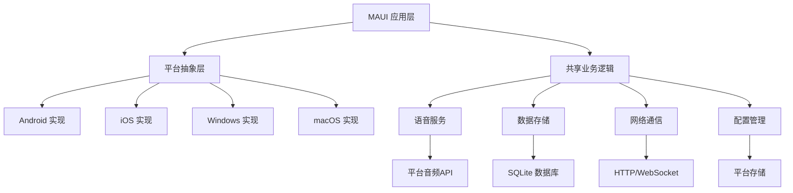

# MAUI 跨平台应用项目

Verdure.Assistant.MAUI 是基于 .NET Multi-platform App UI (MAUI) 框架开发的跨平台移动应用，支持 Android、iOS、Windows 和 macOS 平台，为用户提供统一的移动端语音助手体验。

## 🎯 项目概述

### 设计目标

- **📱 跨平台统一**：一套代码运行在多个平台上
- **🎨 原生体验**：利用平台特定的 UI 控件和交互模式
- **🔄 离线功能**：支持离线模式和数据同步
- **📊 性能优化**：针对移动设备的内存和电池优化
- **🔐 安全可靠**：端到端加密和数据保护

### 支持平台

| 平台 | 最低版本 | 推荐版本 | 特性支持 |
|------|----------|----------|----------|
| **Android** | API 21 (Android 5.0) | API 33+ (Android 13+) | 全功能支持 |
| **iOS** | iOS 11.0 | iOS 16.0+ | 全功能支持 |
| **Windows** | Windows 10 1809 | Windows 11 | 桌面体验 |
| **macOS** | macOS 10.15 | macOS 13.0+ | 桌面体验 |

### 核心功能架构



## 🏗️ 项目结构

### 目录组织

```
src/Verdure.Assistant.MAUI/
├── Platforms/                      # 平台特定代码
│   ├── Android/                    # Android 特定实现
│   │   ├── MainActivity.cs         # 主活动
│   │   ├── MainApplication.cs      # 应用程序类
│   │   ├── AndroidManifest.xml     # 应用清单
│   │   └── Resources/              # Android 资源
│   ├── iOS/                        # iOS 特定实现
│   │   ├── AppDelegate.cs          # 应用委托
│   │   ├── Info.plist              # 应用信息
│   │   └── Entitlements.plist      # 权限配置
│   ├── Windows/                    # Windows 特定实现
│   │   ├── App.xaml                # 应用定义
│   │   └── Package.appxmanifest    # 包清单
│   └── macOS/                      # macOS 特定实现
│       └── Info.plist              # 应用信息
├── Views/                          # 页面视图
│   ├── MainPage.xaml               # 主页面
│   ├── VoicePage.xaml              # 语音交互页面
│   ├── SettingsPage.xaml           # 设置页面
│   └── AboutPage.xaml              # 关于页面
├── ViewModels/                     # 视图模型
│   ├── MainPageViewModel.cs        # 主页 ViewModel
│   ├── VoicePageViewModel.cs       # 语音页 ViewModel
│   └── SettingsPageViewModel.cs    # 设置页 ViewModel
├── Services/                       # 服务接口和实现
│   ├── Interfaces/                 # 服务接口
│   ├── PlatformServices/           # 平台特定服务
│   │   ├── AudioService.cs         # 音频服务
│   │   ├── StorageService.cs       # 存储服务
│   │   └── PermissionService.cs    # 权限服务
│   └── SharedServices/             # 共享服务
│       ├── VoiceChatService.cs     # 语音聊天服务
│       └── DataSyncService.cs      # 数据同步服务
├── Models/                         # 数据模型
│   ├── ChatMessage.cs              # 聊天消息模型
│   ├── UserSettings.cs             # 用户设置模型
│   └── VoiceSession.cs             # 语音会话模型
├── Resources/                      # 共享资源
│   ├── Styles/                     # 样式文件
│   ├── Images/                     # 图片资源
│   ├── Fonts/                      # 字体文件
│   └── Raw/                        # 原始资源文件
├── Converters/                     # 值转换器
├── Behaviors/                      # 行为
├── Controls/                       # 自定义控件
├── Handlers/                       # 自定义处理器
├── App.xaml                        # 应用程序定义
├── AppShell.xaml                   # Shell 导航
└── MauiProgram.cs                  # 程序入口点
```

## 🚀 快速开始

### 环境要求

#### 通用要求
- **.NET 9.0 SDK**
- **Visual Studio 2022 17.8+** 或 **Visual Studio Code**

#### Android 开发
- **Android SDK** (API 21+)
- **Java Development Kit (JDK) 17**
- **Android 模拟器** 或物理设备

#### iOS 开发 (仅 macOS)
- **Xcode 14+**
- **iOS SDK 11.0+**
- **苹果开发者账户** (设备部署需要)

#### Windows 开发
- **Windows 10 1809+**
- **Windows App SDK**

### 项目配置

#### MauiProgram.cs

```csharp
public static class MauiProgram
{
    public static MauiApp CreateMauiApp()
    {
        var builder = MauiApp.CreateBuilder();
        builder
            .UseMauiApp<App>()
            .ConfigureFonts(fonts =>
            {
                fonts.AddFont("OpenSans-Regular.ttf", "OpenSansRegular");
            })
            .ConfigureEssentials(essentials =>
            {
                essentials.UseVersionTracking();
                essentials.UseMapServiceToken("YOUR_MAP_TOKEN");
            });

        // 注册服务
        ConfigureServices(builder.Services);
        
        // 配置日志
        builder.Logging.AddDebug();
        
#if DEBUG
        builder.Logging.SetMinimumLevel(LogLevel.Debug);
#endif

        return builder.Build();
    }
    
    private static void ConfigureServices(IServiceCollection services)
    {
        // 页面和 ViewModels
        services.AddTransient<MainPage>();
        services.AddTransient<MainPageViewModel>();
        services.AddTransient<VoicePage>();
        services.AddTransient<VoicePageViewModel>();
        services.AddTransient<SettingsPage>();
        services.AddTransient<SettingsPageViewModel>();
        
        // 核心服务
        services.AddSingleton<IVoiceChatService, VoiceChatService>();
        services.AddSingleton<IAudioService, AudioService>();
        services.AddSingleton<IDataSyncService, DataSyncService>();
        
        // 平台服务
#if ANDROID
        services.AddSingleton<IPlatformAudioService, AndroidAudioService>();
        services.AddSingleton<IPermissionService, AndroidPermissionService>();
#elif IOS
        services.AddSingleton<IPlatformAudioService, iOSAudioService>();
        services.AddSingleton<IPermissionService, iOSPermissionService>();
#elif WINDOWS
        services.AddSingleton<IPlatformAudioService, WindowsAudioService>();
        services.AddSingleton<IPermissionService, WindowsPermissionService>();
#endif
        
        // 数据服务
        services.AddSingleton<IDataService, SqliteDataService>();
        services.AddSingleton<IStorageService, StorageService>();
        services.AddSingleton<ISettingsService, SettingsService>();
        
        // HTTP 客户端
        services.AddHttpClient("VerdureAPI", client =>
        {
            client.BaseAddress = new Uri("https://api.tenclass.net/xiaozhi/v1/");
            client.Timeout = TimeSpan.FromSeconds(30);
        });
    }
}
```

### 本地运行

#### Android

```bash
# 构建 Android 版本
dotnet build -f net9.0-android

# 在模拟器中运行
dotnet run -f net9.0-android

# 部署到连接的设备
dotnet run -f net9.0-android --device "device-id"

# 生成 APK
dotnet publish -f net9.0-android -c Release
```

#### iOS (需要 macOS)

```bash
# 构建 iOS 版本
dotnet build -f net9.0-ios

# 在模拟器中运行
dotnet run -f net9.0-ios --simulator

# 部署到设备 (需要开发者证书)
dotnet run -f net9.0-ios --device "device-udid"
```

#### Windows

```bash
# 构建 Windows 版本
dotnet build -f net9.0-windows10.0.19041.0

# 运行
dotnet run -f net9.0-windows10.0.19041.0
```

## 📱 用户界面设计

### AppShell 导航结构

```xml
<!-- AppShell.xaml -->
<Shell x:Class="Verdure.Assistant.MAUI.AppShell"
       xmlns="http://schemas.microsoft.com/dotnet/2021/maui"
       xmlns:x="http://schemas.microsoft.com/winfx/2009/xaml"
       xmlns:views="clr-namespace:Verdure.Assistant.MAUI.Views"
       FlyoutBehavior="Disabled">

    <!-- 主页标签 -->
    <TabBar>
        <ShellContent Title="主页"
                      Icon="home_icon.png"
                      Route="main"
                      ContentTemplate="{DataTemplate views:MainPage}" />
        
        <ShellContent Title="语音"
                      Icon="mic_icon.png"
                      Route="voice"
                      ContentTemplate="{DataTemplate views:VoicePage}" />
        
        <ShellContent Title="设置"
                      Icon="settings_icon.png"
                      Route="settings"
                      ContentTemplate="{DataTemplate views:SettingsPage}" />
    </TabBar>
    
</Shell>
```

### 主页面设计

```xml
<!-- Views/MainPage.xaml -->
<ContentPage x:Class="Verdure.Assistant.MAUI.Views.MainPage"
             xmlns="http://schemas.microsoft.com/dotnet/2021/maui"
             xmlns:x="http://schemas.microsoft.com/winfx/2009/xaml"
             xmlns:vm="clr-namespace:Verdure.Assistant.MAUI.ViewModels"
             x:DataType="vm:MainPageViewModel"
             Title="绿荫助手">

    <ScrollView>
        <VerticalStackLayout Spacing="20" Padding="20">
            
            <!-- 欢迎卡片 -->
            <Frame BackgroundColor="{AppThemeBinding Light={StaticResource Primary}, Dark={StaticResource PrimaryDark}}"
                   HasShadow="True" CornerRadius="10">
                <Grid RowDefinitions="Auto,Auto,Auto" ColumnDefinitions="*,Auto">
                    <Label Grid.Row="0" Grid.Column="0" 
                           Text="欢迎使用绿荫助手"
                           Style="{StaticResource HeaderLabelStyle}"
                           TextColor="White"/>
                    
                    <Label Grid.Row="1" Grid.Column="0"
                           Text="{Binding WelcomeMessage}"
                           Style="{StaticResource SubheaderLabelStyle}"
                           TextColor="White" Opacity="0.9"/>
                    
                    <Image Grid.Row="0" Grid.RowSpan="3" Grid.Column="1"
                           Source="assistant_avatar.png"
                           WidthRequest="80" HeightRequest="80"
                           Aspect="AspectFit"/>
                </Grid>
            </Frame>
            
            <!-- 快速操作 -->
            <Label Text="快速操作" Style="{StaticResource SectionHeaderStyle}"/>
            
            <Grid RowDefinitions="Auto,Auto" ColumnDefinitions="*,*" RowSpacing="10" ColumnSpacing="10">
                
                <!-- 语音对话按钮 -->
                <Frame Grid.Row="0" Grid.Column="0" BackgroundColor="White" HasShadow="True">
                    <Frame.GestureRecognizers>
                        <TapGestureRecognizer Command="{Binding NavigateToVoiceCommand}"/>
                    </Frame.GestureRecognizers>
                    <VerticalStackLayout Spacing="10" HorizontalOptions="Center">
                        <Image Source="mic_large.png" WidthRequest="40" HeightRequest="40"/>
                        <Label Text="语音对话" HorizontalOptions="Center" Style="{StaticResource ActionButtonTextStyle}"/>
                    </VerticalStackLayout>
                </Frame>
                
                <!-- 文本聊天按钮 -->
                <Frame Grid.Row="0" Grid.Column="1" BackgroundColor="White" HasShadow="True">
                    <Frame.GestureRecognizers>
                        <TapGestureRecognizer Command="{Binding NavigateToTextChatCommand}"/>
                    </Frame.GestureRecognizers>
                    <VerticalStackLayout Spacing="10" HorizontalOptions="Center">
                        <Image Source="chat_large.png" WidthRequest="40" HeightRequest="40"/>
                        <Label Text="文本聊天" HorizontalOptions="Center" Style="{StaticResource ActionButtonTextStyle}"/>
                    </VerticalStackLayout>
                </Frame>
                
                <!-- 历史记录按钮 -->
                <Frame Grid.Row="1" Grid.Column="0" BackgroundColor="White" HasShadow="True">
                    <Frame.GestureRecognizers>
                        <TapGestureRecognizer Command="{Binding NavigateToHistoryCommand}"/>
                    </Frame.GestureRecognizers>
                    <VerticalStackLayout Spacing="10" HorizontalOptions="Center">
                        <Image Source="history_large.png" WidthRequest="40" HeightRequest="40"/>
                        <Label Text="历史记录" HorizontalOptions="Center" Style="{StaticResource ActionButtonTextStyle}"/>
                    </VerticalStackLayout>
                </Frame>
                
                <!-- 设置按钮 -->
                <Frame Grid.Row="1" Grid.Column="1" BackgroundColor="White" HasShadow="True">
                    <Frame.GestureRecognizers>
                        <TapGestureRecognizer Command="{Binding NavigateToSettingsCommand}"/>
                    </Frame.GestureRecognizers>
                    <VerticalStackLayout Spacing="10" HorizontalOptions="Center">
                        <Image Source="settings_large.png" WidthRequest="40" HeightRequest="40"/>
                        <Label Text="设置" HorizontalOptions="Center" Style="{StaticResource ActionButtonTextStyle}"/>
                    </VerticalStackLayout>
                </Frame>
                
            </Grid>
            
            <!-- 连接状态 -->
            <Frame BackgroundColor="{Binding StatusBackgroundColor}" HasShadow="True">
                <Grid ColumnDefinitions="Auto,*,Auto">
                    <Ellipse Grid.Column="0" 
                             Fill="{Binding StatusIndicatorColor}"
                             WidthRequest="12" HeightRequest="12"
                             VerticalOptions="Center"/>
                    
                    <VerticalStackLayout Grid.Column="1" Margin="10,0">
                        <Label Text="连接状态" FontAttributes="Bold"/>
                        <Label Text="{Binding ConnectionStatusText}" FontSize="12" Opacity="0.8"/>
                    </VerticalStackLayout>
                    
                    <Button Grid.Column="2" 
                            Text="{Binding ConnectButtonText}"
                            Command="{Binding ToggleConnectionCommand}"
                            Style="{StaticResource SmallButtonStyle}"/>
                </Grid>
            </Frame>
            
            <!-- 最近对话 -->
            <Label Text="最近对话" Style="{StaticResource SectionHeaderStyle}"/>
            
            <CollectionView ItemsSource="{Binding RecentMessages}" HeightRequest="200">
                <CollectionView.ItemTemplate>
                    <DataTemplate x:DataType="models:ChatMessage">
                        <Grid Margin="0,5" ColumnDefinitions="Auto,*,Auto">
                            <Image Grid.Column="0" 
                                   Source="{Binding MessageTypeIcon}"
                                   WidthRequest="24" HeightRequest="24"
                                   VerticalOptions="Start" Margin="0,5,10,0"/>
                            
                            <VerticalStackLayout Grid.Column="1">
                                <Label Text="{Binding Content}" FontSize="14" LineBreakMode="TailTruncation" MaxLines="2"/>
                                <Label Text="{Binding Timestamp, StringFormat='{0:MM/dd HH:mm}'}" 
                                       FontSize="12" Opacity="0.6"/>
                            </VerticalStackLayout>
                            
                            <Image Grid.Column="2" 
                                   Source="chevron_right.png" 
                                   WidthRequest="16" HeightRequest="16"
                                   VerticalOptions="Center"/>
                        </Grid>
                    </DataTemplate>
                </CollectionView.ItemTemplate>
            </CollectionView>
            
        </VerticalStackLayout>
    </ScrollView>
    
</ContentPage>
```

### 语音交互页面

```xml
<!-- Views/VoicePage.xaml -->
<ContentPage x:Class="Verdure.Assistant.MAUI.Views.VoicePage"
             xmlns="http://schemas.microsoft.com/dotnet/2021/maui"
             xmlns:x="http://schemas.microsoft.com/winfx/2009/xaml"
             xmlns:vm="clr-namespace:Verdure.Assistant.MAUI.ViewModels"
             xmlns:controls="clr-namespace:Verdure.Assistant.MAUI.Controls"
             x:DataType="vm:VoicePageViewModel"
             Title="语音交互">

    <Grid RowDefinitions="*,Auto">
        
        <!-- 对话显示区域 -->
        <ScrollView Grid.Row="0" x:Name="ChatScrollView">
            <CollectionView ItemsSource="{Binding ChatMessages}" 
                            SelectionMode="None"
                            BackgroundColor="Transparent">
                <CollectionView.ItemTemplate>
                    <DataTemplate x:DataType="models:ChatMessage">
                        <controls:ChatBubble Message="{Binding}" Margin="10,5"/>
                    </DataTemplate>
                </CollectionView.ItemTemplate>
            </CollectionView>
        </ScrollView>
        
        <!-- 语音控制区域 -->
        <Frame Grid.Row="1" BackgroundColor="{AppThemeBinding Light=White, Dark=Black}" 
               HasShadow="True" CornerRadius="0" Margin="0">
            
            <Grid RowDefinitions="Auto,Auto" Padding="20,10">
                
                <!-- 语音波形显示 -->
                <controls:WaveformView Grid.Row="0" 
                                       IsActive="{Binding IsRecording}"
                                       HeightRequest="60"
                                       Margin="0,10"/>
                
                <!-- 控制按钮 -->
                <Grid Grid.Row="1" ColumnDefinitions="*,Auto,Auto,*" ColumnSpacing="15">
                    
                    <!-- 语音模式切换 -->
                    <Button Grid.Column="1" 
                            Text="模式"
                            Command="{Binding ToggleModeCommand}"
                            Style="{StaticResource OutlineButtonStyle}"
                            WidthRequest="60" HeightRequest="60"/>
                    
                    <!-- 主语音按钮 -->
                    <Button Grid.Column="2" 
                            Command="{Binding ToggleRecordingCommand}"
                            Style="{StaticResource VoiceButtonStyle}"
                            BackgroundColor="{Binding VoiceButtonColor}"
                            WidthRequest="80" HeightRequest="80">
                        <Button.Triggers>
                            <DataTrigger TargetType="Button" Binding="{Binding IsRecording}" Value="True">
                                <Setter Property="Text" Value="⏹️"/>
                            </DataTrigger>
                            <DataTrigger TargetType="Button" Binding="{Binding IsRecording}" Value="False">
                                <Setter Property="Text" Value="🎤"/>
                            </DataTrigger>
                        </Button.Triggers>
                    </Button>
                    
                </Grid>
                
                <!-- 状态文本 -->
                <Label Grid.Row="1" 
                       Text="{Binding StatusText}"
                       HorizontalOptions="Center"
                       Margin="0,10,0,0"
                       FontSize="14" Opacity="0.7"/>
                
            </Grid>
        </Frame>
        
    </Grid>
    
</ContentPage>
```

## 🔧 平台特定实现

### Android 实现

#### 权限管理

```xml
<!-- Platforms/Android/AndroidManifest.xml -->
<manifest xmlns:android="http://schemas.android.com/apk/res/android">
    
    <uses-permission android:name="android.permission.RECORD_AUDIO" />
    <uses-permission android:name="android.permission.INTERNET" />
    <uses-permission android:name="android.permission.ACCESS_NETWORK_STATE" />
    <uses-permission android:name="android.permission.WRITE_EXTERNAL_STORAGE" />
    <uses-permission android:name="android.permission.WAKE_LOCK" />
    
    <application android:allowBackup="true" 
                 android:icon="@mipmap/appicon" 
                 android:theme="@style/Maui.SplashTheme"
                 android:requestLegacyExternalStorage="true">
        
        <activity android:name="crc640ec207abc7b2e4.MainActivity"
                  android:exported="true"
                  android:launchMode="singleTop"
                  android:theme="@style/Maui.SplashTheme">
            <intent-filter>
                <action android:name="android.intent.action.MAIN" />
                <category android:name="android.intent.category.LAUNCHER" />
            </intent-filter>
        </activity>
        
    </application>
    
</manifest>
```

#### Android 音频服务

```csharp
// Services/PlatformServices/AndroidAudioService.cs
#if ANDROID
public class AndroidAudioService : IPlatformAudioService
{
    private AudioRecord _audioRecord;
    private AudioTrack _audioTrack;
    private bool _isRecording;
    private Thread _recordingThread;
    
    public event EventHandler<byte[]> AudioDataRecorded;
    
    public async Task<bool> RequestPermissionsAsync()
    {
        var status = await Permissions.RequestAsync<Permissions.Microphone>();
        return status == PermissionStatus.Granted;
    }
    
    public async Task StartRecordingAsync(int sampleRate = 16000, int channelCount = 1)
    {
        if (_isRecording) return;
        
        var hasPermission = await RequestPermissionsAsync();
        if (!hasPermission)
        {
            throw new UnauthorizedAccessException("麦克风权限未授予");
        }
        
        var channelConfig = channelCount == 1 ? ChannelIn.Mono : ChannelIn.Stereo;
        var audioFormat = Android.Media.Encoding.Pcm16bit;
        
        var bufferSize = AudioRecord.GetMinBufferSize(sampleRate, channelConfig, audioFormat);
        
        _audioRecord = new AudioRecord(
            AudioSource.Mic,
            sampleRate,
            channelConfig,
            audioFormat,
            bufferSize * 2);
        
        if (_audioRecord.State != State.Initialized)
        {
            throw new InvalidOperationException("音频录制初始化失败");
        }
        
        _isRecording = true;
        _audioRecord.StartRecording();
        
        _recordingThread = new Thread(RecordingLoop)
        {
            IsBackground = true,
            Name = "AudioRecordingThread"
        };
        _recordingThread.Start();
    }
    
    public Task StopRecordingAsync()
    {
        if (!_isRecording) return Task.CompletedTask;
        
        _isRecording = false;
        _audioRecord?.Stop();
        _audioRecord?.Release();
        _audioRecord = null;
        
        _recordingThread?.Join(1000);
        
        return Task.CompletedTask;
    }
    
    private void RecordingLoop()
    {
        var buffer = new byte[4096];
        
        while (_isRecording && _audioRecord?.RecordingState == RecordState.Recording)
        {
            var bytesRead = _audioRecord.Read(buffer, 0, buffer.Length);
            if (bytesRead > 0)
            {
                var audioData = new byte[bytesRead];
                Array.Copy(buffer, audioData, bytesRead);
                AudioDataRecorded?.Invoke(this, audioData);
            }
        }
    }
    
    public async Task PlayAudioAsync(byte[] audioData, int sampleRate = 16000, int channelCount = 1)
    {
        var channelConfig = channelCount == 1 ? ChannelOut.Mono : ChannelOut.Stereo;
        var audioFormat = Android.Media.Encoding.Pcm16bit;
        
        var bufferSize = AudioTrack.GetMinBufferSize(sampleRate, channelConfig, audioFormat);
        
        _audioTrack = new AudioTrack.Builder()
            .SetAudioAttributes(new AudioAttributes.Builder()
                .SetUsage(AudioUsageKind.Media)
                .SetContentType(AudioContentType.Music)
                .Build())
            .SetAudioFormat(new AudioFormat.Builder()
                .SetEncoding(audioFormat)
                .SetSampleRate(sampleRate)
                .SetChannelMask(channelConfig)
                .Build())
            .SetBufferSizeInBytes(bufferSize)
            .SetTransferMode(AudioTrackMode.Stream)
            .Build();
        
        _audioTrack.Play();
        
        await Task.Run(() =>
        {
            var offset = 0;
            while (offset < audioData.Length)
            {
                var bytesToWrite = Math.Min(bufferSize, audioData.Length - offset);
                var bytesWritten = _audioTrack.Write(audioData, offset, bytesToWrite);
                offset += bytesWritten;
            }
        });
        
        _audioTrack.Stop();
        _audioTrack.Release();
    }
    
    public void Dispose()
    {
        StopRecordingAsync().Wait();
        _audioTrack?.Dispose();
    }
}
#endif
```

#### Android 权限服务

```csharp
#if ANDROID
public class AndroidPermissionService : IPermissionService
{
    public async Task<PermissionResult> RequestMicrophonePermissionAsync()
    {
        try
        {
            var status = await Permissions.RequestAsync<Permissions.Microphone>();
            return MapPermissionStatus(status);
        }
        catch (Exception ex)
        {
            return new PermissionResult
            {
                IsGranted = false,
                ErrorMessage = ex.Message
            };
        }
    }
    
    public async Task<PermissionResult> RequestStoragePermissionAsync()
    {
        try
        {
            var status = await Permissions.RequestAsync<Permissions.StorageWrite>();
            return MapPermissionStatus(status);
        }
        catch (Exception ex)
        {
            return new PermissionResult
            {
                IsGranted = false,
                ErrorMessage = ex.Message
            };
        }
    }
    
    public async Task<bool> IsPermissionGrantedAsync<T>() where T : BasePermission, new()
    {
        var status = await Permissions.CheckStatusAsync<T>();
        return status == PermissionStatus.Granted;
    }
    
    public async Task OpenAppSettingsAsync()
    {
        try
        {
            await AppInfo.ShowSettingsUI();
        }
        catch (Exception ex)
        {
            // 处理无法打开设置的情况
            await Application.Current.MainPage.DisplayAlert(
                "提示", 
                $"无法打开设置页面: {ex.Message}", 
                "确定");
        }
    }
    
    private PermissionResult MapPermissionStatus(PermissionStatus status)
    {
        return new PermissionResult
        {
            IsGranted = status == PermissionStatus.Granted,
            Status = status.ToString(),
            ErrorMessage = status == PermissionStatus.Denied ? "权限被拒绝" : null
        };
    }
}
#endif
```

### iOS 实现

#### Info.plist 配置

```xml
<!-- Platforms/iOS/Info.plist -->
<dict>
    <key>NSMicrophoneUsageDescription</key>
    <string>此应用需要访问麦克风来进行语音交互</string>
    
    <key>NSSpeechRecognitionUsageDescription</key>
    <string>此应用需要语音识别功能来理解您的指令</string>
    
    <key>NSCameraUsageDescription</key>
    <string>此应用可能需要访问摄像头来进行视频通话</string>
    
    <key>UIBackgroundModes</key>
    <array>
        <string>audio</string>
        <string>background-processing</string>
    </array>
    
    <key>CFBundleDisplayName</key>
    <string>绿荫助手</string>
    
    <key>CFBundleShortVersionString</key>
    <string>1.0</string>
    
    <key>CFBundleVersion</key>
    <string>1</string>
    
    <key>LSRequiresIPhoneOS</key>
    <true/>
    
    <key>UIRequiredDeviceCapabilities</key>
    <array>
        <string>microphone</string>
    </array>
</dict>
```

#### iOS 音频服务

```csharp
#if IOS
using AVFoundation;
using Foundation;

public class iOSAudioService : IPlatformAudioService
{
    private AVAudioEngine _audioEngine;
    private AVAudioInputNode _inputNode;
    private AVAudioPlayerNode _playerNode;
    private bool _isRecording;
    
    public event EventHandler<byte[]> AudioDataRecorded;
    
    public async Task<bool> RequestPermissionsAsync()
    {
        var authStatus = AVAudioSession.SharedInstance().RecordPermission;
        
        if (authStatus == AVAudioSessionRecordPermission.Undetermined)
        {
            var tcs = new TaskCompletionSource<bool>();
            
            AVAudioSession.SharedInstance().RequestRecordPermission((granted) =>
            {
                tcs.SetResult(granted);
            });
            
            return await tcs.Task;
        }
        
        return authStatus == AVAudioSessionRecordPermission.Granted;
    }
    
    public async Task StartRecordingAsync(int sampleRate = 16000, int channelCount = 1)
    {
        if (_isRecording) return;
        
        var hasPermission = await RequestPermissionsAsync();
        if (!hasPermission)
        {
            throw new UnauthorizedAccessException("麦克风权限未授予");
        }
        
        try
        {
            // 配置音频会话
            var session = AVAudioSession.SharedInstance();
            var error = session.SetCategory(AVAudioSessionCategory.PlayAndRecord, AVAudioSessionCategoryOptions.DefaultToSpeaker);
            if (error != null)
            {
                throw new InvalidOperationException($"音频会话配置失败: {error.LocalizedDescription}");
            }
            
            error = session.SetMode(AVAudioSession.ModeVoiceChat, out var outError);
            if (error != null)
            {
                throw new InvalidOperationException($"音频模式设置失败: {error.LocalizedDescription}");
            }
            
            error = session.SetActive(true);
            if (error != null)
            {
                throw new InvalidOperationException($"音频会话激活失败: {error.LocalizedDescription}");
            }
            
            // 初始化音频引擎
            _audioEngine = new AVAudioEngine();
            _inputNode = _audioEngine.InputNode;
            
            var format = new AVAudioFormat(sampleRate, (uint)channelCount);
            
            _inputNode.InstallTapOnBus(0, 4096, format, (buffer, when) =>
            {
                var audioBuffer = buffer.AudioBufferList;
                if (audioBuffer.Count > 0)
                {
                    var data = new byte[audioBuffer[0].DataByteSize];
                    Marshal.Copy(audioBuffer[0].Data, data, 0, (int)audioBuffer[0].DataByteSize);
                    AudioDataRecorded?.Invoke(this, data);
                }
            });
            
            _audioEngine.StartAndReturnError(out var startError);
            if (startError != null)
            {
                throw new InvalidOperationException($"音频引擎启动失败: {startError.LocalizedDescription}");
            }
            
            _isRecording = true;
        }
        catch (Exception ex)
        {
            throw new InvalidOperationException($"录音启动失败: {ex.Message}", ex);
        }
    }
    
    public Task StopRecordingAsync()
    {
        if (!_isRecording) return Task.CompletedTask;
        
        _isRecording = false;
        
        _inputNode?.RemoveTapOnBus(0);
        _audioEngine?.Stop();
        
        var session = AVAudioSession.SharedInstance();
        session.SetActive(false);
        
        return Task.CompletedTask;
    }
    
    public async Task PlayAudioAsync(byte[] audioData, int sampleRate = 16000, int channelCount = 1)
    {
        try
        {
            var format = new AVAudioFormat(sampleRate, (uint)channelCount);
            var frameCount = (uint)(audioData.Length / (channelCount * 2)); // 16-bit samples
            
            var audioBuffer = new AVAudioPcmBuffer(format, frameCount);
            audioBuffer.FrameLength = frameCount;
            
            // 复制音频数据到缓冲区
            var audioBufferList = audioBuffer.AudioBufferList;
            if (audioBufferList.Count > 0)
            {
                Marshal.Copy(audioData, 0, audioBufferList[0].Data, audioData.Length);
            }
            
            if (_playerNode == null)
            {
                _playerNode = new AVAudioPlayerNode();
                _audioEngine.AttachNode(_playerNode);
                _audioEngine.Connect(_playerNode, _audioEngine.OutputNode, format);
            }
            
            var tcs = new TaskCompletionSource<bool>();
            
            _playerNode.ScheduleBuffer(audioBuffer, () =>
            {
                tcs.SetResult(true);
            });
            
            if (!_playerNode.Playing)
            {
                _playerNode.Play();
            }
            
            await tcs.Task;
        }
        catch (Exception ex)
        {
            throw new InvalidOperationException($"音频播放失败: {ex.Message}", ex);
        }
    }
    
    public void Dispose()
    {
        StopRecordingAsync().Wait();
        _playerNode?.Dispose();
        _audioEngine?.Dispose();
    }
}
#endif
```

## 🎨 自定义控件

### 聊天气泡控件

```xml
<!-- Controls/ChatBubble.xaml -->
<ContentView x:Class="Verdure.Assistant.MAUI.Controls.ChatBubble"
             xmlns="http://schemas.microsoft.com/dotnet/2021/maui"
             xmlns:x="http://schemas.microsoft.com/winfx/2009/xaml"
             xmlns:models="clr-namespace:Verdure.Assistant.MAUI.Models">
    
    <ContentView.Resources>
        <DataTemplate x:Key="UserMessageTemplate" x:DataType="models:ChatMessage">
            <Grid>
                <Frame BackgroundColor="{StaticResource Primary}"
                       CornerRadius="15,15,5,15"
                       Padding="12,8"
                       HorizontalOptions="End"
                       Margin="60,5,10,5"
                       HasShadow="True">
                    <StackLayout>
                        <Label Text="{Binding Content}" 
                               TextColor="White"
                               FontSize="14"
                               LineBreakMode="WordWrap"/>
                        <Label Text="{Binding Timestamp, StringFormat='{0:HH:mm}'}"
                               TextColor="White"
                               FontSize="11"
                               Opacity="0.8"
                               HorizontalOptions="End"/>
                    </StackLayout>
                </Frame>
            </Grid>
        </DataTemplate>
        
        <DataTemplate x:Key="AssistantMessageTemplate" x:DataType="models:ChatMessage">
            <Grid>
                <Frame BackgroundColor="{AppThemeBinding Light=#F0F0F0, Dark=#2C2C2C}"
                       CornerRadius="15,15,15,5"
                       Padding="12,8"
                       HorizontalOptions="Start"
                       Margin="10,5,60,5"
                       HasShadow="True">
                    <StackLayout>
                        <Label Text="{Binding Content}" 
                               TextColor="{AppThemeBinding Light=Black, Dark=White}"
                               FontSize="14"
                               LineBreakMode="WordWrap"/>
                        <Label Text="{Binding Timestamp, StringFormat='{0:HH:mm}'}"
                               TextColor="{AppThemeBinding Light=#666, Dark=#AAA}"
                               FontSize="11"
                               HorizontalOptions="Start"/>
                    </StackLayout>
                </Frame>
                
                <!-- 助手头像 -->
                <Ellipse Fill="{StaticResource Primary}"
                         WidthRequest="30" HeightRequest="30"
                         HorizontalOptions="Start"
                         VerticalOptions="End"
                         Margin="5,0,0,5">
                    <Ellipse.Clip>
                        <EllipseGeometry Center="15,15" RadiusX="15" RadiusY="15"/>
                    </Ellipse.Clip>
                </Ellipse>
                
                <Label Text="🤖" 
                       FontSize="16"
                       HorizontalOptions="Start"
                       VerticalOptions="End"
                       Margin="12,0,0,8"/>
            </Grid>
        </DataTemplate>
        
        <controls:ChatMessageTemplateSelector x:Key="MessageTemplateSelector"
                                              UserTemplate="{StaticResource UserMessageTemplate}"
                                              AssistantTemplate="{StaticResource AssistantMessageTemplate}"/>
    </ContentView.Resources>
    
    <ContentPresenter ContentTemplate="{StaticResource MessageTemplateSelector}"
                      Content="{Binding}"/>
                      
</ContentView>
```

```csharp
// Controls/ChatBubble.xaml.cs
public partial class ChatBubble : ContentView
{
    public static readonly BindableProperty MessageProperty =
        BindableProperty.Create(nameof(Message), typeof(ChatMessage), typeof(ChatBubble));
    
    public ChatMessage Message
    {
        get => (ChatMessage)GetValue(MessageProperty);
        set => SetValue(MessageProperty, value);
    }
    
    public ChatBubble()
    {
        InitializeComponent();
        BindingContext = this;
    }
}

public class ChatMessageTemplateSelector : DataTemplateSelector
{
    public DataTemplate UserTemplate { get; set; }
    public DataTemplate AssistantTemplate { get; set; }
    
    protected override DataTemplate OnSelectTemplate(object item, BindableObject container)
    {
        if (item is ChatMessage message)
        {
            return message.Type == MessageType.User ? UserTemplate : AssistantTemplate;
        }
        
        return UserTemplate;
    }
}
```

### 语音波形控件

```csharp
// Controls/WaveformView.cs
public class WaveformView : GraphicsView, IDrawable
{
    private readonly List<float> _waveformData = new();
    private readonly Timer _animationTimer;
    private readonly Random _random = new();
    private bool _isActive;
    
    public static readonly BindableProperty IsActiveProperty =
        BindableProperty.Create(nameof(IsActive), typeof(bool), typeof(WaveformView), false, propertyChanged: OnIsActiveChanged);
    
    public bool IsActive
    {
        get => (bool)GetValue(IsActiveProperty);
        set => SetValue(IsActiveProperty, value);
    }
    
    public WaveformView()
    {
        Drawable = this;
        _animationTimer = new Timer(UpdateWaveform, null, Timeout.Infinite, Timeout.Infinite);
        
        // 初始化静态波形数据
        for (int i = 0; i < 50; i++)
        {
            _waveformData.Add(0.1f);
        }
    }
    
    private static void OnIsActiveChanged(BindableObject bindable, object oldValue, object newValue)
    {
        if (bindable is WaveformView waveform)
        {
            waveform._isActive = (bool)newValue;
            
            if (waveform._isActive)
            {
                waveform._animationTimer.Change(0, 50); // 每50ms更新一次
            }
            else
            {
                waveform._animationTimer.Change(Timeout.Infinite, Timeout.Infinite);
                // 重置为静态状态
                for (int i = 0; i < waveform._waveformData.Count; i++)
                {
                    waveform._waveformData[i] = 0.1f;
                }
                waveform.Invalidate();
            }
        }
    }
    
    private void UpdateWaveform(object state)
    {
        if (!_isActive) return;
        
        MainThread.BeginInvokeOnMainThread(() =>
        {
            // 生成随机波形数据
            for (int i = 0; i < _waveformData.Count; i++)
            {
                _waveformData[i] = (float)(_random.NextDouble() * 0.8 + 0.1);
            }
            
            Invalidate();
        });
    }
    
    public void Draw(ICanvas canvas, RectF dirtyRect)
    {
        canvas.StrokeColor = Colors.Blue;
        canvas.StrokeSize = 2;
        
        var width = dirtyRect.Width;
        var height = dirtyRect.Height;
        var centerY = height / 2;
        var barWidth = width / _waveformData.Count;
        
        for (int i = 0; i < _waveformData.Count; i++)
        {
            var x = i * barWidth + barWidth / 2;
            var amplitude = _waveformData[i] * centerY;
            
            // 绘制上半部分
            canvas.DrawLine(x, centerY, x, centerY - amplitude);
            // 绘制下半部分
            canvas.DrawLine(x, centerY, x, centerY + amplitude);
        }
    }
    
    protected override void OnDetachedFromVisualTree()
    {
        base.OnDetachedFromVisualTree();
        _animationTimer?.Dispose();
    }
}
```

## 📦 应用打包和发布

### Android 打包

#### 生成签名密钥

```bash
# 生成 Android 签名密钥
keytool -genkey -v -keystore verdure-assistant.keystore -alias verdure -keyalg RSA -keysize 2048 -validity 10000

# 查看密钥信息
keytool -list -v -keystore verdure-assistant.keystore -alias verdure
```

#### 配置签名

```xml
<!-- 在 .csproj 中添加签名配置 -->
<PropertyGroup Condition="'$(Configuration)' == 'Release' And '$(TargetFramework)' == 'net9.0-android'">
    <AndroidKeyStore>True</AndroidKeyStore>
    <AndroidSigningKeyStore>verdure-assistant.keystore</AndroidSigningKeyStore>
    <AndroidSigningKeyAlias>verdure</AndroidSigningKeyAlias>
    <AndroidSigningKeyPass>your-key-password</AndroidSigningKeyPass>
    <AndroidSigningStorePass>your-store-password</AndroidSigningStorePass>
</PropertyGroup>
```

#### 构建 APK

```bash
# 构建 Release APK
dotnet publish -f net9.0-android -c Release

# 构建 AAB (Android App Bundle) - 推荐用于 Google Play
dotnet publish -f net9.0-android -c Release -p:AndroidPackageFormat=aab
```

### iOS 打包

#### 配置证书和描述文件

```xml
<!-- 在 .csproj 中配置 -->
<PropertyGroup Condition="'$(Configuration)' == 'Release' And '$(TargetFramework)' == 'net9.0-ios'">
    <CodesignKey>iPhone Distribution: Your Company Name</CodesignKey>
    <CodesignProvision>Your_Provisioning_Profile</CodesignProvision>
    <CodesignEntitlements>Entitlements.plist</CodesignEntitlements>
</PropertyGroup>
```

#### 构建 IPA

```bash
# 构建用于 App Store 的版本
dotnet publish -f net9.0-ios -c Release -p:RuntimeIdentifier=ios-arm64 -p:ArchiveOnBuild=true
```

### 部署脚本

```bash
#!/bin/bash
# deploy.sh

# 设置变量
VERSION="1.0.0"
BUILD_CONFIG="Release"

echo "开始构建 Verdure Assistant MAUI v${VERSION}..."

# 清理之前的构建
echo "清理构建目录..."
dotnet clean

# 恢复 NuGet 包
echo "恢复依赖包..."
dotnet restore

# 构建 Android 版本
echo "构建 Android APK..."
dotnet publish -f net9.0-android -c $BUILD_CONFIG -p:ApplicationVersion=$VERSION

# 构建 Android AAB (如果需要)
echo "构建 Android AAB..."
dotnet publish -f net9.0-android -c $BUILD_CONFIG -p:ApplicationVersion=$VERSION -p:AndroidPackageFormat=aab

# 构建 iOS 版本 (仅在 macOS 上)
if [[ "$OSTYPE" == "darwin"* ]]; then
    echo "构建 iOS 应用..."
    dotnet publish -f net9.0-ios -c $BUILD_CONFIG -p:ApplicationVersion=$VERSION
fi

# 构建 Windows 版本
if [[ "$OSTYPE" == "msys" ]] || [[ "$OSTYPE" == "cygwin" ]]; then
    echo "构建 Windows 应用..."
    dotnet publish -f net9.0-windows10.0.19041.0 -c $BUILD_CONFIG -p:ApplicationVersion=$VERSION
fi

echo "构建完成！"
echo "输出文件位于: bin/$BUILD_CONFIG/ 目录中"
```

## 🔍 测试和调试

### 单元测试

```csharp
// Tests/ViewModels/VoicePageViewModelTests.cs
[TestClass]
public class VoicePageViewModelTests
{
    private Mock<IVoiceChatService> _mockVoiceChatService;
    private Mock<IAudioService> _mockAudioService;
    private Mock<IPermissionService> _mockPermissionService;
    private VoicePageViewModel _viewModel;
    
    [TestInitialize]
    public void Setup()
    {
        _mockVoiceChatService = new Mock<IVoiceChatService>();
        _mockAudioService = new Mock<IAudioService>();
        _mockPermissionService = new Mock<IPermissionService>();
        
        _viewModel = new VoicePageViewModel(
            _mockVoiceChatService.Object,
            _mockAudioService.Object,
            _mockPermissionService.Object);
    }
    
    [TestMethod]
    public async Task ToggleRecording_WhenPermissionGranted_ShouldStartRecording()
    {
        // Arrange
        _mockPermissionService.Setup(x => x.RequestMicrophonePermissionAsync())
            .ReturnsAsync(new PermissionResult { IsGranted = true });
        
        _mockAudioService.Setup(x => x.StartRecordingAsync(It.IsAny<int>(), It.IsAny<int>()))
            .Returns(Task.CompletedTask);
        
        // Act
        await _viewModel.ToggleRecordingCommand.ExecuteAsync(null);
        
        // Assert
        Assert.IsTrue(_viewModel.IsRecording);
        _mockAudioService.Verify(x => x.StartRecordingAsync(It.IsAny<int>(), It.IsAny<int>()), Times.Once);
    }
    
    [TestMethod]
    public async Task ToggleRecording_WhenPermissionDenied_ShouldShowError()
    {
        // Arrange
        _mockPermissionService.Setup(x => x.RequestMicrophonePermissionAsync())
            .ReturnsAsync(new PermissionResult { IsGranted = false, ErrorMessage = "权限被拒绝" });
        
        // Act
        await _viewModel.ToggleRecordingCommand.ExecuteAsync(null);
        
        // Assert
        Assert.IsFalse(_viewModel.IsRecording);
        Assert.IsNotNull(_viewModel.ErrorMessage);
    }
}
```

### 集成测试

```csharp
// Tests/Services/VoiceChatServiceIntegrationTests.cs
[TestClass]
public class VoiceChatServiceIntegrationTests
{
    private IServiceProvider _serviceProvider;
    private IVoiceChatService _voiceChatService;
    
    [TestInitialize]
    public void Setup()
    {
        var services = new ServiceCollection();
        
        // 注册真实服务
        services.AddSingleton<IVoiceChatService, VoiceChatService>();
        
        // 注册模拟服务
        services.AddSingleton(new Mock<IAudioService>().Object);
        services.AddSingleton(new Mock<IWebSocketClient>().Object);
        
        _serviceProvider = services.BuildServiceProvider();
        _voiceChatService = _serviceProvider.GetRequiredService<IVoiceChatService>();
    }
    
    [TestMethod]
    public async Task StartVoiceChat_WithValidConfiguration_ShouldConnect()
    {
        // Arrange
        var config = new VoiceChatConfig
        {
            ServerUrl = "ws://localhost:8080/voice",
            SampleRate = 16000,
            Channels = 1
        };
        
        // Act
        var result = await _voiceChatService.StartVoiceChatAsync(config);
        
        // Assert
        Assert.IsTrue(result.Success);
        Assert.IsTrue(_voiceChatService.IsConnected);
    }
    
    [TestCleanup]
    public void Cleanup()
    {
        _serviceProvider?.GetService<IServiceScope>()?.Dispose();
    }
}
```

## 🔗 相关资源

- **[WinUI 项目](/zh/projects/winui)** - Windows 桌面应用版本
- **[Console 项目](/zh/projects/console)** - 命令行版本
- **[API 项目](/zh/projects/api)** - 后端服务
- **[Visual Studio 开发](/zh/development/visual-studio)** - VS 开发环境配置

---

通过学习 MAUI 项目，您将掌握：
- 跨平台移动应用开发
- .NET MAUI 框架使用
- 平台特定功能实现
- 移动应用 UI/UX 设计
- 权限管理和安全
- 应用打包和发布流程

这些技能将帮助您开发出能够在多个平台上运行的高质量移动应用程序。