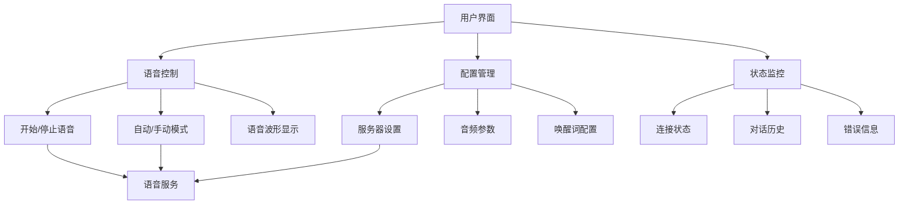

# WinUI 桌面应用项目

Verdure.Assistant.WinUI 是基于 WinUI 3 框架开发的现代 Windows 桌面应用，提供直观的图形用户界面，让用户可以通过可视化界面与智能语音助手进行交互。

## 🎯 项目概述

### 设计目标

- **🖥️ 现代 UI**：采用 WinUI 3 设计语言，提供流畅的用户体验
- **🎤 可视化语音**：实时语音波形显示和状态反馈
- **⚙️ 便捷配置**：图形化配置界面，无需修改配置文件
- **📊 状态监控**：直观的连接状态和服务状态显示
- **🔄 实时交互**：支持连续对话和手动语音控制

### 核心功能



## 🏗️ 项目结构

### 目录组织

```
src/Verdure.Assistant.WinUI/
├── Views/                          # 视图 (XAML 页面)
│   ├── MainWindow.xaml             # 主窗口
│   ├── HomePage.xaml               # 主页
│   ├── SettingsPage.xaml           # 设置页面
│   └── AboutPage.xaml              # 关于页面
├── ViewModels/                     # 视图模型
│   ├── MainWindowViewModel.cs      # 主窗口 ViewModel
│   ├── HomePageViewModel.cs        # 主页 ViewModel
│   └── SettingsPageViewModel.cs    # 设置页 ViewModel
├── Controls/                       # 自定义控件
│   ├── VoiceWaveform.xaml          # 语音波形控件
│   ├── StatusIndicator.xaml        # 状态指示器
│   └── ChatBubble.xaml             # 聊天气泡
├── Services/                       # UI 专用服务
│   ├── NavigationService.cs        # 导航服务
│   ├── DialogService.cs            # 对话框服务
│   └── ThemeService.cs             # 主题服务
├── Helpers/                        # 辅助类
│   ├── BindingHelpers.cs           # 绑定帮助
│   ├── Converters.cs               # 值转换器
│   └── Extensions.cs               # 扩展方法
├── Assets/                         # 资源文件
│   ├── Fonts/                      # 字体文件
│   ├── Images/                     # 图片资源
│   └── Sounds/                     # 音效文件
├── Themes/                         # 主题样式
│   ├── Generic.xaml                # 通用样式
│   └── Dark.xaml                   # 暗黑主题
├── App.xaml                        # 应用程序定义
├── App.xaml.cs                     # 应用程序代码
└── Package.appxmanifest            # 应用清单
```

## 🚀 快速开始

### 环境要求

- **Windows 10 版本 1809** (10.0; Build 17763) 或更高版本
- **Windows 11** (推荐)
- **.NET 10.0 SDK** 
- **Visual Studio 2026** 17.8 或更高版本
- **Windows App SDK** (通过 NuGet 自动安装)

### 本地运行

1. **克隆并进入项目目录**

```bash
git clone https://github.com/maker-community/Verdure.Assistant.git
cd Verdure.Assistant/src/Verdure.Assistant.WinUI
```

2. **使用 Visual Studio 打开**

```bash
# 打开项目文件
start Verdure.Assistant.WinUI.csproj

# 或者打开整个解决方案
start ../../Verdure.Assistant.sln
```

3. **设置启动项目**

在 Visual Studio 中：
- 右键点击 `Verdure.Assistant.WinUI` 项目
- 选择"设为启动项目"
- 确保目标框架为 `net10.0-windows10.0.19041.0`

4. **运行项目**

```bash
# 命令行运行
dotnet run

# 或在 Visual Studio 中按 F5
```

### 项目配置

应用启动时会自动创建配置文件 `%LOCALAPPDATA%/Verdure.Assistant/settings.json`：

```json
{
  "ConnectionSettings": {
    "ServerUrl": "wss://api.tenclass.net/xiaozhi/v1/",
    "ApiKey": "",
    "AutoReconnect": true,
    "ConnectionTimeout": 30
  },
  "VoiceSettings": {
    "EnableVoice": true,
    "AudioSampleRate": 16000,
    "AudioChannels": 1,
    "WakeWords": ["你好小电", "你好小娜"],
    "AutoMode": false
  },
  "UISettings": {
    "Theme": "System",
    "ShowNotifications": true,
    "MinimizeToTray": false,
    "StartMinimized": false
  }
}
```

## 🖼️ 用户界面设计

### 主窗口布局

主窗口采用现代化的导航视图设计：

```xml
<!-- MainWindow.xaml -->
<Grid>
    <Grid.RowDefinitions>
        <RowDefinition Height="Auto"/>
        <RowDefinition Height="*"/>
    </Grid.RowDefinitions>
    
    <!-- 自定义标题栏 -->
    <Grid Grid.Row="0" x:Name="AppTitleBar" Background="Transparent">
        <Grid.ColumnDefinitions>
            <ColumnDefinition Width="Auto"/>
            <ColumnDefinition Width="*"/>
            <ColumnDefinition Width="Auto"/>
        </Grid.ColumnDefinitions>
        
        <Image Grid.Column="0" Source="/Assets/logo.png" Width="24" Height="24" Margin="12,8"/>
        <TextBlock Grid.Column="1" Text="绿荫助手" Style="{StaticResource CaptionTextBlockStyle}" 
                   VerticalAlignment="Center" Margin="8,0"/>
        
        <!-- 窗口控制按钮区域 -->
        <StackPanel Grid.Column="2" Orientation="Horizontal" Margin="0,0,12,0">
            <Button x:Name="MinimizeButton" Style="{StaticResource WindowControlButtonStyle}"
                    Command="{x:Bind ViewModel.MinimizeWindowCommand}">
                <FontIcon FontFamily="{StaticResource SymbolThemeFontFamily}" Glyph="&#xE921;"/>
            </Button>
            <Button x:Name="MaximizeButton" Style="{StaticResource WindowControlButtonStyle}"
                    Command="{x:Bind ViewModel.MaximizeWindowCommand}">
                <FontIcon FontFamily="{StaticResource SymbolThemeFontFamily}" Glyph="&#xE922;"/>
            </Button>
            <Button x:Name="CloseButton" Style="{StaticResource WindowControlButtonStyle}"
                    Command="{x:Bind ViewModel.CloseWindowCommand}">
                <FontIcon FontFamily="{StaticResource SymbolThemeFontFamily}" Glyph="&#xE8BB;"/>
            </Button>
        </StackPanel>
    </Grid>
    
    <!-- 主内容区域 -->
    <NavigationView Grid.Row="1" x:Name="NavigationViewControl"
                    IsTabStop="False"
                    IsBackButtonVisible="Collapsed"
                    ItemInvoked="NavigationView_ItemInvoked">
        
        <!-- 导航菜单项 -->
        <NavigationView.MenuItems>
            <NavigationViewItem Content="主页" Tag="HomePage">
                <NavigationViewItem.Icon>
                    <FontIcon FontFamily="{StaticResource SymbolThemeFontFamily}" Glyph="&#xE80F;"/>
                </NavigationViewItem.Icon>
            </NavigationViewItem>
            
            <NavigationViewItem Content="设置" Tag="SettingsPage">
                <NavigationViewItem.Icon>
                    <FontIcon FontFamily="{StaticResource SymbolThemeFontFamily}" Glyph="&#xE713;"/>
                </NavigationViewItem.Icon>
            </NavigationViewItem>
        </NavigationView.MenuItems>
        
        <!-- 页面内容框架 -->
        <Frame x:Name="ContentFrame" Margin="24"/>
    </NavigationView>
</Grid>
```

### 主页设计

主页是用户主要的交互界面：

```xml
<!-- HomePage.xaml -->
<ScrollViewer>
    <StackPanel Spacing="24" Padding="24">
        
        <!-- 连接状态卡片 -->
        <Border Background="{ThemeResource CardBackgroundFillColorDefaultBrush}"
                CornerRadius="8" Padding="16">
            <Grid>
                <Grid.ColumnDefinitions>
                    <ColumnDefinition Width="Auto"/>
                    <ColumnDefinition Width="*"/>
                    <ColumnDefinition Width="Auto"/>
                </Grid.ColumnDefinitions>
                
                <controls:StatusIndicator Grid.Column="0" 
                                        Status="{x:Bind ViewModel.ConnectionStatus, Mode=OneWay}"
                                        Margin="0,0,12,0"/>
                
                <StackPanel Grid.Column="1" VerticalAlignment="Center">
                    <TextBlock Text="连接状态" Style="{StaticResource BodyTextBlockStyle}"/>
                    <TextBlock Text="{x:Bind ViewModel.ConnectionStatusText, Mode=OneWay}" 
                               Style="{StaticResource CaptionTextBlockStyle}"
                               Foreground="{ThemeResource TextFillColorSecondaryBrush}"/>
                </StackPanel>
                
                <Button Grid.Column="2" 
                        Content="{x:Bind ViewModel.ConnectButtonText, Mode=OneWay}"
                        Command="{x:Bind ViewModel.ToggleConnectionCommand}"
                        Style="{StaticResource AccentButtonStyle}"/>
            </Grid>
        </Border>
        
        <!-- 语音控制区域 -->
        <Border Background="{ThemeResource CardBackgroundFillColorDefaultBrush}"
                CornerRadius="8" Padding="24">
            <StackPanel Spacing="16">
                <TextBlock Text="语音交互" Style="{StaticResource SubtitleTextBlockStyle}"/>
                
                <!-- 语音波形显示 -->
                <controls:VoiceWaveform x:Name="VoiceWaveform" 
                                      Height="80" 
                                      IsActive="{x:Bind ViewModel.IsVoiceActive, Mode=OneWay}"/>
                
                <!-- 语音控制按钮 -->
                <StackPanel Orientation="Horizontal" Spacing="12" HorizontalAlignment="Center">
                    <Button x:Name="VoiceButton"
                            Width="60" Height="60"
                            Style="{StaticResource CircleButtonStyle}"
                            Command="{x:Bind ViewModel.ToggleVoiceCommand}"
                            Background="{x:Bind ViewModel.VoiceButtonColor, Mode=OneWay}">
                        <FontIcon FontFamily="{StaticResource SymbolThemeFontFamily}" 
                                  Glyph="{x:Bind ViewModel.VoiceButtonIcon, Mode=OneWay}" 
                                  FontSize="24"/>
                    </Button>
                </StackPanel>
                
                <!-- 模式切换 -->
                <StackPanel Orientation="Horizontal" HorizontalAlignment="Center" Spacing="8">
                    <TextBlock Text="自动模式" VerticalAlignment="Center"/>
                    <ToggleSwitch IsOn="{x:Bind ViewModel.IsAutoMode, Mode=TwoWay}"/>
                </StackPanel>
                
                <!-- 状态文本 -->
                <TextBlock Text="{x:Bind ViewModel.VoiceStatusText, Mode=OneWay}"
                           HorizontalAlignment="Center"
                           Style="{StaticResource CaptionTextBlockStyle}"
                           Foreground="{ThemeResource TextFillColorSecondaryBrush}"/>
            </StackPanel>
        </Border>
        
        <!-- 对话历史 -->
        <Border Background="{ThemeResource CardBackgroundFillColorDefaultBrush}"
                CornerRadius="8" Padding="16">
            <StackPanel Spacing="12">
                <Grid>
                    <TextBlock Text="对话记录" Style="{StaticResource SubtitleTextBlockStyle}"/>
                    <Button Content="清除" HorizontalAlignment="Right" 
                            Style="{StaticResource SubtleButtonStyle}"
                            Command="{x:Bind ViewModel.ClearChatCommand}"/>
                </Grid>
                
                <ScrollViewer Height="300" VerticalScrollBarVisibility="Auto">
                    <ItemsRepeater ItemsSource="{x:Bind ViewModel.ChatMessages, Mode=OneWay}">
                        <ItemsRepeater.ItemTemplate>
                            <DataTemplate x:DataType="models:ChatMessage">
                                <controls:ChatBubble Message="{Binding}" Margin="0,0,0,8"/>
                            </DataTemplate>
                        </ItemsRepeater.ItemTemplate>
                    </ItemsRepeater>
                </ScrollViewer>
            </StackPanel>
        </Border>
        
    </StackPanel>
</ScrollViewer>
```

### 自定义控件

#### 语音波形控件

```xml
<!-- Controls/VoiceWaveform.xaml -->
<UserControl x:Class="Verdure.Assistant.WinUI.Controls.VoiceWaveform">
    <Canvas x:Name="WaveformCanvas" Background="Transparent">
        <Canvas.Resources>
            <Storyboard x:Name="WaveAnimationStoryboard" RepeatBehavior="Forever">
                <DoubleAnimation Storyboard.TargetName="Wave1" 
                                 Storyboard.TargetProperty="Opacity"
                                 From="0.3" To="1.0" Duration="0:0:1.5" 
                                 AutoReverse="True"/>
                <DoubleAnimation Storyboard.TargetName="Wave2" 
                                 Storyboard.TargetProperty="Opacity"
                                 From="0.2" To="0.8" Duration="0:0:1.2" 
                                 AutoReverse="True"/>
            </Storyboard>
        </Canvas.Resources>
        
        <!-- 波形线条 -->
        <Polyline x:Name="Wave1" Stroke="{ThemeResource AccentFillColorDefaultBrush}"
                  StrokeThickness="2" Opacity="0.3"/>
        <Polyline x:Name="Wave2" Stroke="{ThemeResource AccentFillColorDefaultBrush}"
                  StrokeThickness="1.5" Opacity="0.2"/>
    </Canvas>
</UserControl>
```

```csharp
// Controls/VoiceWaveform.xaml.cs
public sealed partial class VoiceWaveform : UserControl
{
    private readonly Timer _waveUpdateTimer;
    private readonly Random _random = new();
    
    public bool IsActive
    {
        get => (bool)GetValue(IsActiveProperty);
        set => SetValue(IsActiveProperty, value);
    }
    
    public static readonly DependencyProperty IsActiveProperty =
        DependencyProperty.Register(
            nameof(IsActive), 
            typeof(bool), 
            typeof(VoiceWaveform),
            new PropertyMetadata(false, OnIsActiveChanged));
    
    public VoiceWaveform()
    {
        this.InitializeComponent();
        _waveUpdateTimer = new Timer(UpdateWaveform, null, Timeout.Infinite, Timeout.Infinite);
        
        this.SizeChanged += OnSizeChanged;
    }
    
    private static void OnIsActiveChanged(DependencyObject d, DependencyPropertyChangedEventArgs e)
    {
        if (d is VoiceWaveform waveform)
        {
            if ((bool)e.NewValue)
            {
                waveform.StartAnimation();
            }
            else
            {
                waveform.StopAnimation();
            }
        }
    }
    
    private void StartAnimation()
    {
        WaveAnimationStoryboard.Begin();
        _waveUpdateTimer.Change(0, 50); // 每50ms更新一次
    }
    
    private void StopAnimation()
    {
        WaveAnimationStoryboard.Stop();
        _waveUpdateTimer.Change(Timeout.Infinite, Timeout.Infinite);
        
        // 重置为静态波形
        GenerateStaticWaveform();
    }
    
    private void UpdateWaveform(object state)
    {
        DispatcherQueue.TryEnqueue(() =>
        {
            GenerateAnimatedWaveform();
        });
    }
    
    private void GenerateAnimatedWaveform()
    {
        var width = WaveformCanvas.ActualWidth;
        var height = WaveformCanvas.ActualHeight;
        var centerY = height / 2;
        
        var points1 = new PointCollection();
        var points2 = new PointCollection();
        
        for (double x = 0; x <= width; x += 5)
        {
            var amplitude1 = _random.NextDouble() * (height * 0.3);
            var amplitude2 = _random.NextDouble() * (height * 0.2);
            
            var y1 = centerY + Math.Sin(x * 0.1) * amplitude1;
            var y2 = centerY + Math.Cos(x * 0.08) * amplitude2;
            
            points1.Add(new Point(x, y1));
            points2.Add(new Point(x, y2));
        }
        
        Wave1.Points = points1;
        Wave2.Points = points2;
    }
}
```

## 🔧 核心功能实现

### HomePageViewModel

主页的视图模型实现：

```csharp
public partial class HomePageViewModel : ViewModelBase
{
    private readonly IVoiceChatService _voiceChatService;
    private readonly ISettingsService _settingsService;
    private readonly IDialogService _dialogService;
    
    [ObservableProperty]
    private ObservableCollection<ChatMessage> _chatMessages = new();
    
    [ObservableProperty]
    private ConnectionStatus _connectionStatus = ConnectionStatus.Disconnected;
    
    [ObservableProperty]
    private bool _isVoiceActive;
    
    [ObservableProperty]
    private bool _isAutoMode;
    
    [ObservableProperty]
    private string _connectionStatusText = "未连接";
    
    [ObservableProperty]
    private string _connectButtonText = "连接";
    
    [ObservableProperty]
    private string _voiceStatusText = "点击开始语音";
    
    public HomePageViewModel(
        IVoiceChatService voiceChatService,
        ISettingsService settingsService,
        IDialogService dialogService,
        ILogger<HomePageViewModel> logger) : base(logger)
    {
        _voiceChatService = voiceChatService;
        _settingsService = settingsService;
        _dialogService = dialogService;
        
        // 订阅服务事件
        _voiceChatService.ConnectionStatusChanged += OnConnectionStatusChanged;
        _voiceChatService.MessageReceived += OnMessageReceived;
        _voiceChatService.StateChanged += OnVoiceStateChanged;
    }
    
    public override async Task InitializeAsync()
    {
        try
        {
            // 加载设置
            var settings = await _settingsService.LoadSettingsAsync();
            IsAutoMode = settings.VoiceSettings.AutoMode;
            
            // 初始化语音服务
            await _voiceChatService.InitializeAsync();
            
            _logger.LogInformation("主页初始化完成");
        }
        catch (Exception ex)
        {
            _logger.LogError(ex, "主页初始化失败");
            await _dialogService.ShowErrorAsync("初始化失败", ex.Message);
        }
    }
    
    [RelayCommand]
    private async Task ToggleConnectionAsync()
    {
        try
        {
            if (ConnectionStatus == ConnectionStatus.Connected)
            {
                await _voiceChatService.DisconnectAsync();
            }
            else
            {
                await _voiceChatService.ConnectAsync();
            }
        }
        catch (Exception ex)
        {
            _logger.LogError(ex, "切换连接状态失败");
            await _dialogService.ShowErrorAsync("连接失败", ex.Message);
        }
    }
    
    [RelayCommand]
    private async Task ToggleVoiceAsync()
    {
        try
        {
            if (ConnectionStatus != ConnectionStatus.Connected)
            {
                await _dialogService.ShowWarningAsync("未连接", "请先连接到服务器");
                return;
            }
            
            if (IsVoiceActive)
            {
                await _voiceChatService.StopVoiceChatAsync();
            }
            else
            {
                await _voiceChatService.StartVoiceChatAsync();
            }
        }
        catch (Exception ex)
        {
            _logger.LogError(ex, "切换语音状态失败");
            await _dialogService.ShowErrorAsync("语音操作失败", ex.Message);
        }
    }
    
    [RelayCommand]
    private async Task ClearChatAsync()
    {
        var result = await _dialogService.ShowConfirmAsync(
            "清除对话", 
            "确定要清除所有对话记录吗？");
            
        if (result)
        {
            ChatMessages.Clear();
        }
    }
    
    [RelayCommand]
    private async Task SendTextMessageAsync(string text)
    {
        if (string.IsNullOrWhiteSpace(text) || ConnectionStatus != ConnectionStatus.Connected)
        {
            return;
        }
        
        try
        {
            await _voiceChatService.SendTextMessageAsync(text);
            
            // 添加用户消息到对话历史
            ChatMessages.Add(new ChatMessage
            {
                Id = Guid.NewGuid().ToString(),
                Content = text,
                Type = MessageType.User,
                Timestamp = DateTime.Now
            });
        }
        catch (Exception ex)
        {
            _logger.LogError(ex, "发送文本消息失败");
            await _dialogService.ShowErrorAsync("发送失败", ex.Message);
        }
    }
    
    private void OnConnectionStatusChanged(object sender, ConnectionStatus status)
    {
        DispatcherQueue.GetForCurrentThread().TryEnqueue(() =>
        {
            ConnectionStatus = status;
            ConnectionStatusText = GetStatusText(status);
            ConnectButtonText = status == ConnectionStatus.Connected ? "断开" : "连接";
        });
    }
    
    private void OnMessageReceived(object sender, ChatMessage message)
    {
        DispatcherQueue.GetForCurrentThread().TryEnqueue(() =>
        {
            ChatMessages.Add(message);
            
            // 自动滚动到底部
            if (ChatMessages.Count > 100)
            {
                ChatMessages.RemoveAt(0);
            }
        });
    }
    
    private void OnVoiceStateChanged(object sender, DeviceState state)
    {
        DispatcherQueue.GetForCurrentThread().TryEnqueue(() =>
        {
            IsVoiceActive = state == DeviceState.Listening || state == DeviceState.Processing;
            VoiceStatusText = GetVoiceStatusText(state);
        });
    }
    
    private static string GetStatusText(ConnectionStatus status) => status switch
    {
        ConnectionStatus.Connected => "已连接",
        ConnectionStatus.Connecting => "连接中...",
        ConnectionStatus.Disconnected => "未连接",
        ConnectionStatus.Error => "连接错误",
        _ => "未知状态"
    };
    
    private static string GetVoiceStatusText(DeviceState state) => state switch
    {
        DeviceState.Listening => "正在监听...",
        DeviceState.Processing => "处理中...",
        DeviceState.Speaking => "正在播放",
        DeviceState.Connected => "点击开始语音",
        _ => "语音不可用"
    };
    
    public Brush VoiceButtonColor => IsVoiceActive 
        ? new SolidColorBrush(Colors.Red) 
        : Application.Current.Resources["AccentFillColorDefaultBrush"] as Brush;
    
    public string VoiceButtonIcon => IsVoiceActive ? "\uE1D6" : "\uE1D6"; // 麦克风图标
}
```

### 设置页面

```xml
<!-- SettingsPage.xaml -->
<ScrollViewer>
    <StackPanel Spacing="16" Padding="24">
        
        <TextBlock Text="设置" Style="{StaticResource TitleTextBlockStyle}"/>
        
        <!-- 连接设置 -->
        <StackPanel>
            <TextBlock Text="连接设置" Style="{StaticResource SubtitleTextBlockStyle}" Margin="0,0,0,8"/>
            
            <TextBox Header="服务器地址" 
                     Text="{x:Bind ViewModel.ServerUrl, Mode=TwoWay}"
                     PlaceholderText="wss://api.tenclass.net/xiaozhi/v1/"/>
            
            <PasswordBox Header="API Key" 
                         Password="{x:Bind ViewModel.ApiKey, Mode=TwoWay}"
                         PlaceholderText="输入您的 API Key"/>
            
            <ToggleSwitch Header="自动重连" 
                          IsOn="{x:Bind ViewModel.AutoReconnect, Mode=TwoWay}"/>
            
            <Slider Header="连接超时 (秒)" 
                    Minimum="10" Maximum="60" StepFrequency="5"
                    Value="{x:Bind ViewModel.ConnectionTimeout, Mode=TwoWay}"/>
        </StackPanel>
        
        <!-- 语音设置 -->
        <StackPanel>
            <TextBlock Text="语音设置" Style="{StaticResource SubtitleTextBlockStyle}" Margin="0,0,0,8"/>
            
            <ToggleSwitch Header="启用语音功能" 
                          IsOn="{x:Bind ViewModel.EnableVoice, Mode=TwoWay}"/>
            
            <ComboBox Header="音频采样率">
                <ComboBoxItem Content="8000 Hz" Tag="8000"/>
                <ComboBoxItem Content="16000 Hz" Tag="16000" IsSelected="True"/>
                <ComboBoxItem Content="44100 Hz" Tag="44100"/>
            </ComboBox>
            
            <ComboBox Header="音频通道">
                <ComboBoxItem Content="单声道" Tag="1" IsSelected="True"/>
                <ComboBoxItem Content="立体声" Tag="2"/>
            </ComboBox>
            
            <ToggleSwitch Header="自动模式" 
                          IsOn="{x:Bind ViewModel.AutoMode, Mode=TwoWay}"/>
        </StackPanel>
        
        <!-- 界面设置 -->
        <StackPanel>
            <TextBlock Text="界面设置" Style="{StaticResource SubtitleTextBlockStyle}" Margin="0,0,0,8"/>
            
            <ComboBox Header="主题" SelectedIndex="{x:Bind ViewModel.ThemeIndex, Mode=TwoWay}">
                <ComboBoxItem Content="跟随系统"/>
                <ComboBoxItem Content="浅色"/>
                <ComboBoxItem Content="深色"/>
            </ComboBox>
            
            <ToggleSwitch Header="显示通知" 
                          IsOn="{x:Bind ViewModel.ShowNotifications, Mode=TwoWay}"/>
            
            <ToggleSwitch Header="最小化到系统托盘" 
                          IsOn="{x:Bind ViewModel.MinimizeToTray, Mode=TwoWay}"/>
        </StackPanel>
        
        <!-- 操作按钮 -->
        <StackPanel Orientation="Horizontal" Spacing="12">
            <Button Content="保存设置" Style="{StaticResource AccentButtonStyle}"
                    Command="{x:Bind ViewModel.SaveSettingsCommand}"/>
            <Button Content="重置默认" 
                    Command="{x:Bind ViewModel.ResetSettingsCommand}"/>
            <Button Content="测试连接" 
                    Command="{x:Bind ViewModel.TestConnectionCommand}"/>
        </StackPanel>
        
    </StackPanel>
</ScrollViewer>
```

## 🎨 主题和样式

### 自定义样式

```xml
<!-- Themes/Generic.xaml -->
<ResourceDictionary xmlns="http://schemas.microsoft.com/winfx/2006/xaml/presentation"
                    xmlns:x="http://schemas.microsoft.com/winfx/2006/xaml">
    
    <!-- 圆形按钮样式 -->
    <Style x:Key="CircleButtonStyle" TargetType="Button">
        <Setter Property="Width" Value="60"/>
        <Setter Property="Height" Value="60"/>
        <Setter Property="CornerRadius" Value="30"/>
        <Setter Property="Background" Value="{ThemeResource AccentFillColorDefaultBrush}"/>
        <Setter Property="BorderThickness" Value="0"/>
        <Setter Property="Template">
            <Setter.Value>
                <ControlTemplate TargetType="Button">
                    <Grid>
                        <Ellipse Fill="{TemplateBinding Background}" 
                                 Stroke="{TemplateBinding BorderBrush}"
                                 StrokeThickness="{TemplateBinding BorderThickness}"/>
                        <ContentPresenter HorizontalAlignment="Center" 
                                          VerticalAlignment="Center"/>
                        
                        <VisualStateManager.VisualStateGroups>
                            <VisualStateGroup x:Name="CommonStates">
                                <VisualState x:Name="Normal"/>
                                <VisualState x:Name="PointerOver">
                                    <VisualState.Setters>
                                        <Setter Target="RootGrid.Opacity" Value="0.8"/>
                                    </VisualState.Setters>
                                </VisualState>
                                <VisualState x:Name="Pressed">
                                    <VisualState.Setters>
                                        <Setter Target="RootGrid.Opacity" Value="0.6"/>
                                    </VisualState.Setters>
                                </VisualState>
                            </VisualStateGroup>
                        </VisualStateManager.VisualStateGroups>
                    </Grid>
                </ControlTemplate>
            </Setter.Value>
        </Setter>
    </Style>
    
    <!-- 卡片样式 -->
    <Style x:Key="CardStyle" TargetType="Border">
        <Setter Property="Background" Value="{ThemeResource CardBackgroundFillColorDefaultBrush}"/>
        <Setter Property="BorderBrush" Value="{ThemeResource CardStrokeColorDefaultBrush}"/>
        <Setter Property="BorderThickness" Value="1"/>
        <Setter Property="CornerRadius" Value="8"/>
        <Setter Property="Padding" Value="16"/>
    </Style>
    
    <!-- 状态指示器样式 -->
    <Style x:Key="StatusIndicatorStyle" TargetType="Ellipse">
        <Setter Property="Width" Value="12"/>
        <Setter Property="Height" Value="12"/>
    </Style>
    
</ResourceDictionary>
```

### 主题服务

```csharp
public class ThemeService : IThemeService
{
    private readonly ISettingsService _settingsService;
    
    public ThemeService(ISettingsService settingsService)
    {
        _settingsService = settingsService;
    }
    
    public async Task ApplyThemeAsync(AppTheme theme)
    {
        var rootFrame = Window.Current?.Content as FrameworkElement;
        if (rootFrame != null)
        {
            rootFrame.RequestedTheme = theme switch
            {
                AppTheme.Light => ElementTheme.Light,
                AppTheme.Dark => ElementTheme.Dark,
                AppTheme.System => ElementTheme.Default,
                _ => ElementTheme.Default
            };
        }
        
        // 保存主题设置
        var settings = await _settingsService.LoadSettingsAsync();
        settings.UISettings.Theme = theme.ToString();
        await _settingsService.SaveSettingsAsync(settings);
    }
    
    public AppTheme GetCurrentTheme()
    {
        var rootFrame = Window.Current?.Content as FrameworkElement;
        return rootFrame?.RequestedTheme switch
        {
            ElementTheme.Light => AppTheme.Light,
            ElementTheme.Dark => AppTheme.Dark,
            ElementTheme.Default => AppTheme.System,
            _ => AppTheme.System
        };
    }
    
    public bool IsSystemThemeDark()
    {
        var uiSettings = new UISettings();
        var color = uiSettings.GetColorValue(UIColorType.Background);
        return color == Colors.Black;
    }
}
```

## 📦 打包和分发

### 应用清单配置

```xml
<!-- Package.appxmanifest -->
<Package xmlns="http://schemas.microsoft.com/appx/manifest/foundation/windows10"
         xmlns:mp="http://schemas.microsoft.com/appx/2014/phone/manifest"
         xmlns:uap="http://schemas.microsoft.com/appx/manifest/uap/windows10">

  <Identity Name="VerdureAssistant" 
            Publisher="CN=MakerCommunity" 
            Version="1.0.0.0"/>

  <Properties>
    <DisplayName>绿荫助手</DisplayName>
    <PublisherDisplayName>Maker Community</PublisherDisplayName>
    <Logo>Assets\StoreLogo.png</Logo>
    <Description>基于 .NET 10 的智能语音助手</Description>
  </Properties>

  <Dependencies>
    <TargetDeviceFamily Name="Windows.Universal" 
                        MinVersion="10.0.17763.0" 
                        MaxVersionTested="10.0.19041.0"/>
    <PackageDependency Name="Microsoft.WindowsAppRuntime.1.4" 
                       MinVersion="4.0.0.0" 
                       Publisher="CN=Microsoft Corporation, O=Microsoft Corporation, L=Redmond, S=Washington, C=US"/>
  </Dependencies>

  <Applications>
    <Application Id="App" Executable="$targetnametoken$.exe" EntryPoint="$targetentrypoint$">
      <uap:VisualElements DisplayName="绿荫助手" 
                          Description="智能语音助手应用"
                          Square150x150Logo="Assets\Square150x150Logo.png" 
                          Square44x44Logo="Assets\Square44x44Logo.png" 
                          BackgroundColor="transparent">
        <uap:DefaultTile Wide310x150Logo="Assets\Wide310x150Logo.png"/>
        <uap:SplashScreen Image="Assets\SplashScreen.png"/>
      </uap:VisualElements>
      
      <Extensions>
        <!-- 文件类型关联 -->
        <uap:Extension Category="windows.fileTypeAssociation">
          <uap:FileTypeAssociation Name="verduresettings">
            <uap:SupportedFileTypes>
              <uap:FileType>.vdrs</uap:FileType>
            </uap:SupportedFileTypes>
          </uap:FileTypeAssociation>
        </uap:Extension>
        
        <!-- 协议激活 -->
        <uap:Extension Category="windows.protocol">
          <uap:Protocol Name="verdure">
            <uap:DisplayName>Verdure Assistant Protocol</uap:DisplayName>
          </uap:Protocol>
        </uap:Extension>
      </Extensions>
    </Application>
  </Applications>

  <Capabilities>
    <Capability Name="internetClient"/>
    <DeviceCapability Name="microphone"/>
    <DeviceCapability Name="webcam"/>
  </Capabilities>
</Package>
```

### 构建脚本

```powershell
# build-package.ps1
param(
    [string]$Configuration = "Release",
    [string]$Platform = "x64"
)

Write-Host "开始构建 WinUI 应用包..." -ForegroundColor Green

# 设置变量
$ProjectPath = "src\Verdure.Assistant.WinUI\Verdure.Assistant.WinUI.csproj"
$OutputPath = "artifacts\winui"

# 清理输出目录
if (Test-Path $OutputPath) {
    Remove-Item -Path $OutputPath -Recurse -Force
}
New-Item -ItemType Directory -Path $OutputPath -Force | Out-Null

# 构建项目
Write-Host "构建项目..." -ForegroundColor Yellow
dotnet build $ProjectPath -c $Configuration -p:Platform=$Platform

if ($LASTEXITCODE -ne 0) {
    Write-Error "构建失败"
    exit 1
}

# 发布项目
Write-Host "发布应用..." -ForegroundColor Yellow
dotnet publish $ProjectPath -c $Configuration -p:Platform=$Platform -o $OutputPath\publish

# 创建 MSIX 包
Write-Host "创建应用包..." -ForegroundColor Yellow
msbuild $ProjectPath /p:Configuration=$Configuration /p:Platform=$Platform /p:AppxBundlePlatforms=$Platform /p:AppxPackageDir=$OutputPath\packages\ /p:GenerateAppxPackageOnBuild=true

Write-Host "构建完成！" -ForegroundColor Green
Write-Host "输出目录: $OutputPath" -ForegroundColor Cyan
```

### 侧载安装

```powershell
# install.ps1
param(
    [string]$PackagePath
)

if (-not $PackagePath) {
    $PackagePath = Get-ChildItem -Path "artifacts\winui\packages" -Filter "*.msix" | Select-Object -First 1 -ExpandProperty FullName
}

if (-not (Test-Path $PackagePath)) {
    Write-Error "找不到应用包文件"
    exit 1
}

Write-Host "安装应用包: $PackagePath" -ForegroundColor Green

# 启用开发者模式（需要管理员权限）
try {
    $devMode = Get-ItemProperty -Path "HKLM:\SOFTWARE\Microsoft\Windows\CurrentVersion\AppModelUnlock" -Name "AllowDevelopmentWithoutDevLicense" -ErrorAction SilentlyContinue
    if (-not $devMode -or $devMode.AllowDevelopmentWithoutDevLicense -ne 1) {
        Write-Host "启用开发者模式..." -ForegroundColor Yellow
        Set-ItemProperty -Path "HKLM:\SOFTWARE\Microsoft\Windows\CurrentVersion\AppModelUnlock" -Name "AllowDevelopmentWithoutDevLicense" -Value 1
    }
} catch {
    Write-Warning "无法启用开发者模式，请手动在设置中启用"
}

# 安装应用包
try {
    Add-AppxPackage -Path $PackagePath -ForceApplicationShutdown
    Write-Host "应用安装成功！" -ForegroundColor Green
} catch {
    Write-Error "应用安装失败: $($_.Exception.Message)"
    exit 1
}
```

## 🔧 高级功能

### 系统托盘集成

```csharp
public class SystemTrayService : ISystemTrayService
{
    private TaskbarIcon _taskbarIcon;
    private readonly INavigationService _navigationService;
    
    public SystemTrayService(INavigationService navigationService)
    {
        _navigationService = navigationService;
        InitializeTrayIcon();
    }
    
    private void InitializeTrayIcon()
    {
        _taskbarIcon = new TaskbarIcon
        {
            IconSource = new BitmapImage(new Uri("ms-appx:///Assets/tray-icon.ico")),
            ToolTipText = "绿荫助手"
        };
        
        // 创建上下文菜单
        var contextMenu = new ContextMenu();
        
        var showMenuItem = new MenuItem { Header = "显示主窗口" };
        showMenuItem.Click += (s, e) => ShowMainWindow();
        contextMenu.Items.Add(showMenuItem);
        
        contextMenu.Items.Add(new Separator());
        
        var exitMenuItem = new MenuItem { Header = "退出" };
        exitMenuItem.Click += (s, e) => Application.Current.Shutdown();
        contextMenu.Items.Add(exitMenuItem);
        
        _taskbarIcon.ContextMenu = contextMenu;
        _taskbarIcon.TrayLeftMouseDown += (s, e) => ShowMainWindow();
    }
    
    public void ShowTrayIcon()
    {
        _taskbarIcon.Visibility = Visibility.Visible;
    }
    
    public void HideTrayIcon()
    {
        _taskbarIcon.Visibility = Visibility.Hidden;
    }
    
    private void ShowMainWindow()
    {
        var mainWindow = Application.Current.MainWindow;
        if (mainWindow != null)
        {
            if (mainWindow.WindowState == WindowState.Minimized)
            {
                mainWindow.WindowState = WindowState.Normal;
            }
            mainWindow.Show();
            mainWindow.Activate();
        }
    }
    
    public void Dispose()
    {
        _taskbarIcon?.Dispose();
    }
}
```

### 语音识别集成

```csharp
public class SpeechRecognitionService : ISpeechRecognitionService
{
    private SpeechRecognizer _speechRecognizer;
    private readonly ILogger<SpeechRecognitionService> _logger;
    
    public event EventHandler<string> SpeechRecognized;
    
    public SpeechRecognitionService(ILogger<SpeechRecognitionService> logger)
    {
        _logger = logger;
        InitializeSpeechRecognizer();
    }
    
    private async void InitializeSpeechRecognizer()
    {
        try
        {
            _speechRecognizer = new SpeechRecognizer();
            
            // 配置识别约束
            var webSearchGrammar = new SpeechRecognitionTopicConstraint(
                SpeechRecognitionScenario.WebSearch, 
                "webSearch");
            _speechRecognizer.Constraints.Add(webSearchGrammar);
            
            // 编译约束
            var result = await _speechRecognizer.CompileConstraintsAsync();
            if (result.Status != SpeechRecognitionResultStatus.Success)
            {
                _logger.LogError("语音识别约束编译失败: {Status}", result.Status);
                return;
            }
            
            // 设置事件处理器
            _speechRecognizer.ContinuousRecognitionSession.ResultGenerated += OnResultGenerated;
            _speechRecognizer.ContinuousRecognitionSession.Completed += OnCompleted;
            
            _logger.LogInformation("语音识别服务初始化成功");
        }
        catch (Exception ex)
        {
            _logger.LogError(ex, "语音识别服务初始化失败");
        }
    }
    
    public async Task StartContinuousRecognitionAsync()
    {
        if (_speechRecognizer != null)
        {
            await _speechRecognizer.ContinuousRecognitionSession.StartAsync();
            _logger.LogInformation("开始连续语音识别");
        }
    }
    
    public async Task StopContinuousRecognitionAsync()
    {
        if (_speechRecognizer != null)
        {
            await _speechRecognizer.ContinuousRecognitionSession.StopAsync();
            _logger.LogInformation("停止连续语音识别");
        }
    }
    
    private void OnResultGenerated(object sender, SpeechContinuousRecognitionResultGeneratedEventArgs e)
    {
        if (e.Result.Confidence == SpeechRecognitionConfidence.High ||
            e.Result.Confidence == SpeechRecognitionConfidence.Medium)
        {
            var recognizedText = e.Result.Text;
            _logger.LogInformation("识别到语音: {Text} (置信度: {Confidence})", 
                recognizedText, e.Result.Confidence);
            
            SpeechRecognized?.Invoke(this, recognizedText);
        }
    }
    
    private void OnCompleted(object sender, SpeechContinuousRecognitionCompletedEventArgs e)
    {
        _logger.LogInformation("语音识别会话结束: {Status}", e.Status);
    }
    
    public void Dispose()
    {
        _speechRecognizer?.Dispose();
    }
}
```

## 🔗 相关资源

- **[MAUI 项目](/zh/projects/maui)** - 跨平台移动应用
- **[Console 项目](/zh/projects/console)** - 命令行版本  
- **[API 项目](/zh/projects/api)** - 后端服务
- **[Visual Studio 开发](/zh/development/visual-studio)** - VS 开发技巧

---

通过学习 WinUI 项目，您将掌握：
- 现代 Windows 应用开发
- WinUI 3 框架使用
- MVVM 架构模式
- 数据绑定和命令
- 自定义控件开发
- 应用打包和分发

这些技能将帮助您开发出专业级的 Windows 桌面应用程序。